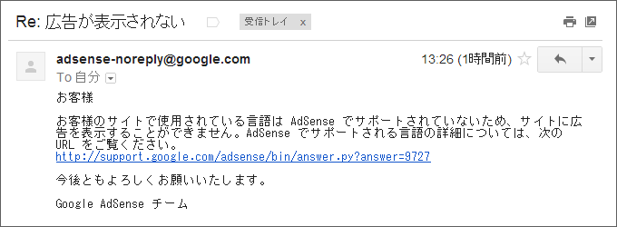
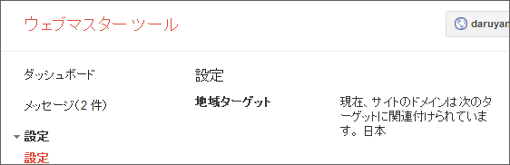
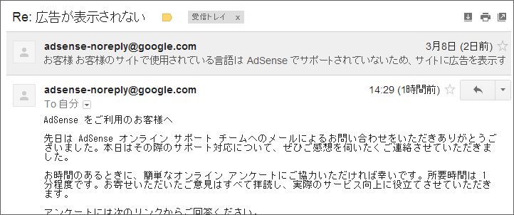

サイドバーに広告（Google AdSense）を置いて「はてなブログ」やドメインの料金だけでも稼ごうと画策していたのだけれど、なぜか黄色い背景しか表示されていなかったことに先日気付いた。これではおカネにならないわけで。

とりあえず、AdSense に問い合わせてみた。すると、1時間ほどで返事が。

<i>「お客様のサイトで使用されている言語は AdSense でサポートされていません」</i>――そんなバカな！　日本語だぞ。もちろん AdSense も対応している言語だ。しかし、だ。もしかしたらタガログ語だのバスク語のサイトと誤判定されているのかもしれない。そこで、念のため <a href="https://www.google.com/webmasters/tools/home?hl=ja">&#x30A6;&#x30A7;&#x30D6;&#x30DE;&#x30B9;&#x30BF;&#x30FC; &#x30C4;&#x30FC;&#x30EB;</a> で確認。ターゲットの言語は……と。

<i>日本語！！　</i>日本語でしたよ。タガログ語でもバスク語でもなかったよ！　ほんと何が悪いのかな。スクリプトを再取得して張り替えてもダメだし。しょうがないので、広告のサイズを変え、まったく新しくスクリプトを取得して貼り付けてみた。

――すると、なぜかイケた。

もうなにがなんだかよくわかんないな。まぁ、そんなこんなでサイドバーの広告が細長くなった。

<h3>後日談</h3>

こんなメールが来た。

感想？　ねーよ。

