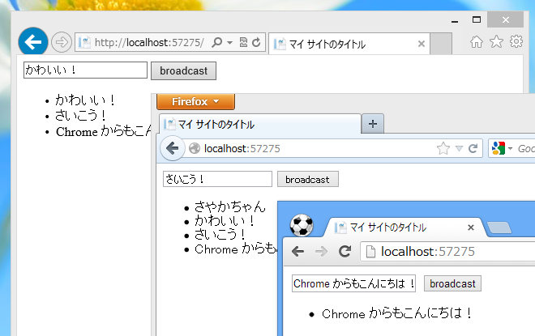

もうだいぶ昔の話になりますが、ASP.NET SignalR が正式リリースされました。

<ul>
<li><a href="http://shiba-yan.hatenablog.jp/entry/20130303/1362291390">ASP.NET SignalR 1.0.1 &#x304C;&#x51FA;&#x3066;&#x307E;&#x3057;&#x305F; - &#x3057;&#x3070;&#x3084;&#x3093;&#x96D1;&#x8A18;</a></li>
</ul>
最新版は 1.0.1 ですかね。

ASP.NET SignalR は「WebMatrix 2」からも使えますが、ベータのとき（<a href="https://blog.daruyanagi.jp/entry/2012/08/31/031730">SignalR Deep Dive ! &#x306B;&#x53C2;&#x52A0;&#x3057;&#x3066;&#x304D;&#x305F;&#xFF0B;WebMatrix &#x3067; SignalR &#x52D5;&#x304B;&#x3057;&#x3066;&#x307F;&#x305F; - &#x3060;&#x308B;&#x308D;&#x3050;</a>）とは少し変わっている部分もあるようなので、もう一度やってみました。とりあえず、<a href="https://github.com/SignalR/SignalR/wiki/QuickStart-Hubs">QuickStart Hubs &middot; SignalR/SignalR Wiki &middot; GitHub</a> を動作させるのが目標。

<h3>NuGet で SignalR を取得</h3>

公式パッケージソースで「SignalR」を検索すると、三番目ぐらいに出てくるはず。

<h3>サーバー（ハブ）</h3>

~/App_Code フォルダに ChatHub.cs を作成し、以下のようなクラスを用意します。

<pre class="code lang-cs" data-lang="cs" data-unlink>using Microsoft.AspNet.SignalR;

public class Chat : Hub
{
public void Send(string message)
{
// Call the addMessage method on all clients            
Clients.All.addMessage(message);
}
}
</pre>
受け取ったメッセージを接続中のすべてのクライアントへそのまま一斉送信する（クライアントクラスの addMessage() を呼び出す）だけの簡単なクラスです。これがサーバー側のコードになります。

名前空間が変わったのかな？

<h3>ハブのマッピング</h3>

さきほど記述したハブをルートテーブルにマップして使えるようにします。~/_AppStart.cshtml を作成し、以下のように記述しましょう。

<pre class="code lang-cs" data-lang="cs" data-unlink>@using System.Web.Routing

@{
RouteTable.Routes.MapHubs();
}
</pre>
<a href="https://github.com/SignalR/SignalR/wiki/QuickStart-Hubs">QuickStart Hubs &middot; SignalR/SignalR Wiki &middot; GitHub</a> に掲載されているコードと少し違いますが、「WebMatrix 2」の場合はこれで OK です。

正直、あんまりよくわかっていないのですけれど、これをコメントアウトすると次のセクションに出てくる &lt;script src="/signalr/hubs"&gt;&lt;/script&gt; が 404 になってしまうので、まぁ、そういうのことをしてくれているのではないでしょうか。クライアントコードで $.connection.chat と書いてハブプロキシを呼び出せるようにごにょごにょするとか、そういう準備全般だと思います。

<h3>クライアント（Javascript + HTML）</h3>

~/Default.cshtml を以下のように書き換えます。自分の場合は jQuery をアップデートしてあるのですが、古いものでも大丈夫なのかな？　コピペで動かす場合は、スクリプトのバージョンだけ間違わないように気を付けてくださいね。

<pre class="code lang-cs" data-lang="cs" data-unlink>@{

}

&lt;!DOCTYPE html&gt;

&lt;html lang=&quot;ja&quot;&gt;
&lt;head&gt;
&lt;meta http-equiv=&quot;Content-Type&quot; content=&quot;text/html; charset=utf-8&quot;/&gt;
&lt;meta charset=&quot;utf-8&quot; /&gt;

&lt;title&gt;マイ サイトのタイトル&lt;/title&gt;

&lt;link href=&quot;~/favicon.ico&quot; rel=&quot;shortcut icon&quot; type=&quot;image/x-icon&quot; /&gt;

&lt;script src=&quot;~/Scripts/jquery-1.9.1.min.js&quot;&gt;&lt;/script&gt;
&lt;script src=&quot;~/Scripts/jquery.signalR-1.0.1.min.js&quot;&gt;&lt;/script&gt;
&lt;script src=&quot;~/signalr/hubs&quot;&gt;&lt;/script&gt;
&lt;script&gt;
$(function () {
// ハブプロキシを作成        
var chat = $.connection.chat;

// サーバーが addMessage() を呼んだら……         
chat.client.addMessage = function (message) {
$('#messages').append('&lt;li&gt;' + message + '&lt;/li&gt;');
};

// 接続開始
$.connection.hub.start().done(function() {
// imput#broadcast がクリックされたら……
$(&quot;#broadcast&quot;).click(function () {
// サーバーの Send() を実行する
chat.server.send($('#msg').val());
});
});
});
&lt;/script&gt;
&lt;/head&gt;
&lt;body&gt;
&lt;div&gt;
&lt;input type=&quot;text&quot; id=&quot;msg&quot; /&gt;
&lt;input type=&quot;button&quot; id=&quot;broadcast&quot; value=&quot;broadcast&quot; /&gt;

&lt;ul id=&quot;messages&quot;&gt;
&lt;/ul&gt;
&lt;/div&gt;
&lt;/body&gt;
&lt;/html&gt;
</pre>
input#broadcast を押したら、input#msg の内容を引数にサーバーの ChatHub.Send(string） を実行します。 すると、それがすべてのクライアントに送信され、それを受け取ったクライアントは ul#messages にそれを追加する、というわけ。

とりあえずブラウザーをいくつか起動して適当に入力してみてください。ちゃんとブロードキャストされているかな？

