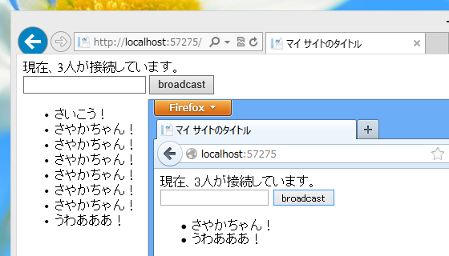

緑タイツの中の人が Facebook で、昨日の記事（<a href="https://blog.daruyanagi.jp/entry/2013/03/12/093613">WebMatrix 2: SignalR &#x3092;&#x52D5;&#x304B;&#x3059; &#xFF08; 1.0.1 &#x5BFE;&#x5FDC;&#x7248;&#xFF09; - &#x3060;&#x308B;&#x308D;&#x3050;</a>）に<i>「SignalRのサンプル作るときは、「今何人接続」表示があるともっと便利ですよー」</i>とコメントを付けてくれました。これは要するに、<i>「そのやり方をブログに書け」</i>ということですよね！（違

幸い、しばやんが偶然たまたま <a href="http://shiba-yan.hatenablog.jp/entry/20130312/1363090277">ASP.NET SignalR &#x3067;&#x63A5;&#x7D9A;&#x4E2D;&#x306E;&#x30AF;&#x30E9;&#x30A4;&#x30A2;&#x30F3;&#x30C8;&#x3092;&#x6570;&#x3048;&#x3066;&#x307F;&#x308B; - &#x3057;&#x3070;&#x3084;&#x3093;&#x96D1;&#x8A18;</a> という記事を書いてくれましたので、それを<del>コピペ</del>参考にして、昨日のサンプルに追加してみました。

<h3>~/_AppStart.cshtml</h3>
<pre class="code lang-cs" data-lang="cs" data-unlink>@using System.Web.Routing

@{
RouteTable.Routes.MapHubs();
}
</pre>

<h3>~/App_Code/ChatHub.cshtml</h3>
<pre class="code lang-cs" data-lang="cs" data-unlink>using Microsoft.AspNet.SignalR;

// 追加
using Microsoft.AspNet.SignalR.Hubs;
using System.Collections.Concurrent;
using System.Threading.Tasks;

[HubName(&quot;chat&quot;)]
public class ChatHub : Hub
{
public void Send(string message)
{
Clients.All.addMessage(message);
}

// 以下、追加
private static readonly ConcurrentDictionary&lt;string, bool&gt;
_connections = new ConcurrentDictionary&lt;string, bool&gt;();

public override Task OnConnected()
{
_connections.TryAdd(Context.ConnectionId, true);

return Clients.All.notify(_connections.Count);
}

public override Task OnDisconnected()
{
bool value;

_connections.TryRemove(Context.ConnectionId, out value);

return Clients.All.notify(_connections.Count);
}

public override Task OnReconnected()
{
_connections.TryAdd(Context.ConnectionId, true);

return Clients.All.notify(_connections.Count);
}
}
</pre>
Dictionary で 接続ID を管理する処理が追加されています。ConcurrentDictionary は、

<blockquote cite="http://msdn.microsoft.com/ja-jp/library/vstudio/dd287191.aspx">

複数のスレッドから同時にアクセスできるキーと値のペアのスレッド セーフなコレクションを表します。

<cite><a href="http://msdn.microsoft.com/ja-jp/library/vstudio/dd287191.aspx">http://msdn.microsoft.com/ja-jp/library/vstudio/dd287191.aspx</a></cite>
</blockquote>

.NET Framework 4 から使えるのかな？

しばやんの記事を読むまでは、単純に接続イベントで int Count をインクリメント・デクリメントしようと思っていたのですが、そんなに簡単なお話ではなかったようです。

あと、クラス名を ChatHub に変更しました。ファイル名とクラス名は合わせたいかな、と思ったので。これには追加の名前空間（Microsoft.AspNet.SignalR.Hubs）が必要です。 [HubName("chat")] という属性を追加すれば動作に影響はありません。

<h3>~/Default.cshtml</h3>
<pre class="code lang-html" data-lang="html" data-unlink>@{

}

&lt;!DOCTYPE html&gt;

&lt;html lang=&quot;ja&quot;&gt;
&lt;head&gt;
        &lt;meta http-equiv=&quot;Content-Type&quot; content=&quot;text/html; charset=utf-8&quot;/&gt;
        &lt;meta charset=&quot;utf-8&quot; /&gt;

        &lt;title&gt;マイ サイトのタイトル&lt;/title&gt;

        &lt;link href=&quot;~/favicon.ico&quot; rel=&quot;shortcut icon&quot; type=&quot;image/x-icon&quot; /&gt;

        &lt;script src=&quot;~/Scripts/jquery-1.9.1.min.js&quot;&gt;&lt;/script&gt;
        &lt;script src=&quot;~/Scripts/jquery.signalR-1.0.1.min.js&quot;&gt;&lt;/script&gt;
        &lt;script src=&quot;~/signalr/hubs&quot;&gt;&lt;/script&gt;
        &lt;script&gt;
            $(function () {
                var chat = $.connection.chat;

                chat.client.addMessage = function (message) {
                    $('#messages').append('&lt;li&gt;' + message + '&lt;/li&gt;');
                };

                // notify() を追加
                chat.client.notify = function (message) {
                    $('#count').html(message)
                };

                $.connection.hub.start().done(function () {
                    $(&quot;#broadcast&quot;).click(function () {
                        chat.server.send($('#msg').val());
                        $(&quot;#msg&quot;).val(&quot;&quot;); // 追加
                    });
                });
            });
        &lt;/script&gt;
    &lt;/head&gt;
&lt;body&gt;
&lt;div&gt;&lt;!-- 追加 --&gt;
現在、&lt;span id=&quot;count&quot;&gt;&lt;/span&gt;人が接続しています。
&lt;/div&gt;&lt;!-- ここまで --&gt;
&lt;div&gt;
&lt;input type=&quot;text&quot; id=&quot;msg&quot; /&gt;
&lt;input type=&quot;button&quot; id=&quot;broadcast&quot; value=&quot;broadcast&quot; /&gt;

&lt;ul id=&quot;messages&quot;&gt;
&lt;/ul&gt;
&lt;/div&gt;
&lt;/body&gt;
&lt;/html&gt;
</pre>
ハブが Clients.All.notify(接続数) するので、クライアント側でそれを span#count にセットします。

ついでに、ブロードキャストしたときにテキストボックスを空にする処理を加えておきました。

<h3>結果</h3>

できました！

