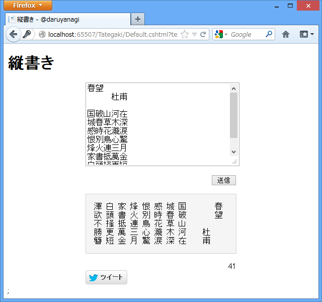

Twitter の Web UI で改行が使えるようになったとのことで、タイムラインが縦書きでいっぱいです。それをみていたら、自分も漢詩なんかが縦書きで投稿できるアプリがほしくなりました。

<ul>
<li><a href="http://tools.daruyanagi.net/Tategaki/">&#x7E26;&#x66F8;&#x304D; - @daruyanagi</a></li>
</ul>

<h3>Inside Tategaki</h3>

<h4>拡張メソッド</h4>

さっそく中身を紹介したいのですが、その前に拡張メソッドをいくつか用意しておきます。クラス名が体を表していないのは見逃してください。拡張メソッドのクラス名なんか飾りなんですよ！

<ul>
<li>Transpose() : 行と列を逆にします</li>
<li>Join() : string.Join() を "hoge".Join() で呼び出す</li>
<li>Times()：string * int がほしかった</li>
</ul>
<b>~/App_Code/EnumerableExtensions.cs</b>

<pre class="code lang-cs" data-lang="cs" data-unlink>using System;
using System.Collections.Generic;
using System.Linq;
using System.Web;

public static class EnumerableExtensions
{
public static IEnumerable&lt;IEnumerable&lt;T&gt;&gt; Transpose&lt;T&gt;(
this IEnumerable&lt;IEnumerable&lt;T&gt;&gt; source)
{
return from row in source
from col in row.Select(
(x, i) =&gt; new KeyValuePair&lt;int, T&gt;(i, x))
group col.Value by col.Key into c
select c as IEnumerable&lt;T&gt;;
}

public static string Join&lt;T&gt;(
this IEnumerable&lt;T&gt; source, string seperator)
{
return string.Join(seperator, source);
}

public static string Times(this string source, int times)
{
return Enumerable.Range(0, times).Select(_ =&gt; source).Join(&quot;&quot;);
}
}
</pre>

<h3>メインページ</h3>

“既定のページの管理”で .cshtml を追加してあります。

<b>~/Tategaki/Default.cshtml</b>

<pre class="code lang-cs" data-lang="cs" data-unlink>@{
var text = (Request[&quot;text&quot;] ?? string.Empty);
}

&lt;div style=&quot;width: 300px; margin: 0 auto;&quot;&gt;
&lt;form action=&quot;&quot;&gt;
&lt;p&gt;&lt;textarea name=&quot;text&quot; style=&quot;width: 100%; height: 10em;&quot;&gt;@text&lt;/textarea&gt;&lt;/p&gt;
&lt;p style=&quot;text-align: right;&quot;&gt;&lt;input type=&quot;submit&quot; /&gt;&lt;/p&gt;
&lt;/form&gt;

@{
text = text.Replace(&quot;  &quot;, &quot;　&quot;).Replace(&quot; &quot;, &quot;　&quot;);
text = Microsoft.VisualBasic.Strings
.StrConv(text, Microsoft.VisualBasic.VbStrConv.Wide, 0);

var s = Request[&quot;s&quot;].AsInt(1);
var new_line = new [] { &quot;\r\n&quot;, &quot;\r&quot;, &quot;\n&quot; };
var lines = Html.Encode(text).Split(new_line, StringSplitOptions.None);
var width = lines.Max(_ =&gt; _.Length);

var vertical_text = lines
.Reverse()
.Select(_ =&gt; _.PadRight(width, '　').ToCharArray().AsEnumerable())
.Transpose()
.Select(_ =&gt; _.Join(&quot; &quot;.Times(s)).TrimEnd())
.Join(&quot;\n&quot;) + &quot;\n\n&quot;;
}
</pre>
半角 ⇒ 全角 の変換処理はめんどくさいの Visual Basic の機能（StrConv 関数）を引っ張ってきました。Web.config を書き換えて DLL の参照を追加するより、一度「Visual Studio」で開いて［参照の追加］を使うのが簡単。

AsInt() は ASP.NET Web Pages で提供されている便利なメソッド。ここでは Request[] で受け取った値を Int32 型にしている（失敗したら 0、引数を与えれていればデフォルト値を返す）。ほかにもいろんな型に対応するメソッドが用意されてるよ！

<ul>
<li><a href="http://www.asp.net/web-pages/overview/more-resources/asp-net-web-pages-api-reference">ASP.NET API Quick Reference : The Official Microsoft ASP.NET Site</a></li>
</ul>
手抜き命名の変数 s は行間に挿入するスペースの数（LINQ の下から二つ目 " ".Times(s) の部分）。

あとは LINQ で

<ol>
<li>横にスライス（縦書きの時は右上始点で読むのリバースしておく）</li>
<li>それをまた縦にスライスして char の表に（空きは簡便のため全角空白で埋める）</li>
<li>行と列を入れ替えて縦書きに</li>
<li>各行の char[] を連結（うしろの空白は不要なのでカット）</li>
<li>すべての行を連結</li>
</ol>
するだけ。もっといい方法あるかな？

<pre class="code lang-cs" data-lang="cs" data-unlink>@functions
{
public string GetShorURL(string url){
string endpoint = &quot;https://www.googleapis.com/urlshortener/v1/url&quot;;
string json = &quot;{\&quot;longUrl\&quot;: \&quot;&quot; + url + &quot;\&quot;}&quot;;
WebClient client = new WebClient { Encoding = System.Text.Encoding.UTF8 };
client.Headers[&quot;Content-Type&quot;] = &quot;application/json&quot;;
var response = Json.Decode(client.UploadString(endpoint, json));
return response.id as string;
}
}

@{
var url = GetShorURL(Request.Url.AbsoluteUri);
}

&lt;pre style=&quot;padding: 1em; background-color: whitesmoke; border: 1px lightgray solid; overflow: auto;&quot;&gt;@vertical_text&lt;/pre&gt;

&lt;div style=&quot;text-align: right;&quot;&gt;
&lt;span&gt;@(140 - vertical_text.Length)&lt;/span&gt;
&lt;/div&gt;

&lt;div&gt;
&lt;a href='https://twitter.com/intent/tweet?text=@HttpUtility.UrlEncode(vertical_text)' class=&quot;twitter-mention-button&quot; data-lang=&quot;ja&quot; data-size=&quot;large&quot; data-related=&quot;daruyanagi&quot; data-url=&quot;@url&quot;&gt;Tweet&lt;/a&gt;
&lt;script&gt;!function (d, s, id) { var js, fjs = d.getElementsByTagName(s)[0]; if (!d.getElementById(id)) { js = d.createElement(s); js.id = id; js.src = &quot;//platform.twitter.com/widgets.js&quot;; fjs.parentNode.insertBefore(js, fjs); } }(document, &quot;script&quot;, &quot;twitter-wjs&quot;);&lt;/script&gt;
&lt;/div&gt;
&lt;/div&gt;
</pre>
goo.gl で短縮するための処理を入れている。リクエストを Json で扱うのだけど、エンコード・でコードするクラスがあるのが便利だった……

