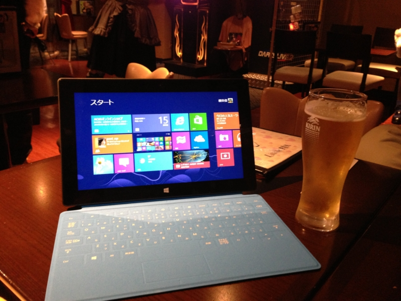

ごく一部、わたくしの観測範囲内でとても話題になっているタブレット、Surface RT を発売当日に購入。ヨドバシで予約注文して、クロネコで会社に届けてもらいました。<i>Windows ユーザーは Mac ユーザーみたいにいちいち店に並んで買わねーんだよ！　</i>そういうのは Windows 95 でやりつくしたからね。ウソです、知名度では完全に負けてますね。

<ul>
<li><a href="http://www.microsoft.com/Surface/ja-JP/surface-with-windows-rt/home">Surface RT &#x306B;&#x542B;&#x307E;&#x308C;&#x308B; Microsoft SkyDrive</a> （← なんだこのタイトル）</li>
</ul>

パッケージはなかなかカッコいい。いつも剥がすのに苦労するおれさまへの配慮か、テーピングひとつとっても心憎し。まぁ、最近では Apple を嚆矢に、こういった粋なパッケージングが当たり前になってきた気もするが……。

そして、御開帳！　AC アダプターの小ささに目を奪われる。タブレットのデキはまさに“上質”で、触って満足できる。軽量化だか何だか知らないが、プラスチック製でペラペラしたモノとは質感が違う。

ただ、知らない人が遠めにみたら単なるタブレットに見るかもしれない。やっぱりフタ代わりになるオシャレなキーボード TouchCover も買っていただきたい。iPad のお風呂カバーよりも断然イケてる。

TouchCover は打鍵感のない、触って入力する新しいキーボード。目の醒めるようなブルー一色がポップでカッコよく、赤も、白も揃えたくなる。実用性で言えば物理的なボタンを備える TypeCover を選ぶ方が賢い<a href="#f1" name="fn1" title="赤くないけど3倍速く入力できる">*1</a>けれど、黒しかなくて地味なんだよなぁ。

机を直接指先で叩いているかのような不思議な感覚に最初は戸惑うが、慣れれば案外サクサク、ペタペタと入力できる。これはこれでアリ。

贅沢を言うならば、ファンクションキーがない<a href="#f2" name="fn2" title="［Fn］キーとの組み合わせで使う">*2</a>のが個人的には痛い。日本語の入力変換で多用するので。ちょっと解決策を探ってみたい。

あと、「Microsoft Office」が付いているだとか、いろんな利点も（そしてそれ以上の弱点も……）あるのだけれど、ファーストインプレッションとしては<i>「こりゃぁ、なかなかいいなぁ！」</i>という感じ。月並みな言葉で申し訳ない。そうだねぇ、デジタルガジェットを買ってこれだけ満足したのは iPhone 3G を買った時以来かも。Microsoft にしてはスゴくイケてる（ぁ

さっそく会社帰りにアキバのメイドバーに寄って、 @shibayan と Surface をひらげてドヤ顔。メイドさんも、多少営業を交えつつ「カッコいい！」と大絶賛してくれました。

<a href="#fn1" name="f1" class="footnote-number">*1</a>:赤くないけど3倍速く入力できる

<a href="#fn2" name="f2" class="footnote-number">*2</a>:［Fn］キーとの組み合わせで使う

