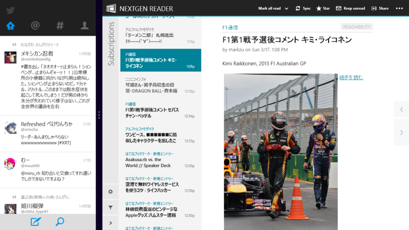
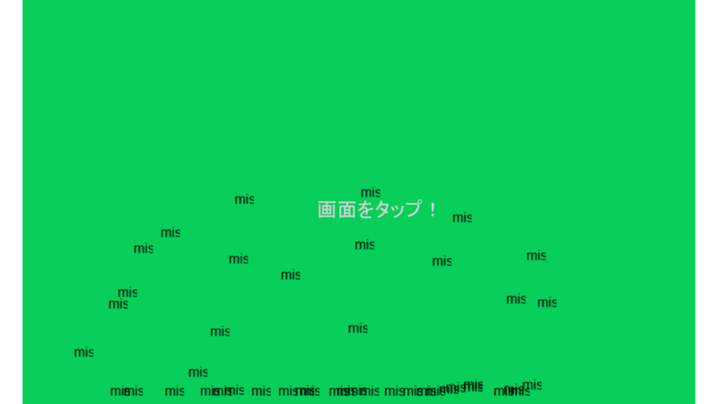
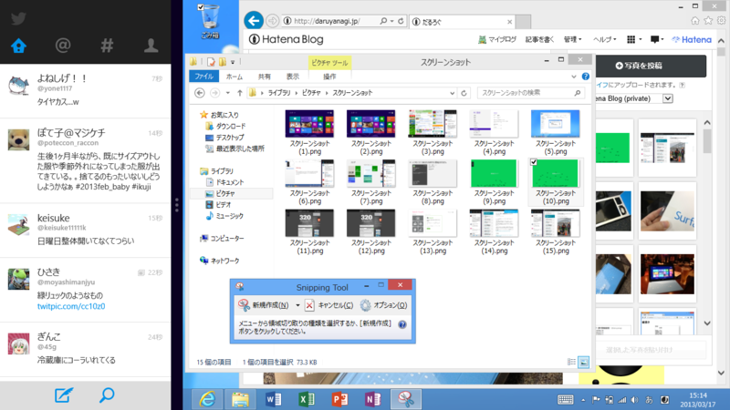

「Nextgen Reader」という Google Reader クライアントを購入、スナップモードの「Twitter」と一緒に使っているのだけれど、このモードがかなり気に入っている。 「Nextgen Reader」から「Internet Explorer」へ飛んでも、左端から右へフリックすればアプリ切り替えで「Nextgen Reader」から戻れる。それは「Twitter」のリンクをクリックしても同様。使い方がハマれば、Windows RT はだいぶ使えると思った。

<ul>
<li><a href="http://apps.microsoft.com/windows/ja-JP/app/nextgen-reader/30648d7a-f0b5-4719-8ca9-7ed6ce3b4b9b">Nextgen Reader &#x3092;&#x8CFC;&#x5165; - Microsoft Store ja-JP</a></li>
<li><a href="http://apps.microsoft.com/windows/ja-JP/app/twitter/8289549f-9bae-4d44-9a5c-63d9c3a79f35">Twitter &#x3092;&#x5165;&#x624B; - Microsoft Store ja-JP</a></li>
</ul>
ただ、不満なところもちょこちょこ。

<h3>アプリの数・品質</h3>

全般的にまだまだ不安定。クソアプリしかリリースしていない自分が言うのもなんだけどね。これはみんなでノウハウを共有して、少しずつ改善するしかない。

Windows RT そのものにも、まだだ改善の余地があると思った。とくにビルトインアプリ……超絶便利というわけでもないし、デザインもそっけなく、使っててワクワクしない。ニコニコ動画みたいに、動画の再生＋オーバーレイとかすると、途端にコマ落ち・音割れが発生するあたり、チューニング不足も感じられる。iOS ではできるのに、Windows RT ではしんどいということがよくある。

あと、個人的に <a href="https://blog.daruyanagi.jp/entry/2012/10/25/220840">Windows 8&#x306B;&#x7652;&#x3057;&#x3068;&#x71B1;&#x72C2;&#x3092;&#x3082;&#x305F;&#x3089;&#x3059;&#x723D;&#x5FEB;&#x306A;&#x5208;&#x308A;&#x53D6;&#x308A;&#x30B2;&#x30FC;&#x30E0;&#x300C;&#x3044;&#x3064;&#x3082;&#x30CB;&#x30B3;&#x30CB;&#x30B3;&#x3042;&#x306A;&#x305F;&#x306E;&#x307E;&#x308F;&#x308A;&#x306B;&#x8513;&#x5EF6;&#x308B;&#x3060;&#x308B;&#x3055;&#x3093;&#x300D; - &#x3060;&#x308B;&#x308D;&#x3050;</a> が Surface RT で動作しなかったのが悲しかった。ただ、これは @mitsuba_tan が対応してくれるらしいので一安心。もうひとつの代表的な“だるやなぎ”アプリ「daruyama」も動作しなかった。とくにゲーム系を中心に、ARM 環境をサポートしていなかったり、テストが十分だったりしない場合が結構ある印象。まぁ、ARM タブレットそのものがこれまでほとんど普及していなかったのだからしょうがないところ。

<ul>
<li><a href="http://apps.microsoft.com/windows/ja-jp/app/daruyama/16347cc3-54e3-468d-a0b8-70122bc69628">http://apps.microsoft.com/windows/ja-jp/app/daruyama/16347cc3-54e3-468d-a0b8-70122bc69628</a></li>
</ul>

<h3>ブログが書けねぇ！</h3>

Windows RT でよく言われる欠点「既存の Windows アプリが動作しない」というのは、それほど苦には感じない。ただし、ブログを書くときは別。これはかなり苦しい。

ボクがブログ記事を書くときのフローは、

<ul>
<li>「WinSnap」などのツールで画面をキャプチャー</li>
<li>「SkyDrive」「Dropbox」などで画像（ときにはメモなども）を自動的に同期</li>
<li>「Paint.NET」で加工</li>
<li>「はてなブログ」のサイドバーにドラッグ＆ドロップでアップロード</li>
</ul>
このうち、最初の3つのフローはデスクトップアプリじゃないと無理なんだなぁ。ストアアプリでもオンラインストレージの画像にアクセスできるけれど、修正・編集までできるわけでもなく。「WinSnap」は標準搭載の「Snipping Tool」（こいつはまぁまぁ使える）で代用できるとして、「Paint.NET」の代わりが「ペイント」というのがだいぶつらい。

まぁ、テキストだけのブログならば不自由しないし、手書きのペイントソフトはいくつかあるので（本当は「Adobe Idea」みたいなのがほしい）、Surface RT で辛いのはソフトウェアに関する雑談記事ぐらいなものなのだけれど。

<h3>まとめにならないまとめ</h3>

なんというか、“ファイルから始めるオペレーション”は全般的にしんどい。ファイルのコンテキストメニューでアプリを起動して編集し、そのファイルをドラッグ＆ドロップでほかのアプリで開く、というような。

ここは脳みその転換をしなきゃいけない。<i>「それを実現するのに“ファイル”という概念が必要ですか？」</i>たぶん、アプリを作る側もあんまりファイルを意識させないような作りにすべき。［共有］チャームでほかのアプリに“コンテンツ”を渡せる、といったように。思い返してみれば、Surface RT がハマる使い方っていうのは“ファイル”が介在しない操作が圧倒的に多いように感じる。

Windows 8 のファイルピッカーのデザインがいまいちなのは、そういう理由もあるんだと思うんですよ（違

まぁ、いろいろ言ったけど、ちゃぶ台で使うなら Surface RT がかなりいい。今日は昼から少し作業をしていたのだけれど、デスクトップではなくコタツで Surface RT を使ってた。これを iPad mini でやろうとは思えないわけで、やっぱり適所適材だのぉ、などと月並みな感想を抱いたりしている。

