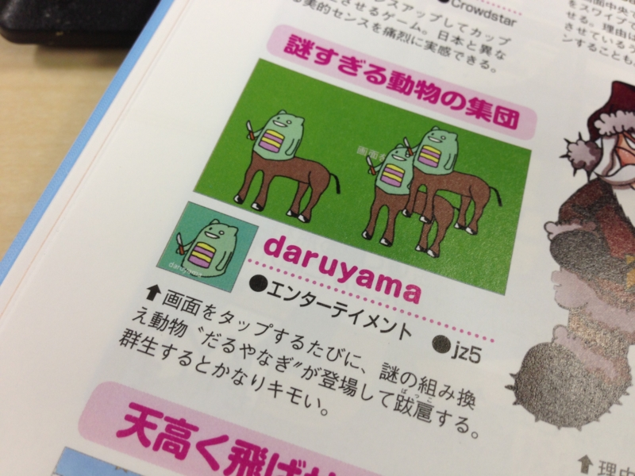

<a href="http://garicchi.com/blog/?p=241">http://garicchi.com/blog/?p=241</a> で知ったのだけれど、だるやなぎアプリの一角を占める「daruyama」が週刊アスキーの増刊号に掲載されたのだそうだ。

<a href="http://www.amazon.co.jp/exec/obidos/ASIN/B00BEZ37VY/bestylesnet-22/">週刊アスキー 4/26号増刊 8・7・XPで使える Windows無料ソフト2013版</a>
<ul><li>出版社/メーカー: アスキー・メディアワークス</li><li>発売日: 2013/03/15</li><li>メディア: 雑誌</li><li> クリック: 1回</li><li><a href="http://d.hatena.ne.jp/asin/B00BEZ37VY/bestylesnet-22" target="_blank">この商品を含むブログを見る</a></li></ul>

ちなみに“だるやなぎ”そのものは遺伝子組み換え動物じゃない。だるやなぎ“の”遺伝子組み換え動物が沸くだけだ。あと、いかに正しいとはいえ“群生するとキモい”といわれると悲しい。いや、まぁ、いいんですけど（笑

ちなみに、<a href="https://blog.daruyanagi.jp/entry/2013/03/17/231841">&#x3068;&#x308A;&#x3042;&#x3048;&#x305A;1&#x65E5;&#x4F7F;&#x3063;&#x3066;&#x307F;&#x3066;&#x611F;&#x3058;&#x305F; Surface RT &#x306E;&#x6B8B;&#x5FF5;&#x306A;&#x3068;&#x3053;&#x308D; - &#x3060;&#x308B;&#x308D;&#x3050;</a> で「ARM で動作しない」と書いたけれどあれは間違いというか、あの後ちゃんと動いた。初回実行時にはインターネット接続が必要なのかもしれない？　あんまりよく検証してない。

ちなみに、元ネタはこれらしい。京大かどこかの研究室。

<ul>
<li><a href="http://apps.microsoft.com/windows/ja-jp/app/daruyama/16347cc3-54e3-468d-a0b8-70122bc69628">http://apps.microsoft.com/windows/ja-jp/app/daruyama/16347cc3-54e3-468d-a0b8-70122bc69628</a></li>
</ul>
あと、こっちもよろしく。ARM 対応に期待！

<ul>
<li><a href="https://blog.daruyanagi.jp/entry/2012/10/25/220840">Windows 8&#x306B;&#x7652;&#x3057;&#x3068;&#x71B1;&#x72C2;&#x3092;&#x3082;&#x305F;&#x3089;&#x3059;&#x723D;&#x5FEB;&#x306A;&#x5208;&#x308A;&#x53D6;&#x308A;&#x30B2;&#x30FC;&#x30E0;&#x300C;&#x3044;&#x3064;&#x3082;&#x30CB;&#x30B3;&#x30CB;&#x30B3;&#x3042;&#x306A;&#x305F;&#x306E;&#x307E;&#x308F;&#x308A;&#x306B;&#x8513;&#x5EF6;&#x308B;&#x3060;&#x308B;&#x3055;&#x3093;&#x300D; - &#x3060;&#x308B;&#x308D;&#x3050;</a></li>
</ul>