
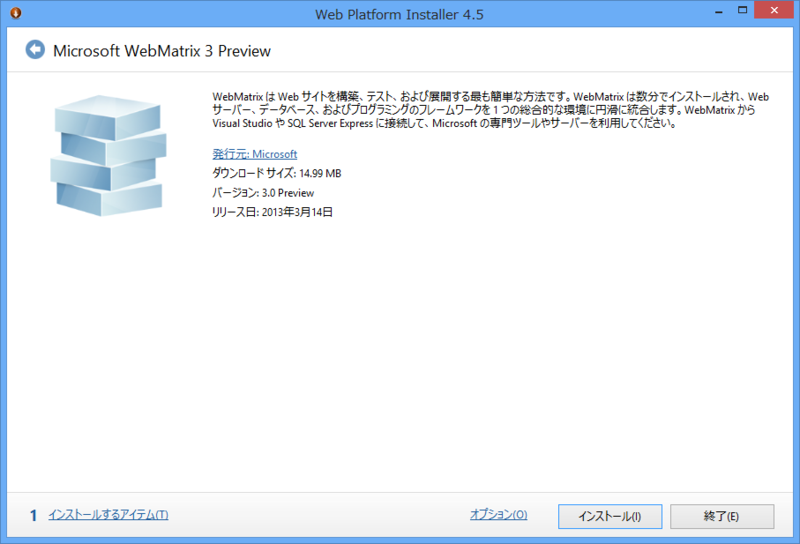

      Webmatrix 3 Preview available and it's cool, no seriously it's cool.<a class="twitter-tweet-url" href="http://t.co/TvNagkwlnw" target="_top">URL</a>

<a href="http://twitter.com/patricsmsdn/status/314730319263698944" class="twitter-detail-info-permalink">2013-03-21 22:28:50</a> via web

ｷﾀ━━━━━━(ﾟ∀ﾟ)━━━━━━!!!!

<h3>早速インストール</h3>

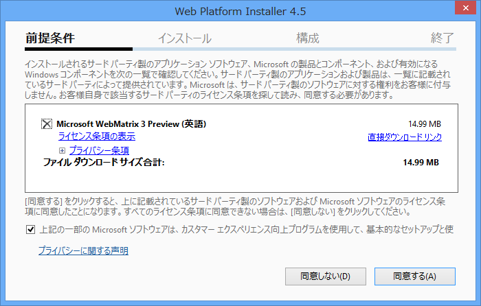

「英語版」らしい。日本語版もあればいいけど、べつに英語でもいいや。

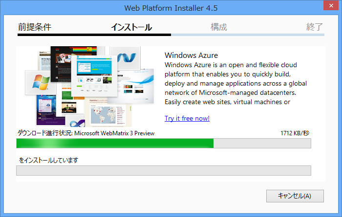

踊りながらセットアップを待つ。

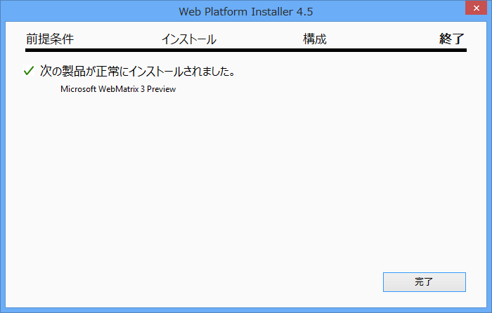

依存関係周りは WebMatrix 2 と変わらなさそう。自分の環境では何も要求されなかった。

<h4>追記（2013-03-22 6:10 JST）</h4>

      @<a class="twitter-user-screen-name" href="http://twitter.com/daruyanagi" target="_top">daruyanagi</a> 今回からSQL Server等の余計なインストールを要求されることがなくなっているはずです。今までWMをインストールしようとすると大量の追加インストールが必要だったのが、かなり改善されています。まあ既にインストールされてる場合は関係ないんですけど

<a href="http://twitter.com/superriver/status/314845330191568898" class="twitter-detail-info-permalink">2013-03-22 06:05:50</a> via web to @<a href="http://twitter.com/daruyanagi/status/314843886386298880"  class="twitter-user-screen-name">daruyanagi</a>

帝国兵のひとが教えてくれました。確かに不要なものまでインストールされるのが不快だという人は多かったので、素晴らしい改善だと思います。

<h3>Windows Azure 連携</h3>

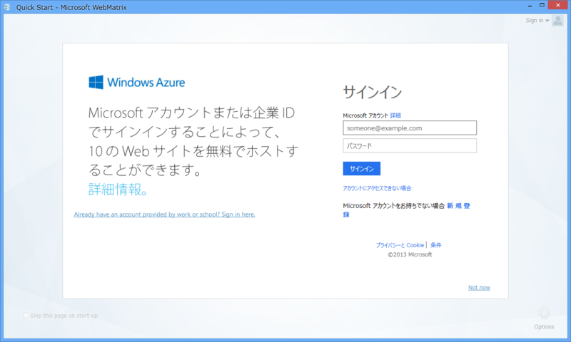

Microsoft ID （Windows Azure）でログインしろと言われる。たぶんこれは必須でないけれど、“Not now”のリンクが小さいので誤解されそう。とりあえず今回は素直にログインしてみる。

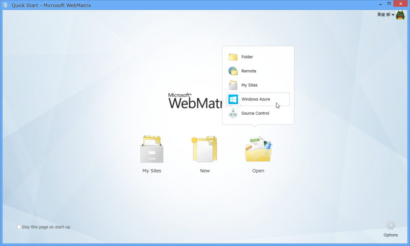

すると、スタートアップ画面に“Windows Azure”のメニューが！？　あかん、手が止まらへん。誘われるままにメニューをぽちっ。

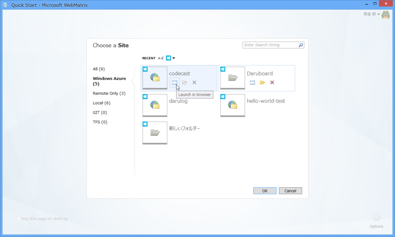

ふぁ━━━━━━(ﾟ∀ﾟ)━━━━━━!!!!

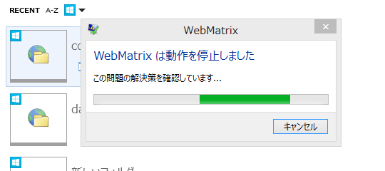

あかん、興奮しすぎて WebMatrix がクラッシュしてしまった。

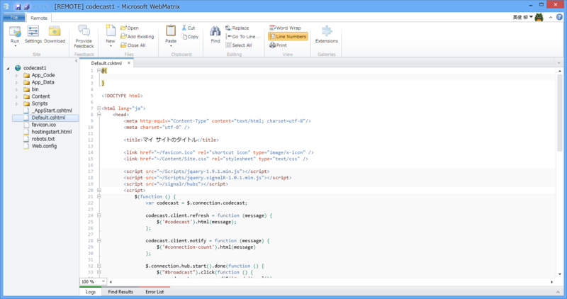

成功するとこんな感じ。“Windows Azure Web Sites”が直接開ける。もちろん、ダウンロードしてローカルで開くことも可能。

<h3>Source Control</h3>

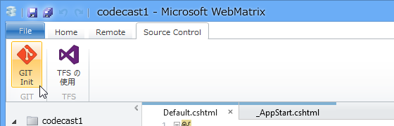

もう一つの目玉機能は、Source Control らしい。とりあえず初期状態で Git と TFS に対応している。

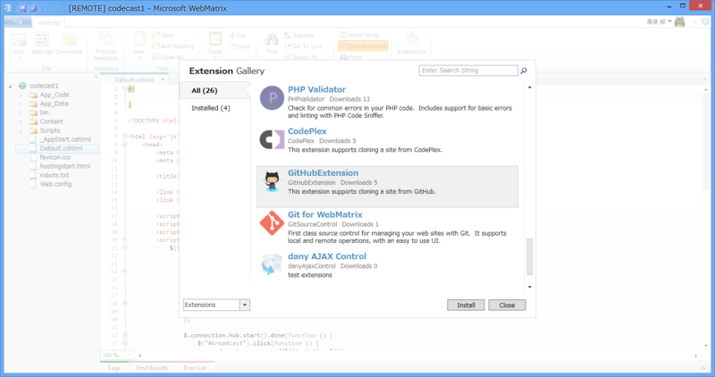

拡張機能として提供されているので、初回利用時にはインストールが必要。

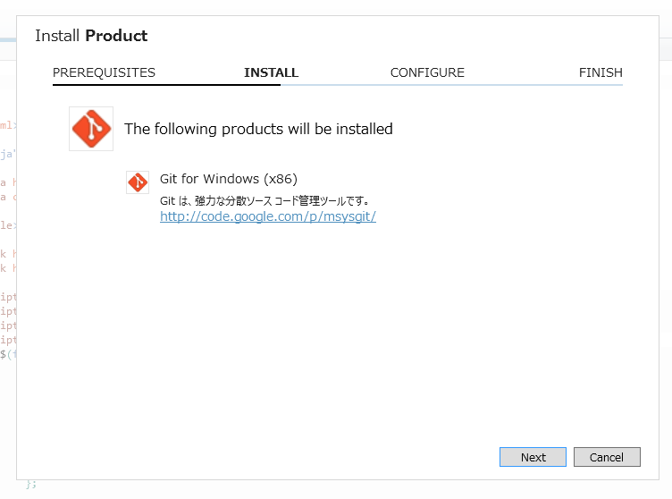

たとえば、Git Init しようとすると、「Git for Windows」がインストールされる。これって msysgit と一緒なのかなぁ？

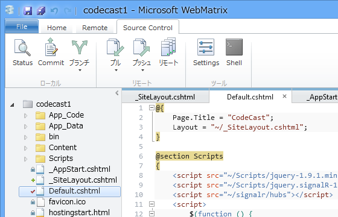

インストールするとこんな感じになる。一通りのことはできるみたいだけど、なんだあれ、巻き戻しとブランチのツリー？　アレはほしいと思った。あと、Diff は「WinDiff」を使うので見栄えがアレ。好みの Diff ツールが使えるみたいだが……できたらカッコいいのが内蔵されてほしい。

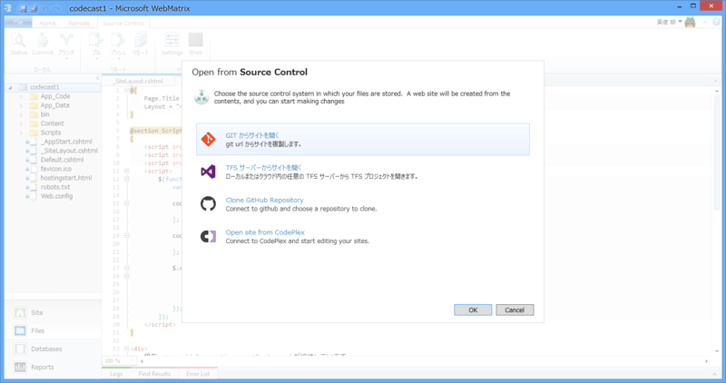

GitHub や CodePlex からプロジェクトをクローンすることもできる。

Source Control サービス → ローカルにクローンはできるけれど、ローカルのレポジトリ → Source Control サービスのプロジェクトの新規作成 はできないみたいなので、サービス側でプロジェクトを作ってクローンするのがいいのかな。

まだまだ全部みきれてないけれど、これはすごいアップデートだなぁ。ASP.NET Web Pages 3 なんかもでちゃったりするんだろうか？（笑

