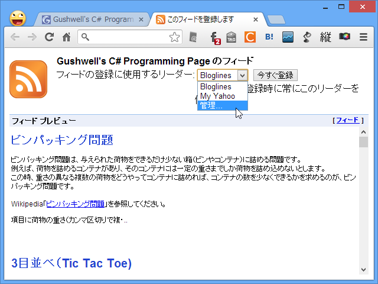
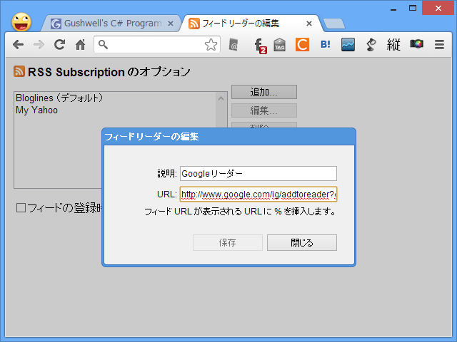

本格的に終わらせる気か……

とりあえず、“フィードリーダーの編集”画面にフィード購読用の URL を追加して対処。フィードを登録するときに出てくる、「iGoogle」か「Google リーダー」かを選択するあのおなじみの画面からリンクをコピって編集した。

<pre class="code" data-unlink>http://www.google.com/ig/addtoreader?&amp;feedurl=%s</pre>
そのうちこの URL もなくなってしまうのかな。

とりあえず、本当に死ぬまで Google リーダーは使い続けるつもり。代替サービスを見極めたいし、もしかしたら気が変わって存続してくれるとも限らない。

<blockquote cite="http://internet.watch.impress.co.jp/docs/news/20130314_591732.html">

米Googleは13日、RSSリーダーサービス「Google Reader」を7月1日に終了すると発表した。サービス終了の理由についてGoogleは、利用が減少していることに加えて、同社のエネルギーを選択したプロダクトに注ぐためだと説明している。

<cite><a href="http://internet.watch.impress.co.jp/docs/news/20130314_591732.html">RSS&#x30EA;&#x30FC;&#x30C0;&#x30FC;&#x300C;Google Reader&#x300D;&#x304C;7&#x6708;1&#x65E5;&#x306B;&#x7D42;&#x4E86; -INTERNET Watch</a></cite>
</blockquote>
