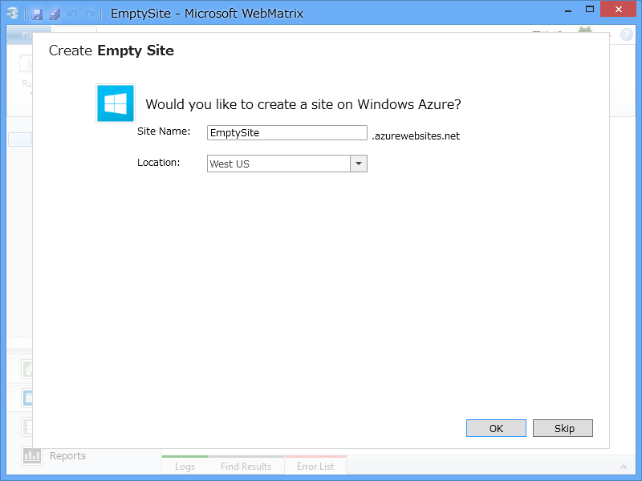
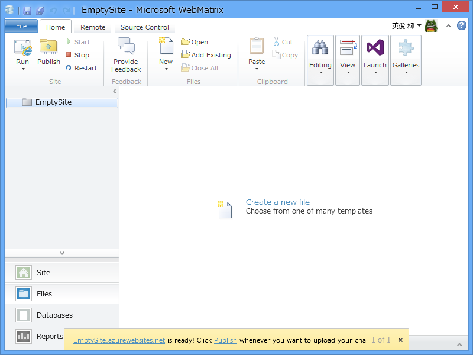
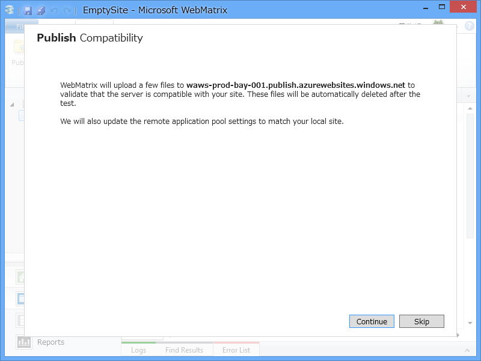
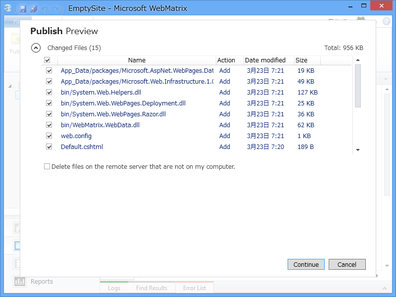
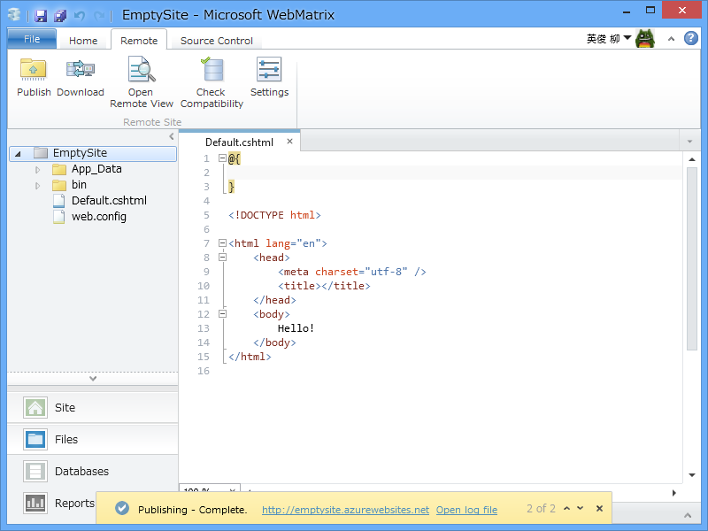
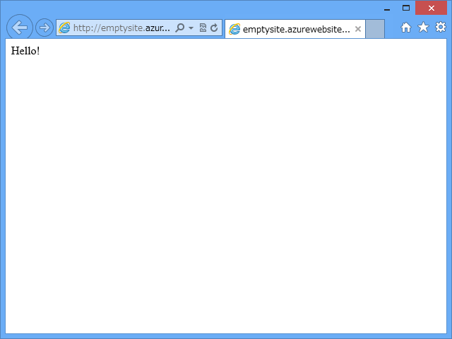

<a href="https://blog.daruyanagi.jp/entry/2013/03/22/060002">Microsoft WebMatrix 3 Preview - &#x3060;&#x308B;&#x308D;&#x3050;</a> の続きというか、補足のようなもの。

Windows Azure （Microsoft ID）でログインした状態で Web サイトを新規作成すると、「Windows Azure にもサイトを作らないか？（うほっ」と言われる。

素直にそれに従うと……フツーに Windows Azure Web Sites ができちゃう。もう簡単すぎて笑うしかない……。まぁ、もともと Windows Azure は簡単だけれど。

さすがにこれだけだと空なので、Default.cshtml でもおいて公開してみる。いつも通り［Publish］ボタンを押すと、初回は互換性チェックが走って……

ファイルのアップロードをして……

完成。

あー、全部 Azure Web Sites にしてしまいたいなぁ。実はそれほど高くなさそうなのだけれど、サブドメイン使いまくってるとやっぱり ExpressWeb には勝てないわけで。

GitHub や CodePlex を使うつもりならば、そっちでプロジェクトを作成し、WebMatrix 3 でクローンするといい。おんなじ感じで Azure Web Sites も簡単に作れる。

<h4>おまけ</h4>

@ishisaka さんが Git 周りを中心に WebMatrix 3 の記事を書いてくれているので必見やで。

<ul>
<li><a href="http://opcdiary.net/?p=26455">WebMatrix 3 Preview&#x30EA;&#x30EA;&#x30FC;&#x30B9; &#x7279;&#x306B;Git&#x95A2;&#x9023;&#x6A5F;&#x80FD;&#x306E;&#x7D39;&#x4ECB; | OPCDiary</a></li>
</ul>

