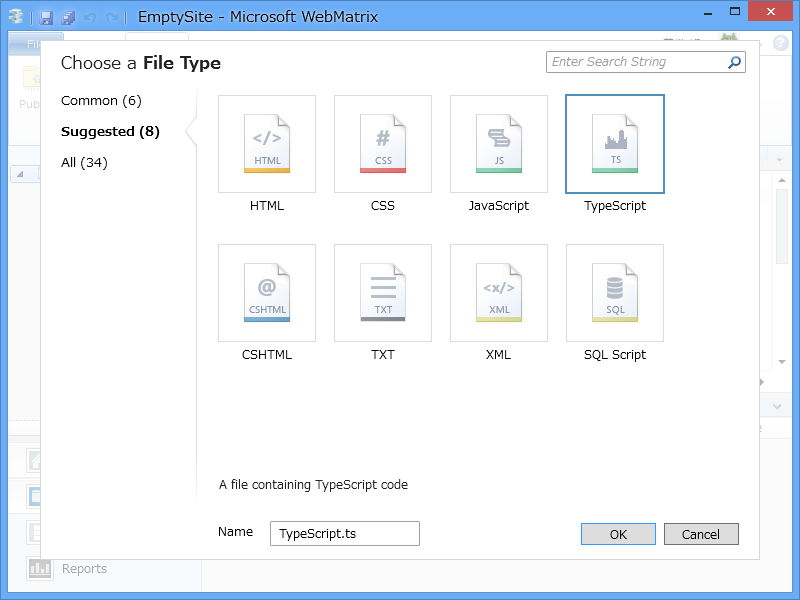
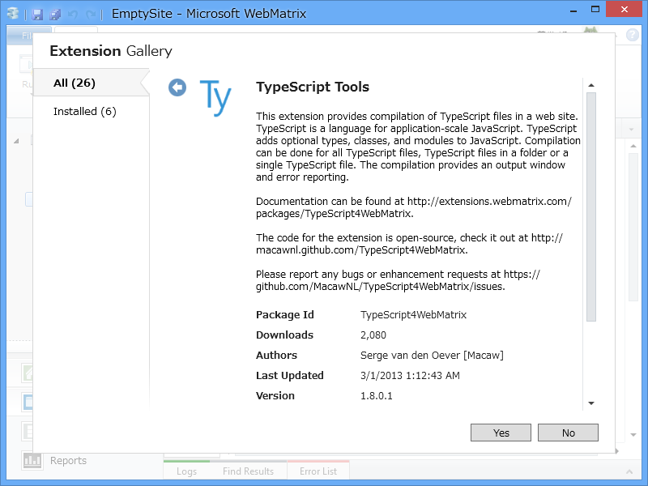
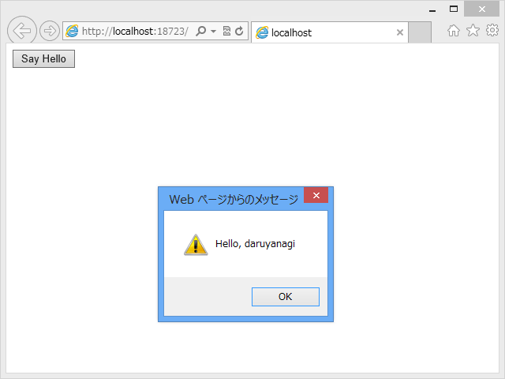

<blockquote cite="http://www.microsoft.com/web/post/webmatrix-3-preview-release-notes?category=Documentation">

Hugely improved remote editing experience with great code completion and colorization for PHP, ASP.NET as well as Node.js. Support for TypeScript is now included.

<cite><a href="http://www.microsoft.com/web/post/webmatrix-3-preview-release-notes?category=Documentation">WebMatrix 3 Preview Release Notes</a></cite>
</blockquote>

確かに、追加できるファイルの形式に TypeScript（*.ts）が追加されている。

ただ、これは構文色分けのサポートだけみたい。入力補完もコンパイルもできない。

まぁ、以前のバージョンでは構文色分けもできなかった<a href="#f1" name="fn1" title="http://www.forest.impress.co.jp/docs/review/20121017_566289.html">*1</a>わけで、それだけでもだいぶうれしいところではある。

なお、TS ファイルのコンパイルを行うには、今までどおり拡張機能「TypeScript Tools」（<a href="http://extensions.webmatrix.com/packages/TypeScript4WebMatrix">WebMatrix Gallery</a>）が必要。拡張機能ボタンからインストールしてくれたまい。

あとは、コンパイルするとできる JS ファイルを……

HTML から呼び出せば……

ちゃんと使える。

おれ……TypeScript が Generics に対応したら本気出すんだ……。

<a href="#fn1" name="f1" class="footnote-number">*1</a>:http://www.forest.impress.co.jp/docs/review/20121017_566289.html

