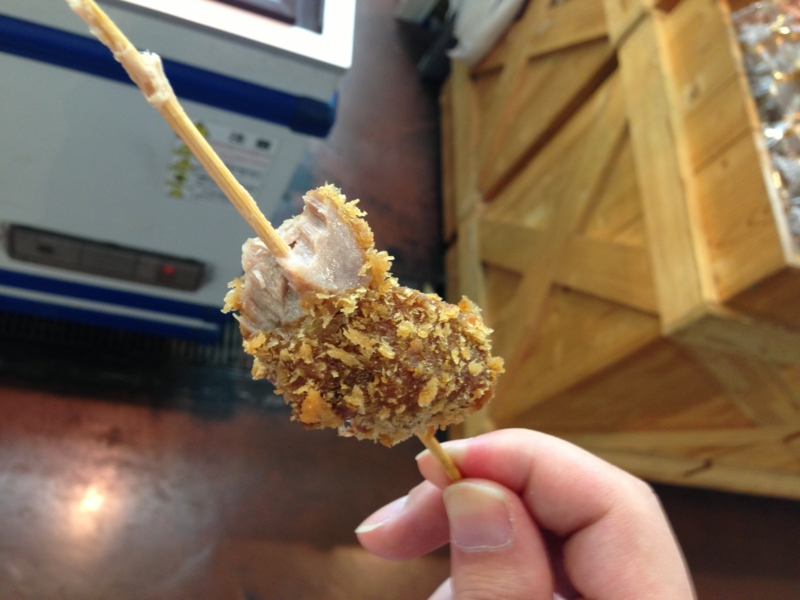
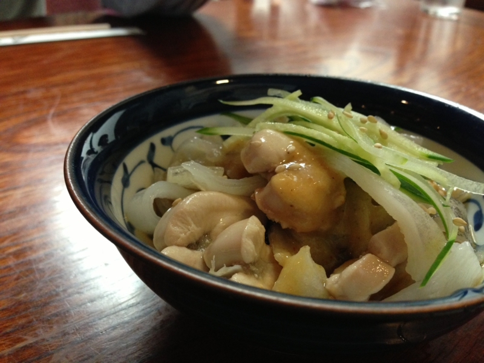
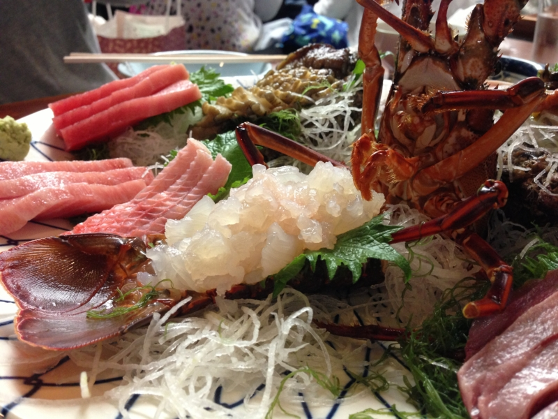
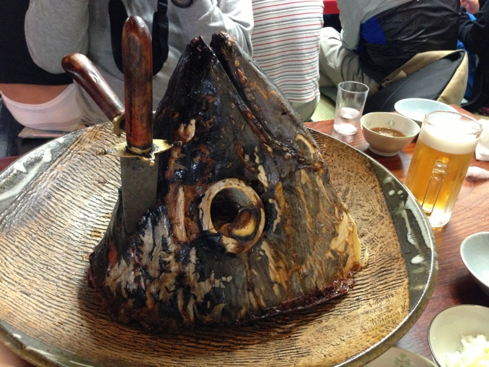
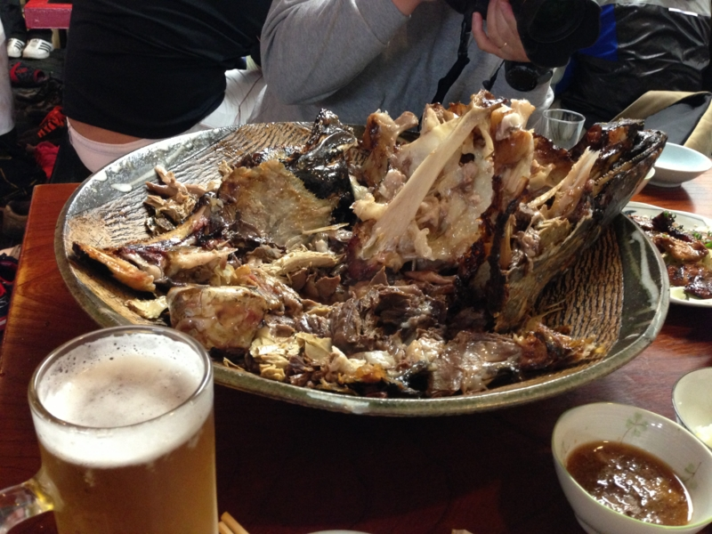
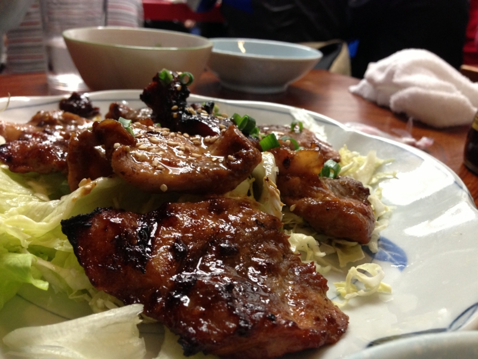
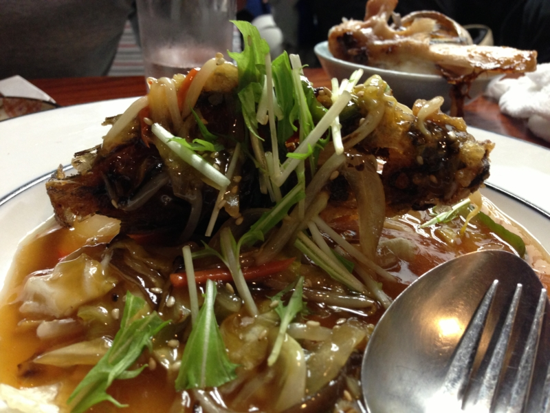

Y 氏が虎○門病院へ入院し、白衣の天使と戯れること幾星霜。やっとこさそれにも飽きて退院したらしいので、@subsfn の企画の下、快気祝いを兼ねて三浦半島に来駕してやった。途中、港でマグロ串を買い食いしたりしつつ、お昼時に予約済みのお店へ。

<h3>くろば亭</h3>

ちょっと早く着きすぎたので、おつまみや……

お刺身をアテにビールを愉しむ。@subsfn がお酒飲めなくてよかった……じゃなくて、毎度さっさと酔っぱらって、お前にばかり運転させてすまん。

今回のメインはマグロの兜焼き（？）。これでも少人数向けの小さいものなのだけれど、そのデカさに圧倒される。

するとそこへおっさんが現れて、鮮やかな手さばきであっという間にバラバラになった<a href="#f1" name="fn1" title="この様子は Facebook にアップロードしている。 https://www.facebook.com/photo.php?v=10200121462054071">*1</a>。マグロを供養するために謎の念仏・祈祷もしていたけど、なんかハゲ頭に圧倒されて写真に収めるのを忘れていた。

あとは、マグロのカルビ焼きだの、カサゴの天ぷらのあんかけなども堪能。途中、Y 氏が食べ過ぎてダウンしたけど、つつがなく昼食は終了しました。

<b>ご請求、一人一万円超えた／(＾o＾)＼</b>

<iframe width="425" height="350" frameborder="0" scrolling="no" marginheight="0" marginwidth="0" src="https://maps.google.co.jp/maps?ie=UTF8&amp;q=%E3%81%8F%E3%82%8D%E3%81%B0%E4%BA%AD&amp;fb=1&amp;gl=jp&amp;hq=%E3%81%8F%E3%82%8D%E3%81%B0%E4%BA%AD&amp;hnear=%E3%81%8F%E3%82%8D%E3%81%B0%E4%BA%AD&amp;cid=0,0,293693934677962691&amp;t=m&amp;brcurrent=3,0x60183c8f0a66e4af:0xce232ec6167b8f27,0&amp;ll=35.144828,139.622176&amp;spn=0.006141,0.00912&amp;z=16&amp;iwloc=A&amp;output=embed"></iframe> <small><a href="https://maps.google.co.jp/maps?ie=UTF8&amp;q=%E3%81%8F%E3%82%8D%E3%81%B0%E4%BA%AD&amp;fb=1&amp;gl=jp&amp;hq=%E3%81%8F%E3%82%8D%E3%81%B0%E4%BA%AD&amp;hnear=%E3%81%8F%E3%82%8D%E3%81%B0%E4%BA%AD&amp;cid=0,0,293693934677962691&amp;t=m&amp;brcurrent=3,0x60183c8f0a66e4af:0xce232ec6167b8f27,0&amp;ll=35.144828,139.622176&amp;spn=0.006141,0.00912&amp;z=16&amp;iwloc=A&amp;source=embed" style="color:#0000FF;text-align:left">大きな地図で見る</a></small>

<h3>ホテル京急油壺観潮荘</h3>

メシの後は、海洋深層水とやらの温泉でのんびり、適当に駄弁ってた。いい天気、ほどよい気温、海が見えていい感じ。

<iframe width="425" height="350" frameborder="0" scrolling="no" marginheight="0" marginwidth="0" src="https://maps.google.co.jp/maps?ie=UTF8&amp;q=%E3%83%9B%E3%83%86%E3%83%AB%E4%BA%AC%E6%80%A5%E6%B2%B9%E5%A3%BA%E8%A6%B3%E6%BD%AE%E8%8D%98&amp;fb=1&amp;gl=jp&amp;hq=%E3%83%9B%E3%83%86%E3%83%AB%E4%BA%AC%E6%80%A5%E6%B2%B9%E5%A3%BA%E8%A6%B3%E6%BD%AE%E8%8D%98&amp;cid=0,0,4386145909584337459&amp;t=m&amp;brcurrent=3,0x60183c6891e875fd:0x3f2dce4e401d4c74,0&amp;ll=35.16381,139.615524&amp;spn=0.00614,0.00912&amp;z=16&amp;iwloc=A&amp;output=embed"></iframe> <small><a href="https://maps.google.co.jp/maps?ie=UTF8&amp;q=%E3%83%9B%E3%83%86%E3%83%AB%E4%BA%AC%E6%80%A5%E6%B2%B9%E5%A3%BA%E8%A6%B3%E6%BD%AE%E8%8D%98&amp;fb=1&amp;gl=jp&amp;hq=%E3%83%9B%E3%83%86%E3%83%AB%E4%BA%AC%E6%80%A5%E6%B2%B9%E5%A3%BA%E8%A6%B3%E6%BD%AE%E8%8D%98&amp;cid=0,0,4386145909584337459&amp;t=m&amp;brcurrent=3,0x60183c6891e875fd:0x3f2dce4e401d4c74,0&amp;ll=35.16381,139.615524&amp;spn=0.00614,0.00912&amp;z=16&amp;iwloc=A&amp;source=embed" style="color:#0000FF;text-align:left">大きな地図で見る</a></small>

さいごに、@subsfn 氏、第二子の誕生おめでとう！　カードキャプターの未来に幸多からんことを。

<a href="#fn1" name="f1" class="footnote-number">*1</a>:この様子は Facebook にアップロードしている。 https://www.facebook.com/photo.php?v=10200121462054071

