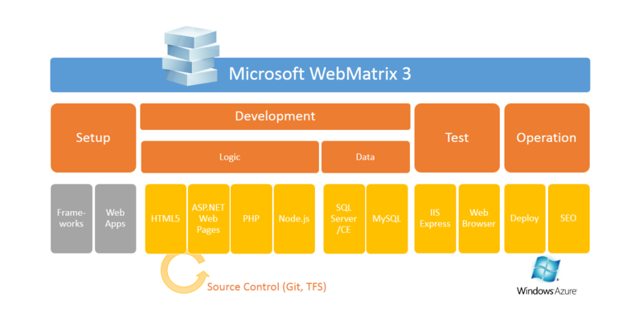

<blockquote cite="http://www.microsoft.com/japan/web/webmatrix/">

WebMatrix はマイクロソフトが提供する無料の Web サイト構築ツールで、Web サイトの初期設定・編集、公開といった一連の Web サイト構築作業を “カンタン” に行う事ができます。

<cite><a href="http://www.microsoft.com/japan/web/webmatrix/">Microsoft Web Platform</a></cite>
</blockquote>

WebMatrix とは、

<ul>
<li><b>Setup</b>：ライブラリ、フレームワーク、オープンソースで提供されている各種 Web アプリケーションのインストール</li>
<li><b>Development</b>：HTML（CSS、JavaScript、TypeScript ）＋DB（SQL Server、MySQL）による Web アプリケーションの開発。開発言語として ASP.NET Web Pages、PHP、Node.js をサポート。NuGet、OpenAuth 認証、モバイル開発にも対応。</li>
<li><b>Test</b>：IIS Express での実行、IE / Firefox / Chrome……によるテスト</li>
<li><b>Operation</b>：Web サーバーへの配置、SEO</li>
</ul>
といった作業をシームレスに行うための統合ツール。

次期バージョン「<a href="http://www.microsoft.com/web/webmatrix/next/">WebMatrix 3</a>」では

<ul>
<li>Windows Azure Web Sites 連携の強化</li>
<li>Source Control（Git、TFS）機能の追加</li>
</ul>
が行われているけれど、こうやってみてみると根本的な立ち位置はあんまり変わっていない。

<ul>
<li><a href="http://www.forest.impress.co.jp/docs/news/20130325_593025.html">&#x300C;Microsoft WebMatrix 3 Preview&#x300D;&#x304C;&#x516C;&#x958B;&#x3001;Git/TFS&#x306B;&#x3088;&#x308B;&#x30BD;&#x30FC;&#x30B9;&#x30B3;&#x30FC;&#x30C9;&#x7BA1;&#x7406;&#x6A5F;&#x80FD;&#x3092;&#x7D71;&#x5408; - &#x7A93;&#x306E;&#x675C;</a></li>
</ul>
もちろん一部も機能だけをとりだして、たとえば WordPress のセットアップとデプロイのためだけに使ったり、JavaScript のエディターとして使ってもいいと思う。どちらかというと簡易ツールという位置づけなので、なにか困ったり、もっと高度なことがしたければ「Visual Studio」を使えばいい。「WebMatrix」から簡単に呼び出せる。

