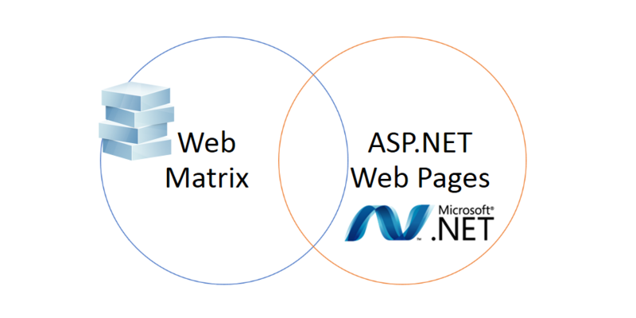
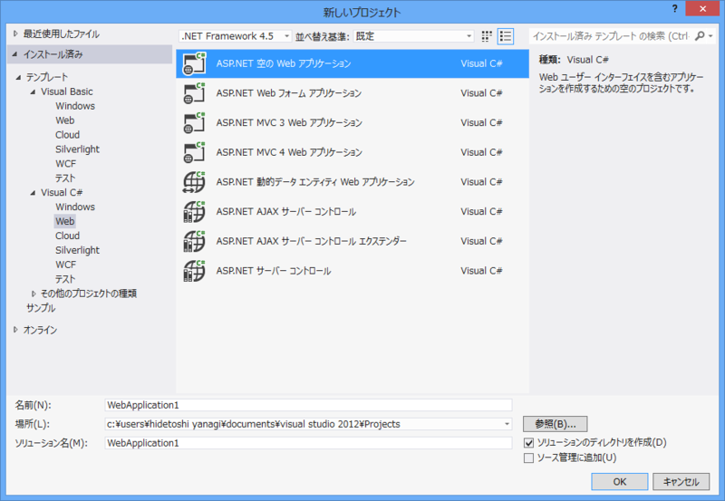

<h3>WebMatrix と ASP.NET Web Pages</h3>

 

<ul>
<li><a href="https://blog.daruyanagi.jp/entry/2013/03/20/064753">ASP.NET Web &#x30DA;&#x30FC;&#x30B8;&#x3068;&#x306F; - &#x3060;&#x308B;&#x308D;&#x3050;</a></li>
<li><a href="https://blog.daruyanagi.jp/entry/2013/03/26/060901">WebMatrix &#x3068;&#x306F; - &#x3060;&#x308B;&#x308D;&#x3050;</a></li>
</ul>
これでだいたい ASP.NET Web Pages と WebMatrix の違いは説明できるかなぁ、と思う。

<ul>
<li>WebMatrix は ASP.NET Web Pages の開発<b>も</b>できる開発環境</li>
<li>ASP.NET Web Pages は WebMatrix で<b>も</b>使えるフレームワーク</li>
</ul>
ってな感じですね。

ASP.NET Web Pages そのものは開発環境に依存しない。

<ul>
<li>Microsoft .NET Framework 4 以降</li>
<li>ASP.NET MVC (ASP.NET Web Pages もインストールされる)</li>
<li>IIS Express</li>
<li>Microsoft SQL Server Compact 4.0（使わないなら入れなくていいと思う）</li>
</ul>
と、ソースコードを記述するためのテキストエディターがあればよい。必要なコンポーネントは <a href="http://www.microsoft.com/web/downloads/platform.aspx">Web Platform Installer : The Official Microsoft IIS Site</a> で個別にインストール可能で、

<pre class="code" data-lang="" data-unlink>iisexpress.exe /port:35896 /path:C:\Path\To\WebSite</pre>
とコマンドを打てば、Web サイト（Web アプリケーション）を実行できる。

<ul>
<li><a href="http://www.asp.net/web-pages/overview/getting-started/aspnet-web-pages-(razor)-faq">ASP.NET Web Pages (Razor) FAQ | Microsoft Docs</a></li>
</ul>

<h3>Visual Studio と APS.NET Web Pages</h3>

ASP.NET Web Pages の開発には、WebMatrix 以外にも、Visual Studio が利用できる。対応バージョンの関係は以下の通り。

<table>
<tr>
<td></td>
<th>Visual Studio 2010</th>
<th>Visual Studio 2012</th>
</tr>
<tr>
<th>ASP.NET Web Pages 1.0</th>
<td>Install ASP.NET MVC 3</td>
<td>Install ASP.NET MVC 3</td>
</tr>
<tr>
<th>ASP.NET Web Pages 2</th>
<td>Install ASP.NET MVC 4</td>
<td>（Included）</td>
</tr>
</table>
今のところ、「ASP.NET MVC - 2」が ASP.NET Web Pages のバージョンみたいだね。

ちなみに、入門者向けに無償提供されている Visual Studoio 2012 Express for Web でも ASP.NET Web Pages は利用可能<a href="#f-12dd82a7" name="fn-12dd82a7" title="Visual Web Developer はどうだか知らんけど、わざわざ古いものを使わなくていいと思う">*1</a>。 とくに問題がなければ入れておくことをお勧めする。

とはいえ、Visual Studio そのものに ASP.NET Web Pages のための特別なサポートがあるわけじゃない（MVC はがっつりサポートされてるけど）。サイトテンプレートもないし、CSHTML ファイルを追加するメニューすらない。なので、あくまでも WebMatrix をメインに開発しつつ、デバッグ機能やインスペクタ機能なんかが使いたくなったら Visual Studio を補助的に使うというのがオススメ。そっちのほうが ASP.NET Web Pages 本来の“軽量な”という理念にも合うしね。なんにしろ頼れるお兄さんがいるのは心強い。

<ul>
<li><a href="http://www.asp.net/web-pages/overview/using-visual-studio/program-asp-net-web-pages-in-visual-studio">http://www.asp.net/web-pages/overview/using-visual-studio/program-asp-net-web-pages-in-visual-studio</a></li>
</ul>

<h4>補足</h4>

WebMatrix で開発した Web サイトを Visual Studio で実行すると、

<blockquote>

型または名前空間名 'Linq' は名前空間 'System' に存在しません。アセンブリ参照が不足しています。

</blockquote>

などと表示され、うまく動作しないことがある。これはターゲットフレームワークが .NET Framework 2.0 （？）になっているからのようだ。Web.config に

<pre class="code lang-xml" data-lang="xml" data-unlink>&lt;?xml version=&quot;1.0&quot;?&gt;
&lt;configuration&gt;
&lt;system.web&gt;
&lt;compilation targetFramework=&quot;4.0&quot;&gt;&lt;!-- 4.5 でも？ --&gt;
&lt;/compilation&gt;
&lt;/system.web&gt;
&lt;/configuration&gt;
</pre>
という記述を追加しておくといい。

<a href="#fn-12dd82a7" name="f-12dd82a7" class="footnote-number">*1</a>:Visual Web Developer はどうだか知らんけど、わざわざ古いものを使わなくていいと思う

