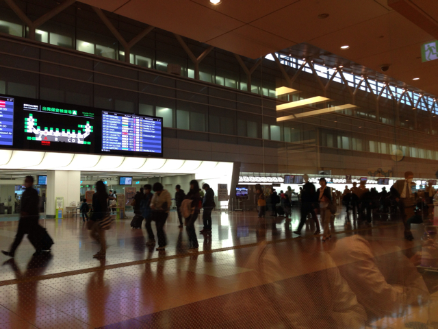
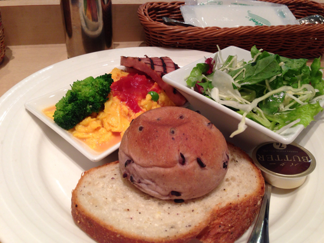
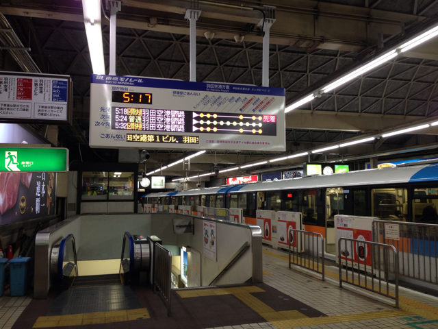
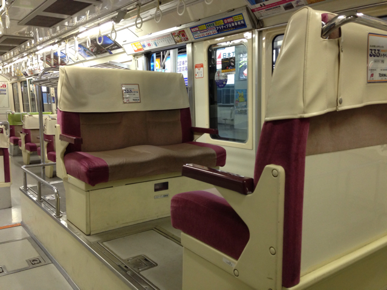

空港で朝ごはんを食べながら、このブログを書いている。

前回飛行機に乗り遅れたので、今回は気合をいれて早起きしたのだけど、流石にちょっと早かった。出発まで1.5時間以上ある。

そうそう、いつも羽田空港へ行くには京急を使うのだけど、今回はモノレールにしてみた。

正直、ガタガタ揺れて乗り心地は良くないけれど、景色はこちらの方がいい。夜明けの東京湾をみていると、ちょっとワクワクする。これからいろんなことが一斉に始まるんだって気がする。

それにしても、モノレールの座席配置は不思議。見ているだけで楽しい。

寝不足でちょっとハイテンションだけど、飛行機で寝られたらいいなぁ。

