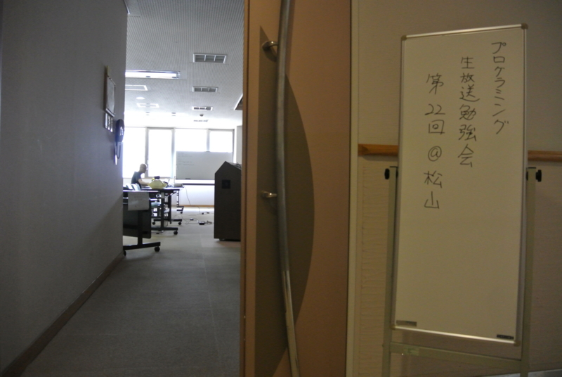
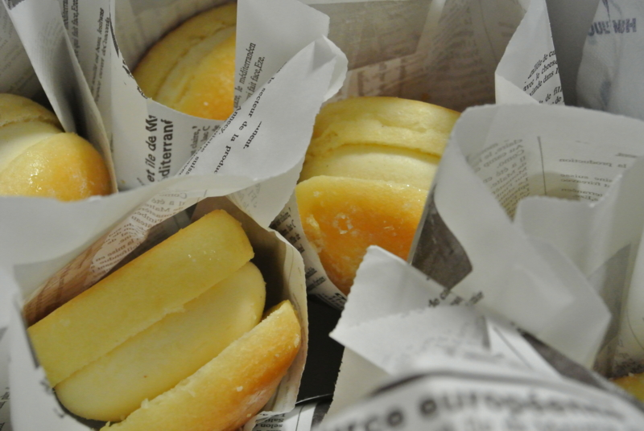
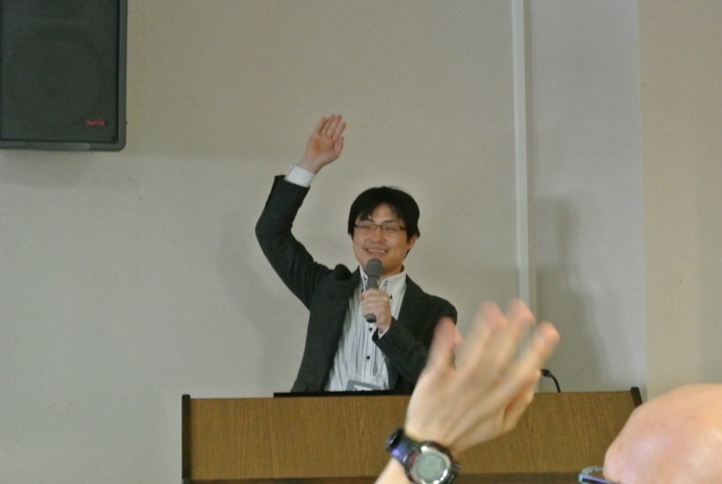
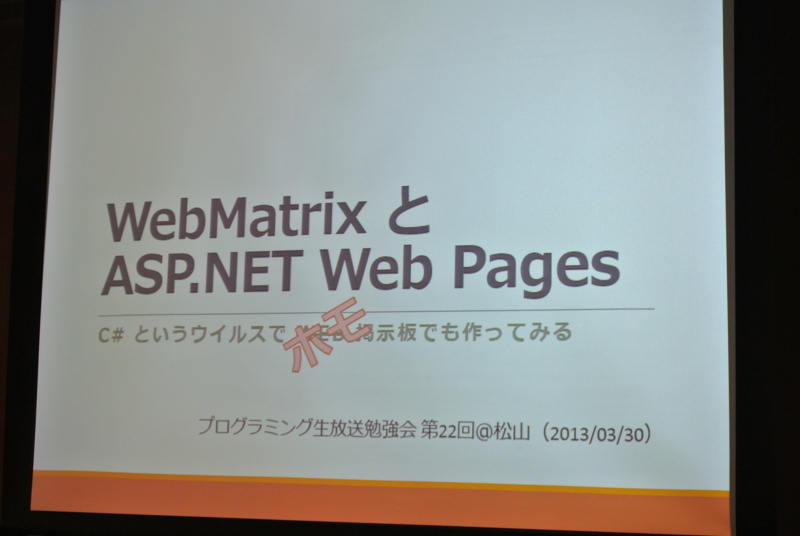
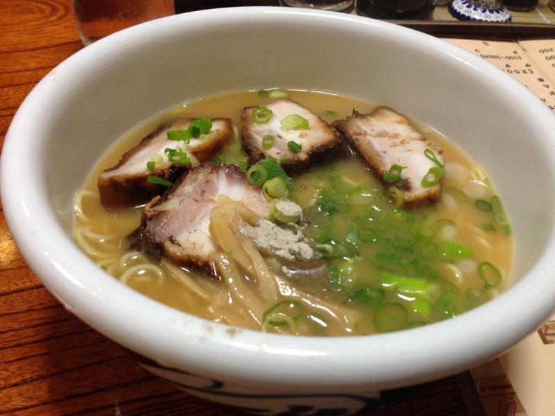

<ul>
<li><a href="http://atnd.org/events/37393">&#x30D7;&#x30ED;&#x30B0;&#x30E9;&#x30DF;&#x30F3;&#x30B0;&#x751F;&#x653E;&#x9001;&#x52C9;&#x5F37;&#x4F1A; &#x7B2C;22&#x56DE;&#xFF20;&#x677E;&#x5C71; #pronama : ATND</a></li>
</ul>
全体的なことについては、二人のブログにお任せします。とくに温かく迎えてくれた @nakaji には感謝、感謝です。差し入れのお菓子も、松山らしからぬハイセンスでした。@you_and_i さん、今度は名古屋にお邪魔しますよ！

<ul>
<li><a href="http://nakaji.hatenablog.com/entry/2013/04/02/013703">&#x30D7;&#x30ED;&#x30B0;&#x30E9;&#x30DF;&#x30F3;&#x30B0;&#x751F;&#x653E;&#x9001;&#x52C9;&#x5F37;&#x4F1A; &#x7B2C;22&#x56DE;&#xFF20;&#x677E;&#x5C71; &#x306B;&#x53C2;&#x52A0; #pronama - &#x306A;&#x304B;&#x65E5;&#x8A18;</a></li>
<li><a href="http://d.hatena.ne.jp/youandi/20130330/p1">&#x30D7;&#x30ED;&#x30B0;&#x30E9;&#x30DF;&#x30F3;&#x30B0;&#x751F;&#x653E;&#x9001;&#x52C9;&#x5F37;&#x4F1A; &#x7B2C;22&#x56DE;&#xFF20;&#x677E;&#x5C71; &#x306B;&#x53C2;&#x52A0; - &#x685C;&#x3001;&#x62B9;&#x8336;&#x3001;&#x767D;&#x3001;&#x65E5;&#x8A18;</a></li>
</ul>
今回は、セッションひとつと、ライトニングトークをひとつ、担当させてもらいました。生まれて初めてのセッションだったので、開始直前は緊張で左手が生まれたての小鹿のように震えていたのですが、開始早々笑いが取れたので楽になりました。聞いてくれてたみんな、ありがとう。

ただ、練習不足がたたって、用意したネタのいくつかを披露し損ねたのが残念ですね。とくに Windows Azure Web Sites と WebMatrix 3 Preview についてまったく話せなかったのは、時間の関係とニコ動の反応を見て自分でバッサリ削る決断をしたとはいえ、だいぶ残念なことでした。まぁ、それは次回のお楽しみということで。逆に、とっさに取り繕った Markdown のデモが成功したのは自分を褒めてあげたいですね（何

スライドはホモホモしいので公開しません。フォローアップ記事はあとで書きたいな。

ガキどもが比較的多く集まるプロ生向けに、わりかし砕けたものを用意したのですが、松山の会場は若干平均年齢が高く、ちょっと失敗したなぁ、と反省しています。ネタを削って真面目に話せば、時間も足りていたかも。けれど、ネタに力を入れた分、ニコ生のほうはウケていたようで安心しました。今回は ASP.NET Web Pages ってのがあるっていうだけ知って帰ってもらえれば十分かな。

自己採点をするなら、40点ですかね。いずれ @chack411 さんみたいにしゃべれるようになりたいです。

<h3>追伸</h3>

勉強会前に @nakaji と @jz5 で食べに行ったラーメンはコレ。

出汁が甘いけれど（個人的には好み）、結構癖になる感じが美味しい。あんまり期待せずに食べに行ったのだけど、案外気に入りました。

<iframe width="425" height="350" frameborder="0" scrolling="no" marginheight="0" marginwidth="0" src="https://maps.google.co.jp/maps?ie=UTF8&amp;q=%E7%93%A2%E5%A4%AA&amp;fb=1&amp;gl=jp&amp;hq=%E7%93%A2%E5%A4%AA&amp;cid=0,0,15820296508481762831&amp;t=m&amp;brcurrent=3,0x354fe58c4df61cc3:0xf5250d884f14952a,0&amp;ll=33.840907,132.761514&amp;spn=0.006238,0.00912&amp;z=16&amp;iwloc=A&amp;output=embed"></iframe> <small><a href="https://maps.google.co.jp/maps?ie=UTF8&amp;q=%E7%93%A2%E5%A4%AA&amp;fb=1&amp;gl=jp&amp;hq=%E7%93%A2%E5%A4%AA&amp;cid=0,0,15820296508481762831&amp;t=m&amp;brcurrent=3,0x354fe58c4df61cc3:0xf5250d884f14952a,0&amp;ll=33.840907,132.761514&amp;spn=0.006238,0.00912&amp;z=16&amp;iwloc=A&amp;source=embed" style="color:#0000FF;text-align:left">大きな地図で見る</a></small>

