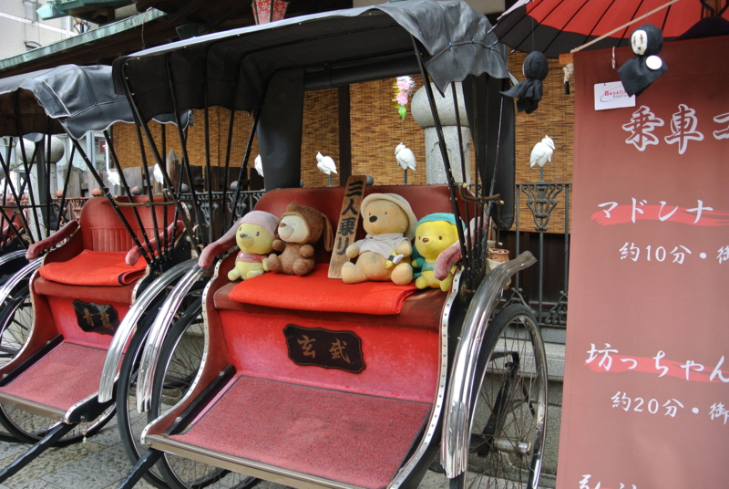
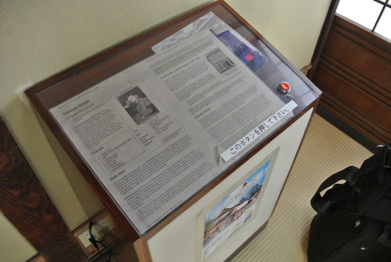
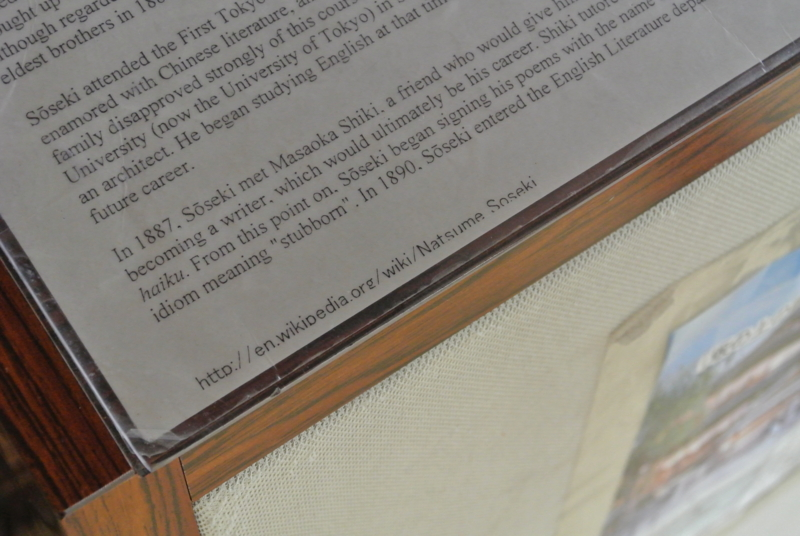

<a href="https://blog.daruyanagi.jp/entry/2013/04/03/080959">&#x9053;&#x5F8C;&#x6E29;&#x6CC9;&#x3078;&#x884C;&#x3063;&#x3066;&#x304D;&#x305F;&#x3063;&#x305F; - &#x3060;&#x308B;&#x308D;&#x3050;</a> に関連する小噺を一つ。

おっと、小噺で思い出したけど、セッションを担当するときは小噺を用意しておいた方がいいよ。デモで待ち時間が多いときや、失敗したのを取り繕うときに使える。<a href="https://blog.daruyanagi.jp/entry/2013/04/03/072017">&#x30D7;&#x30ED;&#x30B0;&#x30E9;&#x30DF;&#x30F3;&#x30B0;&#x751F;&#x653E;&#x9001;&#x52C9;&#x5F37;&#x4F1A; &#x7B2C;22&#x56DE;&#xFF20;&#x677E;&#x5C71;&#x306B;&#x53C2;&#x52A0;&#x3057;&#x3066;&#x304D;&#x307E;&#x3057;&#x305F; #pronama - &#x3060;&#x308B;&#x308D;&#x3050;</a> のデモで、ひたすら Git の競合を解決していた @nakaji が言ってた（ぁ

それはともかく。これを見てくれ。こいつをどう思う？

道後温泉本館には“坊っちゃんの間”というのがあって、夏目漱石に関する資料を集めた部屋がある。そこには英語での案内も掲示されているのだけれど。

まさかの Wikipedia 丸コピ！！

@5zj が見つけたのだけれど、だいぶ笑った。

でも、まぁ、いいんじゃないでしょうか。海外にも夏目漱石に興味を持ってくれている人がいっぱいいて、百科事典の記事まである。それが地元で再利用されて、海外からの観光客のために役立っているだなんて、ちょっと素敵なことじゃない？

