
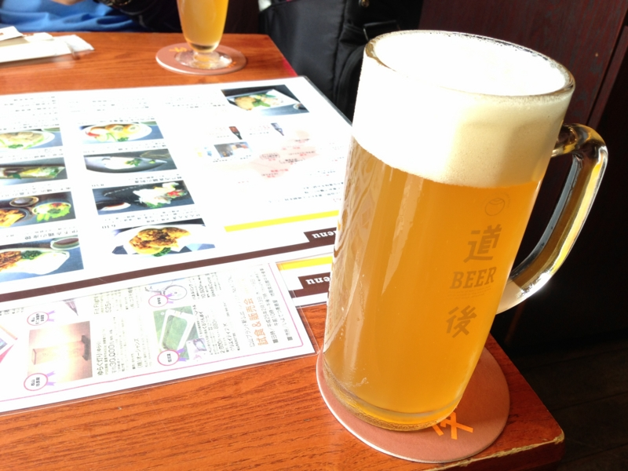

<a href="https://blog.daruyanagi.jp/entry/2013/04/03/080959">&#x9053;&#x5F8C;&#x6E29;&#x6CC9;&#x3078;&#x884C;&#x3063;&#x3066;&#x304D;&#x305F;&#x3063;&#x305F; - &#x3060;&#x308B;&#x308D;&#x3050;</a> のあとは、@jz5 と<a href="http://www.dogobeer.co.jp/bakusyukan.html">&#x9053;&#x5F8C;&#x9EA6;&#x9152;&#x9928;</a> で真昼間からビールをゴクゴク。あんまり地ビールとかよくわからんのだけど、いつも飲んでるのより複雑な味がして、後味が引く。

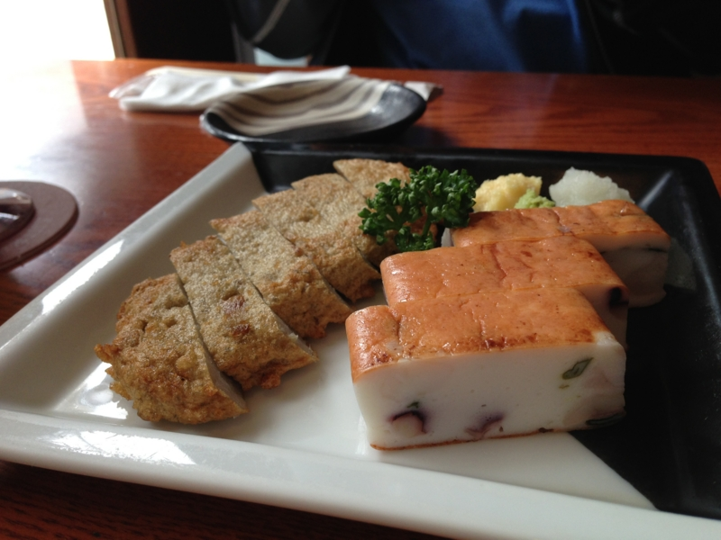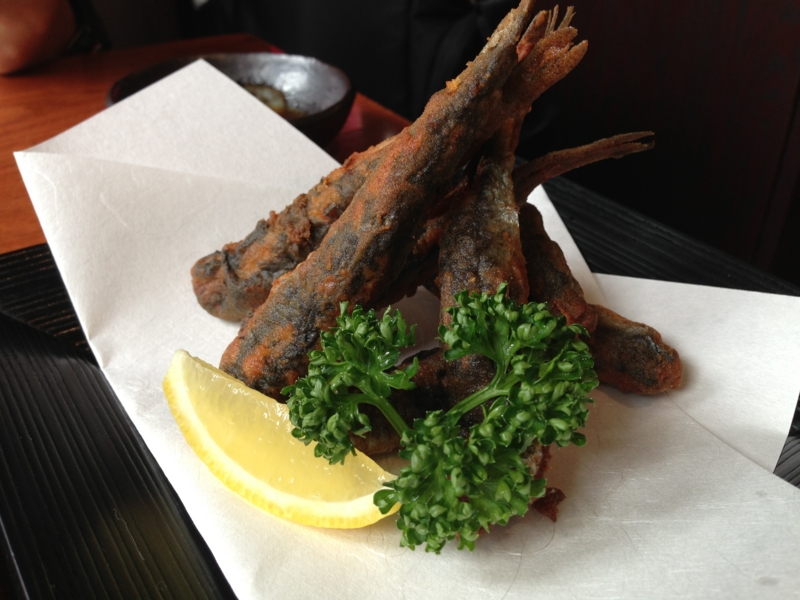

松山名物のじゃこ天やホウタレイワシのから揚げも楽しんだ。個人的には、このイワシのから揚げ美味しかったな。じゃこ天も美味しいけれど、あったかいうちに食うべし。

<h3>郷土料理 五志喜 本店</h3>

そのあとは、@jz5 が鯛めしを食べたいと駄々をこねるので、それが食べられる店を探して大街道周辺を歩き回った。歩けばすぐ見つかるだろうと思って松山城の登山口まで上ったが、それらしきものはない。また戻って、30分ほど歩き回りやっとこさよさげな店を見つけた。

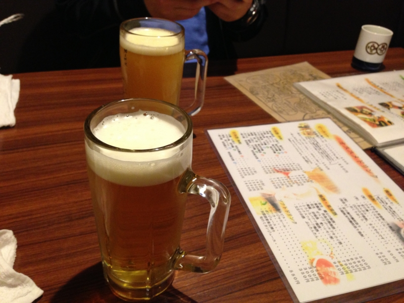

歩き疲れたのでここでもビール。なんか @jz5 は「みかんビール」とやらを飲んでたけど、自分は普通のビールを頼んだ。

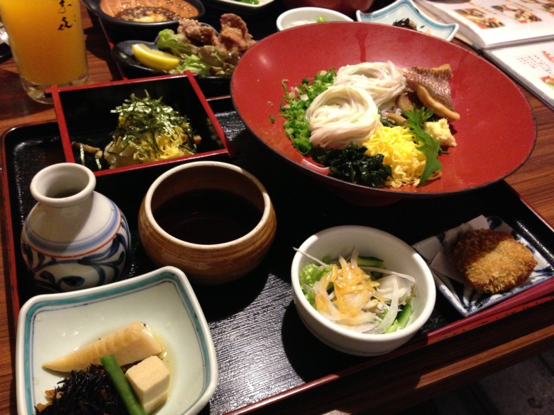

@jz5 が念願の鯛めしにありついている間、ボクは鯛そうめんの方をいただく。もともとこの店はそうめん屋さんのようで、五色のそうめんが美しい。お店の名前もそれから来たのかしら。鯛もじゅるりと旨い。定食についてきたみかん寿司とやらも美味しかったけど、どこがみかんだったのかわからないうちに全部食べてしまうぐらい旨い。

松山の鯛めしは、鯛の切り身をご飯に載せて食べるタイプみたい。次行く機会があれば食べてみたいな。

<h3>秋山兄弟生誕地</h3>

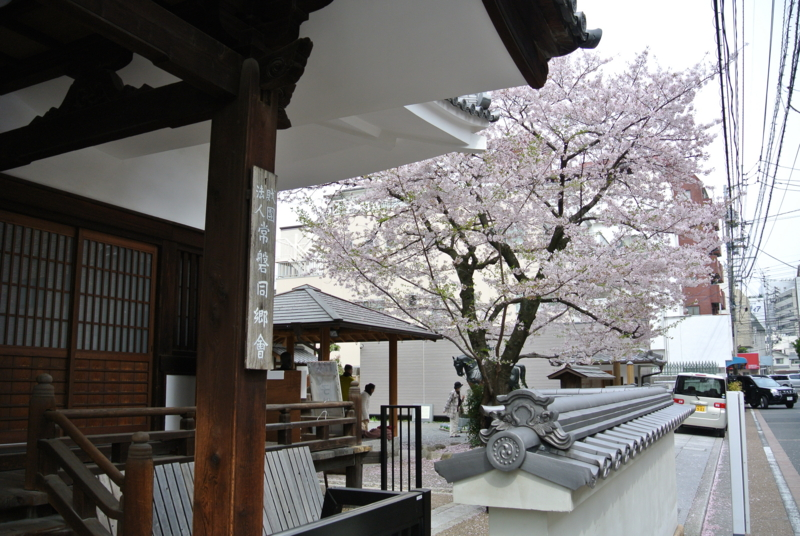

そのあと、また松山城の方に戻って <a href="http://www.akiyama-kyodai.gr.jp/">&#x79CB;&#x5C71;&#x5144;&#x5F1F;&#x751F;&#x8A95;&#x5730; &#x516C;&#x5F0F;&#x30DB;&#x30FC;&#x30E0;&#x30DA;&#x30FC;&#x30B8;</a> を見学。前回はココを行き逃したのが痛恨事だった。

見学料を数百円程度とられたが、案内がとても充実している。設備はそれほどでもないえけれど、案内のおばさんがとても物知りで、放っておけば次から次へと秋山兄弟に関する逸話が口からあふれ出してくる。まるで真之の智謀の如しだよ。

まぁ、ボクも大河ドラマこそ見てないが、『坂の上の雲』（に限らず司馬遼太郎作品）は結構読んでるからだいたい知ってたけどね（きりっ

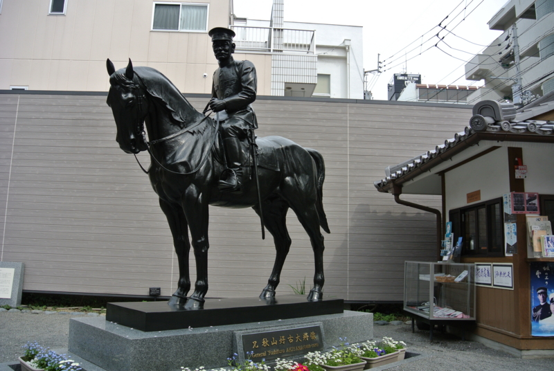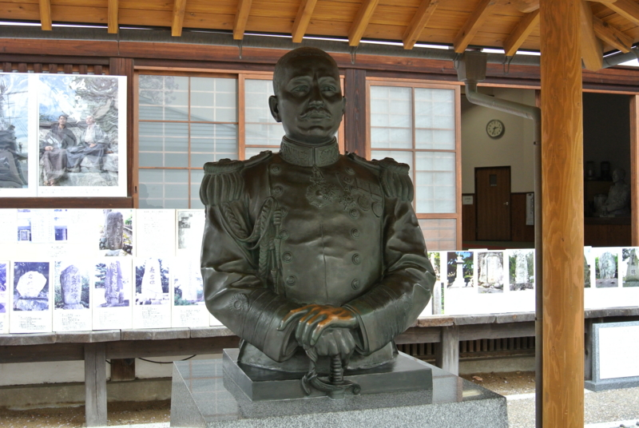

この小さな町で、正岡子規や夏目漱石、秋山兄弟が同じ時代（厳密に言えば入れ違いだけど！）に息をしていたのかと思うと、とても感慨深い。そして、誰もかれもとても愛されている。

秋山好古が書いた揮毫がすべて集められていて、それを眺めて時間を過ごした。彼にとっては半ば義務のようなものだったと拝察するけれど、“忠魂碑”という文字を何度も書かされるのは拷問にも近かったのではないか、とボクなどには思われる。彼は地位を得て喜び奢るタイプじゃなかったし、部下を死なせて平然としていられるタイプでもなかった。

@jz5 とはここから市電で JR 松山駅まで戻ってお別れ。ボクは歩き疲れてホテルで少し寝た。

<h3>艶吉 花園邸</h3>

目が覚めると6時を過ぎていたので、もう有名どころの観光はできない。というわけで、ご飯を食べるところを探して市電に。1Day パス（400円）を骨の髄までしゃぶりつくしてやる！

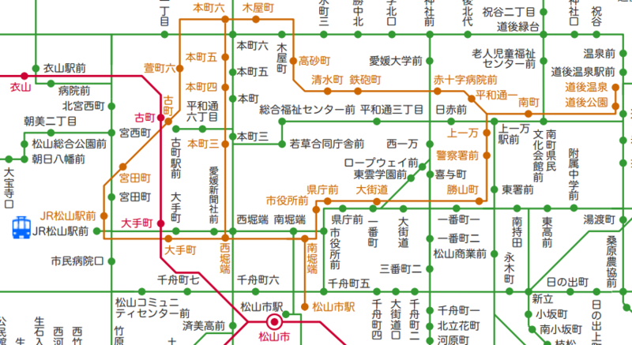

最初は古町（こまち）方面に行ったのだけど、こっちには店がまったくない！　というわけで、松山市駅の方に向かい、呑み屋を一人で探していた。で、ココの店を見つけてメニューをガン見しつつ、書いるかどうか吟味していた。

その姿が目撃されていたらしい。恥ずかしい……。ちょうどこの店で <a href="http://agile459.doorkeeper.jp/events/3260">&#x30B7;&#x30DE;&#x30EA;&#x30B9;Scrum - Agile459/&#x30A2;&#x30B8;&#x30E3;&#x30A4;&#x30EB;&#x56DB;&#x56FD; | Doorkeeper</a> の打ち上げをやっていたらしい。なんという偶然、この広い街で。

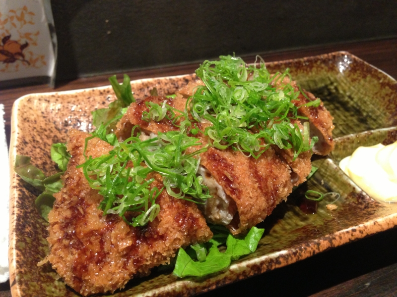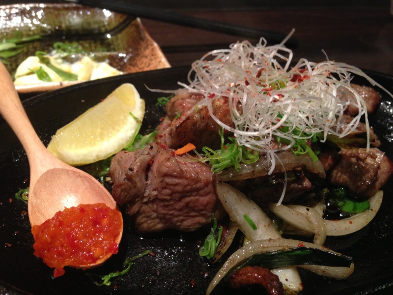

何かの縁だと思い、一度は入るのをやめたこの店に戻ってきて、ひとりでじゃこカツとか、地鶏の焼いたのとかを食べていた。結構おいしい。これぐらいのレベルの店があるなら、松山に引っ越してもマズい居酒屋に泣くことはなさそうだ。

ちなみに、じゃこカツはじゃこ天を揚げたもの。じゃこ天は冷えるとイマイチなのだけど、じゃこカツは熱をカツの衣で閉じ込めることでそれを解決。衣の油っ気のせいか、じゃこ天があっさりと、涼味すら漂わせている。なかなか気に入った。

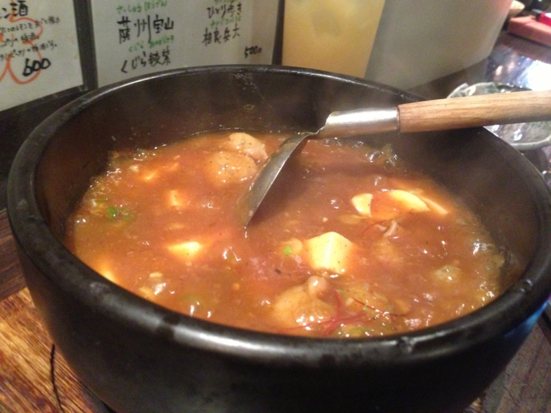

そんなこんなしていると、@you_and_i さんが顔を出しに来てくれて、モツのマーボー鍋（？）をアテに、二人で飲みながらアジャイル開発について少しお話を聞くことができた。ボクは職業プログラマーではないし、ましてや大規模開発に従事することもないのだけど、そういうことじゃなくて、もっと普遍的なことに応用できそうな考え方が詰まっているなぁ、と思いました、マル。

