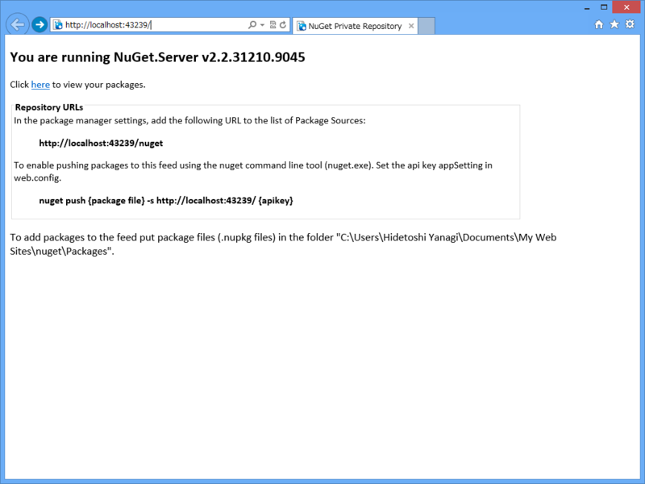
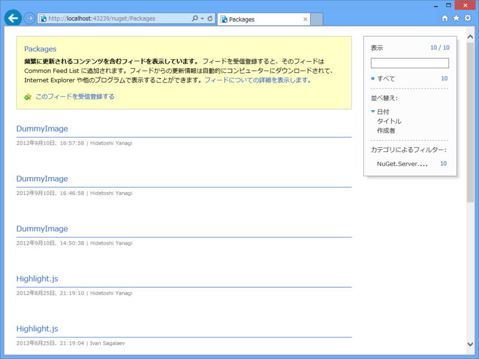
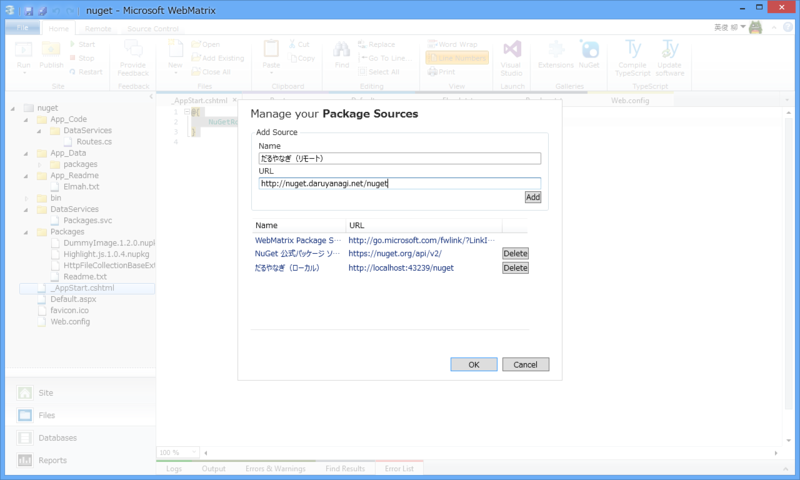
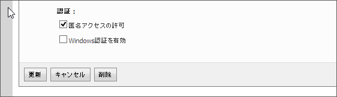

      オレオレデザインのベースを NuGet 化しよう

<a href="http://twitter.com/daruyanagi/status/319719585307844609" class="twitter-detail-info-permalink">2013-04-04 16:54:23</a> via <a href="http://www.metrotwit.com/" rel="nofollow">MetroTwit</a>

 

      プライベート NuGet サーバーがあれば、公式レポジトリを汚さなくてすむのだけど

<a href="http://twitter.com/daruyanagi/status/319719769924308993" class="twitter-detail-info-permalink">2013-04-04 16:55:07</a> via <a href="http://www.metrotwit.com/" rel="nofollow">MetroTwit</a>

 

      @<a class="twitter-user-screen-name" href="http://twitter.com/daruyanagi" target="_top">daruyanagi</a> 立てればいいやん

<a href="http://twitter.com/shibayan/status/319719804137250816" class="twitter-detail-info-permalink">2013-04-04 16:55:16</a> via <a href="http://www.s-software.net/" rel="nofollow">みについ</a> to @<a href="http://twitter.com/daruyanagi/status/319719769924308993"  class="twitter-user-screen-name">daruyanagi</a>

 

      @<a class="twitter-user-screen-name" href="http://twitter.com/shibayan" target="_top">shibayan</a> 前にブログに書いてた方法でまだいけんの？

<a href="http://twitter.com/daruyanagi/status/319719872550543360" class="twitter-detail-info-permalink">2013-04-04 16:55:32</a> via <a href="http://www.metrotwit.com/" rel="nofollow">MetroTwit</a> to @<a href="http://twitter.com/shibayan/status/319719804137250816"  class="twitter-user-screen-name">shibayan</a>

 

      @<a class="twitter-user-screen-name" href="http://twitter.com/daruyanagi" target="_top">daruyanagi</a> 多分

<a href="http://twitter.com/shibayan/status/319719938417897472" class="twitter-detail-info-permalink">2013-04-04 16:55:48</a> via <a href="http://www.s-software.net/" rel="nofollow">みについ</a> to @<a href="http://twitter.com/daruyanagi/status/319719872550543360"  class="twitter-user-screen-name">daruyanagi</a>

というわけで、<a href="http://shiba-yan.hatenablog.jp/entry/20111017/1318860985">NuGet.Server &#x3092;&#x5229;&#x7528;&#x3057;&#x3066;&#x30D7;&#x30E9;&#x30A4;&#x30D9;&#x30FC;&#x30C8;&#x30EA;&#x30DD;&#x30B8;&#x30C8;&#x30EA;&#x3092;&#x69CB;&#x7BC9;&#x3059;&#x308B; - &#x3057;&#x3070;&#x3084;&#x3093;&#x96D1;&#x8A18;</a> を参考に自分で NuGet サーバーをたててみた。<i>WebMatrix で。</i>このブログはできるだけ WebMatrix でなんとかやってしまう主義なのです。

<h3>プロジェクトを作成する</h3>

まず、ASP.NET で「空の Web サイト」テンプレートを選択。最初はテンプレートじゃなくて、クイックスタートで［Empty Site］メニューを選んだのだけど、これだと NuGet が使えないみたい。ちょっと泣いた。

次に NuGet で <a href="http://nuget.org/packages/NuGet.Server">NuGet Gallery | NuGet.Server 2.2.2</a> をインストール。

そのとき、あらかじめテンプレートの favicon.ico を削除しておくといい。NuGet.Server にはかわいい favicon が含まれているのだけど、インストールがスキップされてしまう。

下準備はこれで完了。

<h3>実行 & 手直し</h3>

とりあえず実行するとエラーになる。~/App_Code/DataServices/Routes.cs に少し手を加えないといけないようだ。

<pre class="code lang-cs" data-lang="cs" data-unlink>using System.Data.Services;
using System.ServiceModel.Activation;
using System.Web.Routing;
using Ninject;
using NuGet.Server;
using NuGet.Server.DataServices;
using NuGet.Server.Infrastructure;
using RouteMagic;

// [assembly: WebActivator.PreApplicationStartMethod(typeof(.NuGetRoutes), &quot;Start&quot;)]
[assembly: WebActivator.PreApplicationStartMethod(typeof(NuGetRoutes), &quot;Start&quot;)]

// namespace {
namespace ASP {
public static class NuGetRoutes {
public static void Start() {
MapRoutes(RouteTable.Routes);
}

private static void MapRoutes(RouteCollection routes) {
// The default route is http://{root}/nuget/Packages
var factory = new DataServiceHostFactory();
var serviceRoute = new ServiceRoute(&quot;nuget&quot;, factory, typeof(Packages));
serviceRoute.Defaults = new RouteValueDictionary { { &quot;serviceType&quot;, &quot;odata&quot; } };
serviceRoute.Constraints = new RouteValueDictionary { { &quot;serviceType&quot;, &quot;odata&quot; } };
routes.Add(&quot;nuget&quot;, serviceRoute);
}

private static PackageService CreatePackageService() {
return NinjectBootstrapper.Kernel.Get&lt;PackageService&gt;();
}
}
}
</pre>
修正個所は二か所かな？ WebActivator というのはよくわからないけれど、名前から察するに、おそらくアプリケーションの実行前にメソッドを挿入（インジェクション）するものだと思う。なぜわざわざ型名を .NuGetRoutes としてあったのかはよくわからない。

名前空間は空になっている。アプリケーションの名前空間を入れておこう。WebMatrix で作成するアプリケーションの名前空間は ASP みたいなので、それを加えておく。

<h4>追記（13:45）</h4>

      だるさん、名前空間が空っぽになったのは Web Pages に名前空間という概念が無いからとられへんかったんやろ

<a href="http://twitter.com/shibayan/status/320032320637788160" class="twitter-detail-info-permalink">2013-04-05 13:37:05</a> via <a href="http://www.s-software.net/" rel="nofollow">みについ</a>

 

      ほんとは .NuGetRoutes の前に名前空間が入る

<a href="http://twitter.com/shibayan/status/320032425063358464" class="twitter-detail-info-permalink">2013-04-05 13:37:30</a> via <a href="http://www.s-software.net/" rel="nofollow">みについ</a>

NuGet をインストールする際、テンプレートにしたがって名前空間が補われるのだけど、Web Pages には名前空間がない（とれない）ので、空白になってしまうということみたいだね。なるほどなるほど。

これでコンパイルは通るのだけど…… <a href="http://localhost:43239/nuget/">http://localhost:43239/nuget/</a> （ポートはそれぞれの環境ごとに違うので読み替えてくれ）が 404 になってしまう。どうもさきほどの NuGetRoutes.Start() がちゃんとキックされていないみたい。

<pre class="code lang-cs" data-lang="cs" data-unlink>#~/_AppStart.cshtml

@{
NuGetRoutes.Start();
}
</pre>
というわけで、無理やりたたき起こしてやった（ぁ

これでうまく動いた。

 

<a href="http://localhost:43239/nuget/">http://localhost:43239/nuget/</a> を NuGet のパッケージソースに加えれば、~/Packages に放り込んだ NuGet パッケージが検索できるようになるぞー！

<h3>ExpressWeb へデプロイ</h3>

ローカルでそのまま使ってもいいのだけれど、リモートでホストした方が便利だと思う。今回は ExpressWeb へアップロードしたけれど、動作させるためにはエラーを二つ潰す必要がある。

<h4>複数サイトバインディング</h4>

よくわからんが、エラーメッセージにしたがって Web.config を書き換えればよい。

<pre class="code lang-xml" data-lang="xml" data-unlink>&lt;system.serviceModel&gt;
&lt;serviceHostingEnvironment
        aspNetCompatibilityEnabled=&quot;true&quot;
        multipleSiteBindingsEnabled=&quot;true&quot;
    /&gt;
&lt;/system.serviceModel&gt;
</pre>

<h4>認証スキーム</h4>

これまたよくわからんが、ExpressWeb 側で Windows 認証を無効化したらエラーが解消した。

<ul>
<li><a href="http://nuget.daruyanagi.net/">NuGet Private Repository</a></li>
</ul>
できた！　プッシュできるようにしてもいいのだけれど、WebMatrix で管理するなら NuGet パッケージを ~/Packages に追加するのは別に苦じゃないので、今回はパス。

