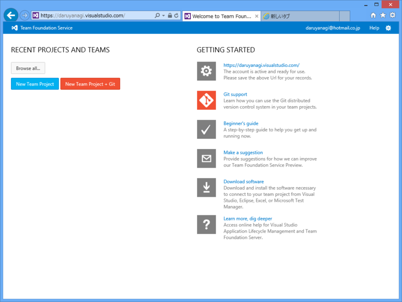
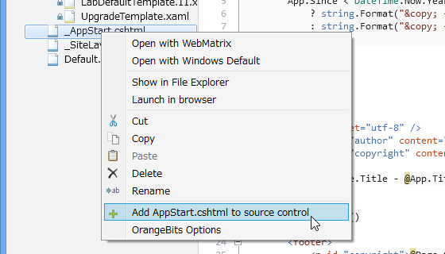
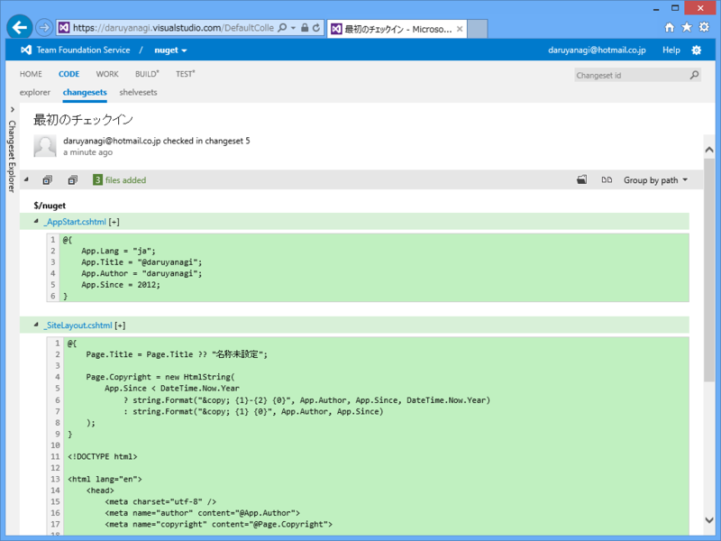

<a href="https://blog.daruyanagi.jp/entry/2013/04/03/072017">&#x30D7;&#x30ED;&#x30B0;&#x30E9;&#x30DF;&#x30F3;&#x30B0;&#x751F;&#x653E;&#x9001;&#x52C9;&#x5F37;&#x4F1A; &#x7B2C;22&#x56DE;&#xFF20;&#x677E;&#x5C71;&#x306B;&#x53C2;&#x52A0;&#x3057;&#x3066;&#x304D;&#x307E;&#x3057;&#x305F; #pronama - &#x3060;&#x308B;&#x308D;&#x3050;</a> の復習もかねて、WebMatrix 3 Preview から Team Foundation Service を利用してみた。自分の理解では、

<blockquote>

Team Foundation Service = ( ソース管理 + アジャイル支援 ).AsCloud();

</blockquote>

って感じ。自分のような趣味の個人開発者にとってアジャイル支援の部分がどれだけ役に立つのかは未知数だけれど、とりあえずソース管理（Source Control）の部分だけでも体験しておこう。
 
 

<h3>アカウントの取得</h3>

<a href="http://tfs.visualstudio.com/">Visual Studio Online | Now Azure DevOps</a> へアクセス。アカウントを作成しよう。

サブドメインがもらえる。カッコいい！　今回は<i> <a href="https://daruyanagi.visualstudio.com">https://daruyanagi.visualstudio.com</a> </i>をゲットしたぞ。

できたぞジョジョ―！

<h3>WebMatrix 3 Preview → Team Foundation Service</h3>

既存のプロジェクトを Team Foundation Service で管理してみる。

さきほど取得した <a href="https://daruyanagi.visualstudio.com">https://daruyanagi.visualstudio.com</a> を入力。

ここで注意というかハマったのだけど、WebMatrix 3 で Windows Azure 統合を有効（つまり Microsoft ID でログイン済み）にしていた場合、その ID と Team Foundation Service の ID が食い違っているとログインが完了しない。3回ぐらい自動リトライして「無理でした」みたいなことを言われてしまう。TFS のアカウントを取り直して解決。

サイトを TFS へ追加。よくわかんないので初期値で。

不思議な踊りをしながら待つ。

完了したら、Source Control タブがこんな感じになるので、さっそくチェックイン……

……できませんでした。

よくわかんないので放置。

<h3>Team Foundation Service → WebMatrix 3 Preview</h3>

悔しいので、今度は TFS でプロジェクトを作って、それを WebMatrix で取得するようにしてみる。

ソース管理に Git が選べるけど、今回は TFS で行くぜ！

プロセステンプレートというのは、アジャイル開発にもいくつか流儀があって、そのどれを選択するかという話らしい（参考：<a href="http://d.hatena.ne.jp/youandi/20130330/p1">&#x30D7;&#x30ED;&#x30B0;&#x30E9;&#x30DF;&#x30F3;&#x30B0;&#x751F;&#x653E;&#x9001;&#x52C9;&#x5F37;&#x4F1A; &#x7B2C;22&#x56DE;&#xFF20;&#x677E;&#x5C71; &#x306B;&#x53C2;&#x52A0; - &#x685C;&#x3001;&#x62B9;&#x8336;&#x3001;&#x767D;&#x3001;&#x65E5;&#x8A18;</a>）。とりあえずデフォルトで。

できますたー！

これを WebMatrix 側から開くわけだ。

もしかしたら拡張機能を先に入れなきゃいけないかもしれない。ここら辺の手順は忘れちゃった。

プロジェクトを開くと、すっからかん（なにやらリードオンリーのファイルがいくつかあるが）な Web サイトが開くので、

あとはファイルをひとつづつソース管理に追加して......

チェックイン。

今回はうまくいったみたい。

TFS の方にもちゃんと反映されている。これだけでは TFS のポテンシャルの半分も発揮できていないけれど、一応触ることはできた。

