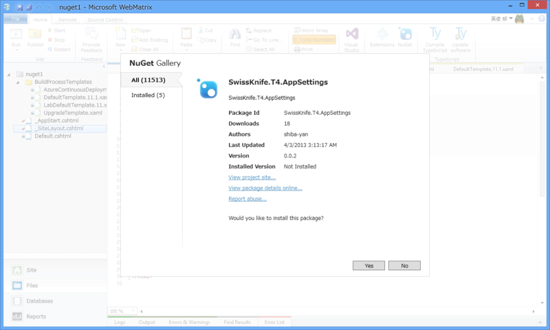
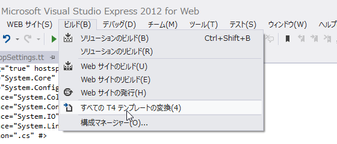
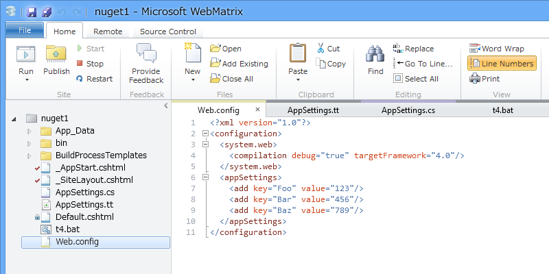
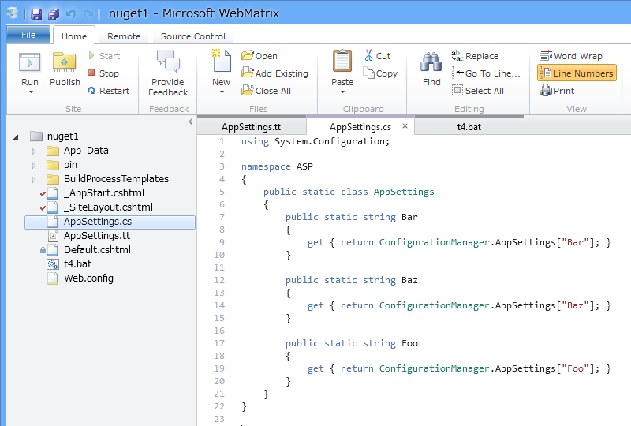
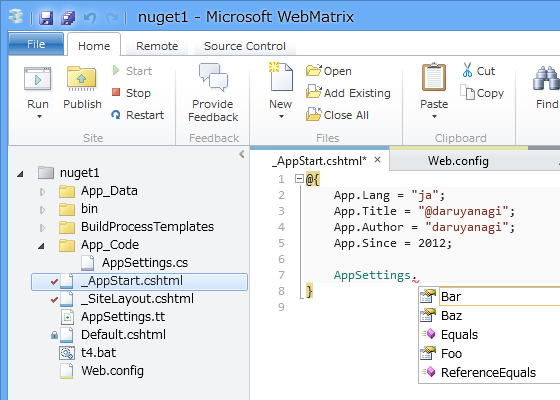

Web.config の appSettings セクションをもとにクラスを生成してくれる T4 テンプレート SwissKnife.T4.AppSettings がよさげなので、これが WebMatrix 3 も使えないかなぁ、といろいろ試してみた。

<ul>
<li><a href="http://shiba-yan.hatenablog.jp/entry/20130403/1364964363">Web.config &#x304B;&#x3089; AppSettings &#x30AF;&#x30E9;&#x30B9;&#x3092;&#x751F;&#x6210;&#x3059;&#x308B; T4 &#x3092; NuGet &#x3067;&#x516C;&#x958B;&#x3057;&#x307E;&#x3057;&#x305F; - &#x3057;&#x3070;&#x3084;&#x3093;&#x96D1;&#x8A18;</a></li>
</ul>

<h3>アプローチその壱：Visual Studio の助けを借りる</h3>

SwissKnife.T4.AppSettings をインストールし、Web.config を編集して Web サイトを実行するだけでは動かなかったので（まぁ、そうだろうね！）、WebMatrix から Visual Studio を召喚してなんとかならないかな、というのが最初のアプローチ。Visual Studio には T4 を扱うためのメニューが用意されているはずだ。

しかし――

あれれ。メニューがない。

一度 NuGet を削除して、Visual Studio で新たに T4 テンプレート を作成すると［すべての T4 テンプレートの変換］というメニューが出るのだが。

この方法は諦めた。

<h3>アプローチその弐：TextTransform.exe を使う</h3>

しょうがないので、<a href="http://msdn.microsoft.com/ja-jp/library/vstudio/bb126245.aspx">Generating Files with the TextTransform Utility - Visual Studio 2015 | Microsoft Docs</a> を参考に TextTransform.exe を利用したテンプレートの変換を試みる。

ちなみに、こいつは Visual Studio Professional 以上が必要なようだ。Visual Studio 2012 Express for Web をインストールしただけでは

<pre class="code" data-lang="" data-unlink>C:\Program Files (x86)\Common Files\Microsoft Shared\TextTemplating\11.0</pre>
に TextTransform.exe が追加されない。

ごくごく簡単なバッチを書いて、必要な時に叩くようにしよう。

<pre class="code lang-sh" data-lang="sh" data-unlink>&quot;Path\To\TextTransform.exe&quot; -out AppSettings.cs AppSettings.tt

pause
</pre>
するとエラーが出る。

<pre class="code" data-lang="" data-unlink>c:\Users\Hidetoshi Yanagi\AppData\Local\Temp\AppSettings.tt(10,0) : error
: 変換を実行しています
: System.NullReferenceException
: オブジェクト参照がオブジェクトインスタンスに設定されていません。
場所 Microsoft.VisualStudio.TextTemplating46c835e8a19f4e3d880d23699cc45057
.GeneratedTextTransformation.TransformText() 場所 c:\Users\Hidetoshi Yanagi\
AppData\Local\Temp\AppSettings.tt:行 10</pre>
<a href="https://blog.daruyanagi.jp/entry/2013/04/05/133515">WebMatrix&#xFF1A;NuGet &#x30B5;&#x30FC;&#x30D0;&#x30FC;&#x3092;&#x305F;&#x3066;&#x308B; - &#x3060;&#x308B;&#x308D;&#x3050;</a> でもぶち当たった、ASP.NET Web Pages で名前空間が取得できない問題と同じようなことが起こっているようだ。あまり NuGet で取得したコードに手を加えたくはないが、10行目を修正する。

<pre class="code lang-cs" data-lang="cs" data-unlink>//var namespaceName = System.Runtime.Remoting.Messaging
//    .CallContext.LogicalGetData(&quot;NamespaceHint&quot;).ToString();
var namespaceName = &quot;ASP&quot;;
</pre>
とりあえずこれで動かすことはできた。IntelliSense でバリバリ AppSettings が呼べるぞー。

 

<h4>蛇足</h4>

んー、それにしてもこの問題、なんとかうまく解決できないのかな？　たとえば、名前空間が取れなかったときを ASP.NET Web Pages で決め打ちできるならば（あまりよくない実装だけど）、

<pre class="code lang-cs" data-lang="cs" data-unlink>var ns = System.Runtime.Remoting.Messaging
.CallContext.LogicalGetData(&quot;NamespaceHint&quot;);
var namespaceName = ns == null ? &quot;ASP&quot; : ns.ToString();
var templateFileName = Path.GetFileNameWithoutExtension(Host.TemplateFile);
</pre>
みたいな感じでもいいのかもしれない。

<h4>追記</h4>

AppSettings.cs は ~/App_Code フォルダに収めなきゃいけないのを忘れていた。WebMatrix で App_Code フォルダを作成し、バッチを以下のように書き換えて実行してね！

<pre class="code lang-sh" data-lang="sh" data-unlink>&quot;Path\To\TextTransform.exe&quot; -out ./App_Code/AppSettings.cs AppSettings.tt

pause
</pre>

