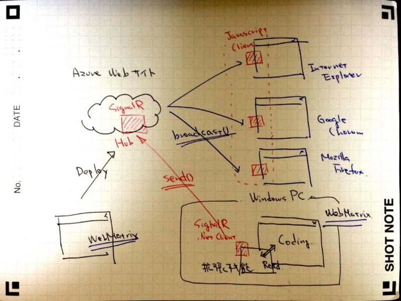
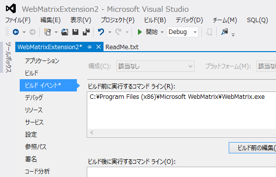
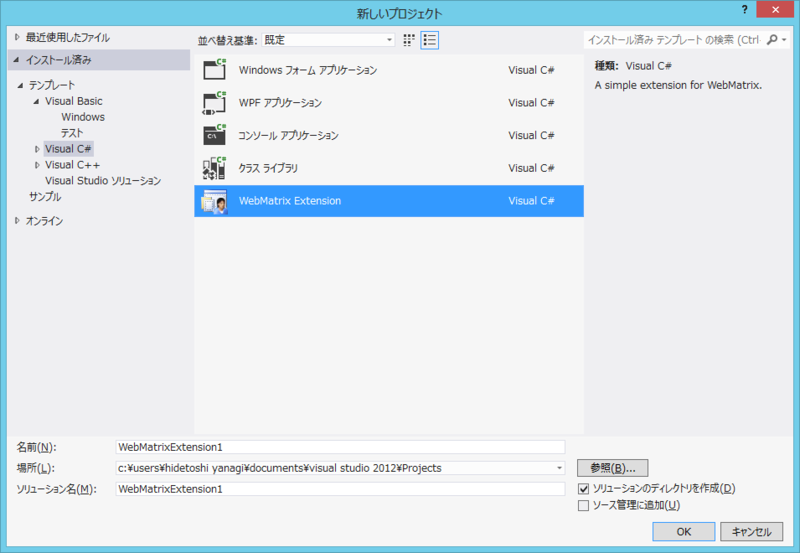
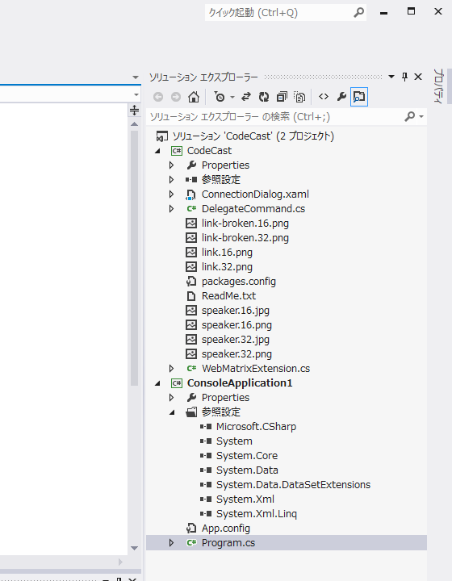

<iframe src="http://www.slideshare.net/slideshow/embed_code/18071351" width="427" height="356" frameborder="0" marginwidth="0" marginheight="0" scrolling="no" style="border:1px solid #CCC;border-width:1px 1px 0;margin-bottom:5px" allowfullscreen webkitallowfullscreen mozallowfullscreen> </iframe> 
 <strong> <a href="http://www.slideshare.net/daruyanagi/web-matrix-18071351" title="Web matrix でプログラミング生放送してみた" target="_blank">Web matrix でプログラミング生放送してみた</a> </strong> from <strong><a href="http://www.slideshare.net/daruyanagi" target="_blank">Hidetoshi Yanagi</a></strong> 

<a href="https://blog.daruyanagi.jp/entry/2013/04/03/072017">&#x30D7;&#x30ED;&#x30B0;&#x30E9;&#x30DF;&#x30F3;&#x30B0;&#x751F;&#x653E;&#x9001;&#x52C9;&#x5F37;&#x4F1A; &#x7B2C;22&#x56DE;&#xFF20;&#x677E;&#x5C71;&#x306B;&#x53C2;&#x52A0;&#x3057;&#x3066;&#x304D;&#x307E;&#x3057;&#x305F; #pronama - &#x3060;&#x308B;&#x308D;&#x3050;</a> でやった LT の補足です。

<h3>何をしていたか</h3>

もう少し絵がうまかったらよかったのだけど。

<ul>
<li>WebMatrix 拡張機能で WebMatrix のエディター画面の情報を取得</li>
<li>WebMatrix 拡張機能（SignalR .NET Client）で Windows Azure 上の SignalR サーバー（Hub）へテキストを送信</li>
<li>SignalR Hub が Web ページ（SignalR JavaScript Client を仕込んである）へ接続中のブラウザーへ向けてテキストを一斉送信</li>
</ul>
これで「手元の WebMatrix で書いたコードを一斉配信する」システムができた。なお、Windows Azure  上の SignalR Hub も WebMatrix で記述しているので、「ピュア WebMatrix 製」ってことやね！

<ul>
<li>WebMatrix の拡張機能って自分でも作れるんだよ</li>
<li>SignalR は WebMatrix でも使えます！</li>
<li>.NET でも JavaScript でも OK！</li>
</ul>
ってことが伝わればうれしかったのだけど、なかなかそこまでうまくいかなかった。

<h3>WebMatrix で SignalR を使う</h3>

この辺りを参考にしてください。

<ul>
<li><a href="https://blog.daruyanagi.jp/entry/2013/03/12/093613">WebMatrix 2: SignalR &#x3092;&#x52D5;&#x304B;&#x3059; &#xFF08; 1.0.1 &#x5BFE;&#x5FDC;&#x7248;&#xFF09; - &#x3060;&#x308B;&#x308D;&#x3050;</a></li>
<li><a href="https://blog.daruyanagi.jp/entry/2013/03/13/065552">WebMatrix 2: SignalR &#x3092;&#x52D5;&#x304B;&#x3059; &#xFF08; 1.0.1 &#x5BFE;&#x5FDC;&#x7248;&#xFF09; &#x203B;&#x540C;&#x6642;&#x63A5;&#x7D9A;&#x8005;&#x6570;&#x306E;&#x8FFD;&#x52A0; - &#x3060;&#x308B;&#x308D;&#x3050;</a></li>
</ul>
サーバーのソースコードは、<a href="http://codecast.codeplex.com/">CodePlex Archive</a> に置いてあります。

<h3>WebMatrix 拡張機能を作成する</h3>

だいぶ前に書きました。

<ul>
<li><a href="https://blog.daruyanagi.jp/entry/2012/10/12/223708">WebMatrix&#x306E;&#x62E1;&#x5F35;&#x6A5F;&#x80FD;&#x3092;&#x4F5C;&#x308B;&#x305C;&#x30FC; - &#x3060;&#x308B;&#x308D;&#x3050;</a></li>
</ul>
ただ、ちょっと古くなっているかもしれない。

<h4>Visual Studio 2012 Professional</h4>

Visual Studio 2012 Professional向けに、開発テンプレートが Visual Studio 拡張機能として用意されているようです。

<ul>
<li><a href="http://visualstudiogallery.msdn.microsoft.com/f40607ae-66ba-4982-a4e5-5ea969ea43e1">WebMatrix ExtensionTemplate - Visual Studio Marketplace</a></li>
</ul>

あとはビルドイベントで WebMatrix を起動するように設定すれば OK。

<h4>Visual Studio 2012 Express for Desktop</h4>

また、多少手間はかかりますが、無償の Express エディションでも開発は可能です。

<ul>
<li><a href="http://extensions.webmatrix.com/documentation_2">http://extensions.webmatrix.com/documentation_2</a></li>
</ul>
上記のサイトから WebMatrix Extension Kit（ZIP形式）をダウンロードして、（ドキュメント）\Visual Studio 2012\Templates\ProjectTemplates\Visual C# へコピーします。

すると、［テンプレート］‐［Visual C#］に「WebMatrix Extension」というテンプレートが現れるので新規プロジェクトを作成。

さらに、Express エディションではビルドイベントの機能が使えないようなので、デバッグ実行するためのコンソールアプリケーションを作成。

 

<pre class="code lang-cs" data-lang="cs" data-unlink>using System;
using System.Collections.Generic;
using System.Linq;
using System.Text;
using System.Diagnostics;

namespace ConsoleApplication1
{
class Program
{
static void Main(string[] args)
{
Process webMatrix = new Process();

webMatrix.StartInfo.FileName = @&quot;C:\Program Files (x86)\Microsoft WebMatrix\WebMatrix.exe&quot;;
webMatrix.Start();
webMatrix.WaitForExit();
}
}
}
</pre>
あとは拡張機能のソリューションをリビルド → コンソールアプリを実行 という感じで開発を進めていけるはず。

<h4>WebMatrix 拡張機能のソースコード</h4>

さすがに恥ずかしくて公開できないレベル……調査不足で、リボンボタンを押したときしかコードを送出できない。

<pre class="code lang-cs" data-lang="cs" data-unlink>private void HandleBloadcastButtonInvoke(object obj)
{
if (!ConnectionAvailable) return;

try
{
var workspace = _webMatrixHost.Workspace as IEditorWorkspace;
if (workspace == null) return;

var selection = workspace
.CurrentEditor
.ServiceProvider
.GetService(typeof(IEditorSelection)) as IEditorSelection;

Send(selection.Text);
}
catch (Exception exception)
{
Send(string.Format(&quot;{0}: {1}&quot;, exception, exception.Message));
}
}

public void Send(string message)
{
proxy.Invoke(&quot;Send&quot;, message).ContinueWith(_ =&gt;
{
if (_.IsFaulted)
{
_webMatrixHost.ShowNotification(message);
}
else
{
// _webMatrixHost.ShowNotification(message);
}
});
}
</pre>
テキストの入力が取れなくても、たとえば、

<ul>
<li>ファイルを保存したとき（File Watcher を利用）</li>
<li>ショートカットキー</li>
</ul>
なんかはとれるはずなので、もう少し何とかしてから公開したいですね。あと、簡単な認証機能。

