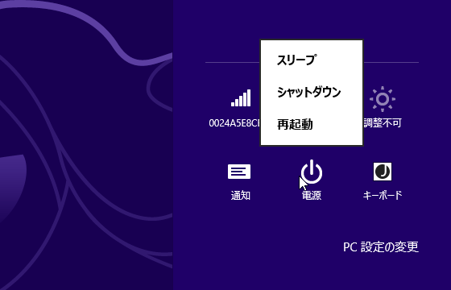
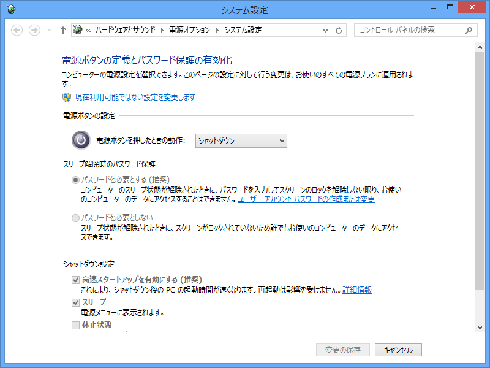
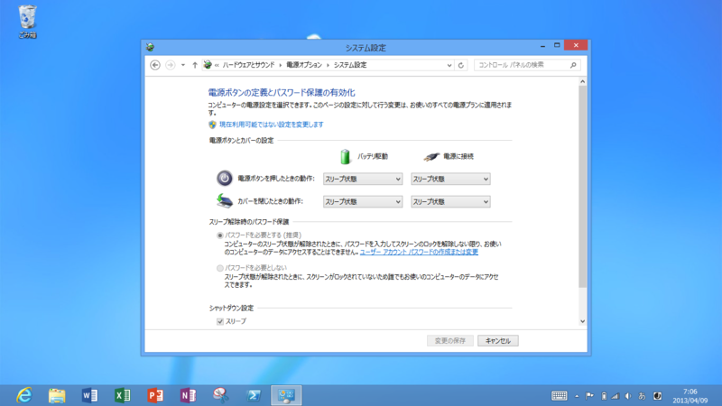
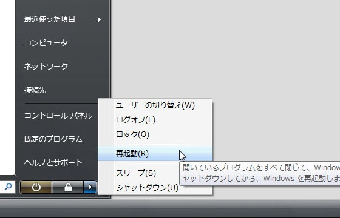

「Windows 8 をシャットダウンする方法が分からない」という声をよく聞く。そのせいか、シャットダウンの方法を解説するブログ記事をよく見かける。チャームを出して、［設定］を押して……というヤツだ。ほかにも［Ctrl］＋［Alt］＋［Delete］キーを押して画面右下のボタンからシャットダウンするという技もある。

でも、一番手っ取り早いのは<i>電源ボタンを押す</i>ことだと思う。

少なくともうちのデスクトップマシンでは電源ボタンの既定の動作が「シャットダウン」になっていて、押すと実際シャットダウンシーケンスが始まる。

ちなみに Surface RT の場合はこんな感じ。電源ボタンの操作に加え、カバーを閉じた場合のアクションも指定可能になっており、既定では「スリープ」が割り当てられている。おそらくたいていのラップトップは同じ設定になっているはず。

<h3>ソフトウェアシャットダウンはもう古い</h3>

けれど、これに納得しない人は少なくないだろう。<i>「わざわざこんな使いにくいところに電源メニューを配置するなんて！　意味わからない！」</i>でも、それは今に始まったことじゃないんですよ。

たとえば、Windows Vista の電源メニューはこんな感じだった。すでに「スリープ（スタンバイ＋休止状態）」が既定になっていて、再起動やシャットダウンを選択するにはひと手間かかるようになっている。

なにをいまさら？　Windows 8 ではその“ひと手間”がさらに増えただけだ。

冷静に考えてみれば、PC をシャットダウンすることなど日に何度あるだろう。再起動だって必要になれば「再起動しますか？」→［はい］ボタンの押し下げで済むことがほとんどだ。そんなことのために“特等席”を用意してあげる意味って？

たしかに、かつては作法に則ってソフトウェアでシャットダウンすることが推奨されていた。

<blockquote cite="http://irk.or.jp/kaga/pc/1-5.html">

普通の電化製品の常識的に考えれば、電源ボタンをまた押して、電源を切ればいいということになりますが、パソコンに限っては、それは極力やってはならないタブーなんです。後できちんと説明しますが、WINDOWSのメニューから電源を切るを選択して終わらせなければいけません。 それでは、なぜ、電源ボタンを押してはいけないのか？ これには、ちゃんとした理由があるのですが、その説明は初心者の方には難しいので、稀にパソコンが壊れてしまうことがあるからとだけ言っておきましょう。当然ですが、パソコンが壊れたら困りますよね。けして、電源ボタンをむやみに押さないようにして下さい。

<cite><a href="http://irk.or.jp/kaga/pc/1-5.html">&#x7B2C;&#xFF11;&#x7AE0; &#x30D1;&#x30BD;&#x30B3;&#x30F3;&#x3092;&#x59CB;&#x3081;&#x3088;&#x3046; &#xFF08;&#xFF15;&#xFF09;&#x30D1;&#x30BD;&#x30B3;&#x30F3;&#x306E;&#x7D42;&#x4E86;</a></cite>
</blockquote>

けれど、それももう過去の話。ACPI（<a href="http://ja.wikipedia.org/wiki/Advanced_Configuration_and_Power_Interface">Advanced Configuration and Power Interface - Wikipedia</a>）が十分に普及した今、わざわざ古い「タブー」に縛られなければならない理由はない。

<blockquote cite="http://windows.microsoft.com/ja-jp/windows7/turning-off-your-computer-properly">

<h4>コンピューターの電源を正しくオフにする</h4>

エネルギーを節約するためだけでなく、コンピューターのセキュリティを確保し、データが確実に保存されるようにするためにも、コンピューターでの作業を終えた後、正しく電源をオフにすることが重要です。コンピューターの電源を正しくオフにするには、コンピューターの電源ボタンを押す、スタート メニューの [シャットダウン] ボタン (電源ボタンと呼ばれることもあります) を使用する、カバーを閉じる (ノート PC の場合) の 3 つの方法があります。

<h4>スリープの使用</h4>

コンピューターをスリープ解除するには、コンピューター ケースの電源ボタンを押します。Windows が起動するまで待つ必要がないため、数秒内にコンピューターをスリープ解除してすぐに作業を再開できます。

<cite><a href="http://windows.microsoft.com/ja-jp/windows7/turning-off-your-computer-properly">&#x30B3;&#x30F3;&#x30D4;&#x30E5;&#x30FC;&#x30BF;&#x30FC;&#x306E;&#x96FB;&#x6E90;&#x3092;&#x6B63;&#x3057;&#x304F;&#x30AA;&#x30D5;&#x306B;&#x3059;&#x308B;</a></cite>
</blockquote>

Microsoft のサイトにもこう書いてある。

<h3>ユーザーの慣れを継続的にコントロールする</h3>

つまり、Windows 8 で電源メニューが分かりにくい場所に配置されているのは“デザイン”――「使うな」という開発者側の意図の表れ――なのだと思う。そろそろそんなもの使うのやめましょうよ、という Microsoft のメッセージなのだ。さすがに電源メニューをそっくり取り去ってしまうのは問題なので、新しいスタート画面との兼ね合いであそこに御行幸をお願い奉り申し上げたというわけ。

今思えば、このために Microsoft は Windows Vista の時代からゆっくり時間をかけてユーザーを馴らしていたと言える。OS のデザインというのは、技術の進歩およびユーザーのレベルと共進化していくものらしい。

その意味で、Windows Vista の商業的失敗は不幸だった。Windows XP から Windows 8 へのアップデートはユーザーの“慣れ”に配慮したデザインの漸進的進歩をまったく無視した行為。10年の時間を一気に取り戻そうとするのだから浦島太郎になっても仕方がない。OS をアップデートしないということは、機能面での遅れだけでなく、デザインへの慣れという点でもかなり不利だ。アップデートに否定的なユーザーは、この代償についても考慮を割くべきだと思う。

とはいえ、アップデートしないユーザーにすべての責任を負わせるわけにもいかないだろう。アップデートにかかる費用と面倒が馬鹿にならないのも事実で、Microsoft はもっとアップデートのハードルを下げるべきだ。もっと頻繁に新バージョンをリリースし、その分アップデートにかかる費用を下げれば、ユーザーが5年も10年も我慢して旧製品を使い続ける理由はなくなるはずだ。

というわけで、「Windows 8.1」にはその面での期待をしている。ちょっと気は早いけれど「Windows 8.2」もさっさと出してほしい。

――「Visual Studio 2012.2」のリリースを祝して、記す。

<ul>
<li><a href="http://www.forest.impress.co.jp/docs/news/20130408_594991.html">Microsoft&#x3001;&#x300C;Visual Studio 2012 Update 2&#x300D;&#x3092;&#x6B63;&#x5F0F;&#x516C;&#x958B; - &#x7A93;&#x306E;&#x675C;</a></li>
</ul>

