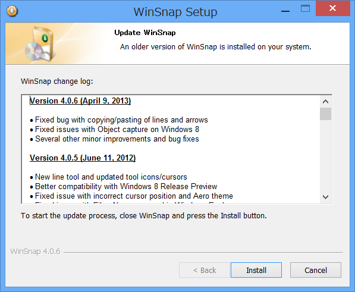

<h3>Version 4.0.6 (April 9, 2013)</h3>

<ul>
<li>Fixed bug with copying/pasting of lines and arrows</li>
<li>Fixed issues with Object capture on Windows 8</li>
<li>Several other minor improvements and bug fixes</li>
</ul>
Windows 8 はソフトウェアキーボードやチャームが実装された関係でデスクトップのオブジェクト構造が結構変わっちゃっていて。ながらくオブジェクト（ボタンやメニュー）を選択してキャプチャーする機能がほとんど機能しない状態だったのだけれど、とりあえずこのバージョンで治ったみたい。ありがたやありがたや。

有償アプリなのでなかなか手を出しにくいと思うけれど、このツールはなかなかいいものですよ。僕みたいなキャプチャー小僧には欠かせません。

<ul>
<li><a href="http://www.forest.impress.co.jp/library/software/winsnap/">WinSnap - &#x7A93;&#x306E;&#x675C;&#x30E9;&#x30A4;&#x30D6;&#x30E9;&#x30EA;</a></li>
</ul>

