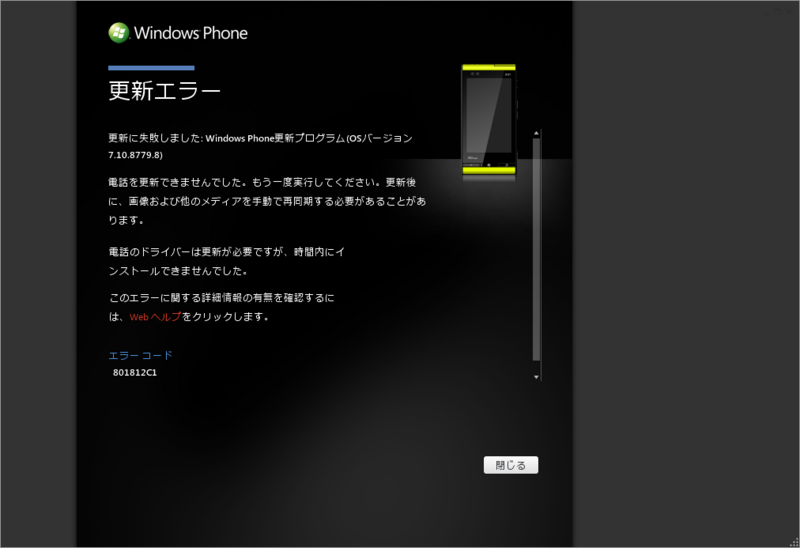

<ul>
<li><a href="http://k-tai.impress.co.jp/docs/news/20130131_585882.html">au&#x306E;&#x300C;Windows Phone IS12T&#x300D;&#x3001;Windows Phone 7.8&#x306B; - &#x30B1;&#x30FC;&#x30BF;&#x30A4; Watch</a>（2013/1/31）</li>
<li><a href="http://k-tai.impress.co.jp/docs/news/20130315_591895.html">au&#x306E;&#x300C;Windows Phone IS12T&#x300D;&#x3001;OS&#x66F4;&#x65B0;&#x3067;&#x4E0D;&#x5177;&#x5408; - &#x30B1;&#x30FC;&#x30BF;&#x30A4; Watch</a>（2013/3/15）</li>
<li><a href="http://k-tai.impress.co.jp/docs/news/20130321_592564.html">Windows Phone IS12T&#x3001;Windows Phone 7.8&#x3078;&#x306E;&#x66F4;&#x65B0;&#x518D;&#x958B; - &#x30B1;&#x30FC;&#x30BF;&#x30A4; Watch</a>（2013/3/21）</li>
</ul>
強制アップデートもせず、ずっと待っていたのだけれど、正直待ちくたびれた。新しくなったタイルをちょろっとイジって満足し、いつも通りポッケに仕舞った。

アップデートの途中、何度繰り返してもエラーが出てうまくいかなかったのだけれど（エラーは毎回異なるモノが出る）、たまたまデスクトップ機の OS を再インストールしなければならなくなり、「Zune Software」も再度セットアップした。すると、新しい環境ではすんなりアップデートできた。どうやらクライアントソフトがおかしかったようだ。

まぁ、なんというか、Windows Phone に対する当初の期待はすっかり色あせ、もはや残念なモノになりつつある。この状況をひっくり返すには、なにか大技が必要なんじゃないだろうか。あまり期待はできないけれど。

