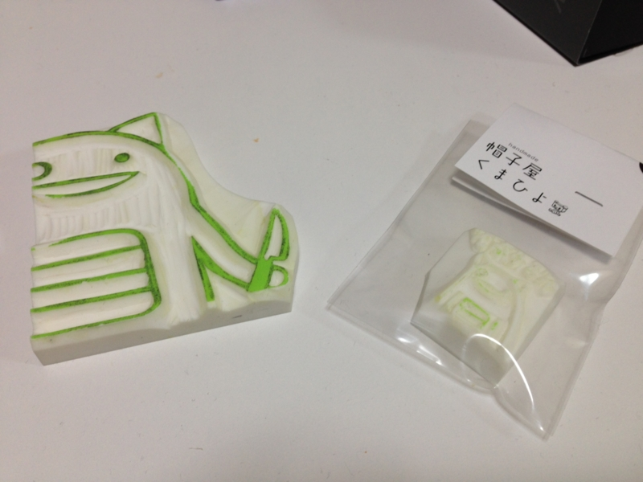
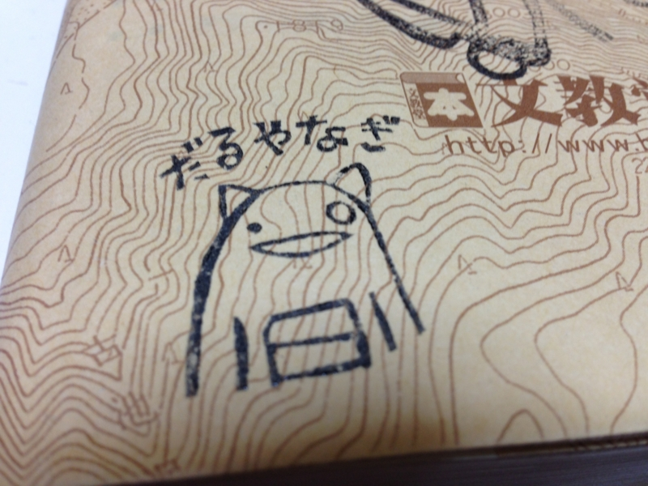
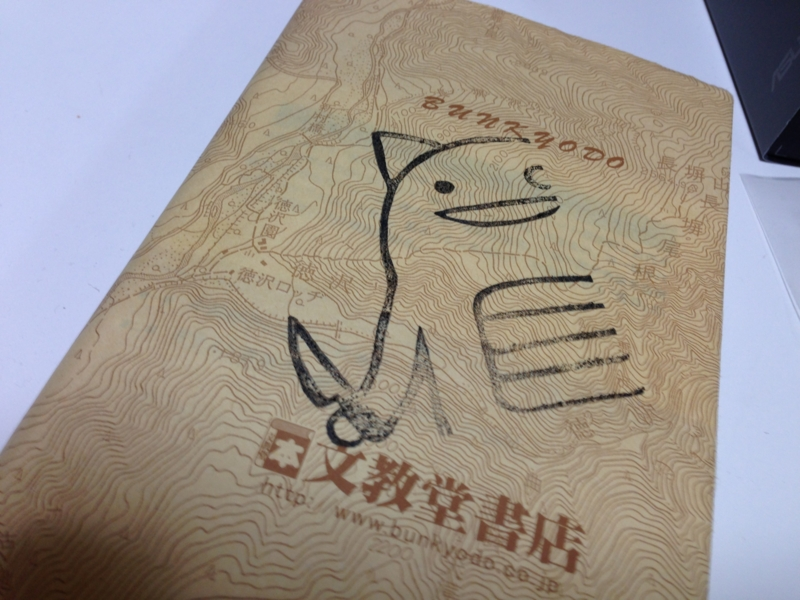

もうだいぶ前の話（去年の暮）になるのだけれど、Twitter のお知り合いに消しゴムハンコを作ってもらった……のだが！　家に肝心のスタンプ台がなく、そのままになっていた（← さっさと買えよ！）。で、やっとこさ先日スタンプ台をゲットしたので、さっそく（？）ブックカバーにぺたぺたしてみた。

なかなかいい感じじゃないか （^ｑ^

ちょっと無理を言って通常のサイズのものに加えキングサイズのハンコもひとつ作ってもらったのだけれど、どちらもいろいろ使えそうだ。とくにキングサイズはインパクトがスゴい。今年はこれで暑中見舞いでも作って送ろうかと。小さいほうは……そうだね、蔵書印にでもしてやろうか（笑

黒だけでは寂しいので、いろんな色のスタンプ台がほしくなってきた。

<ul>
<li><a href="http://yaplog.jp/kmhiyo/">&#x304F;&#x307E;&#x3072;&#x3088;&#x306E;&#x624B;&#x4ED5;&#x4E8B;&#xFF5C;yaplog!&#xFF08;&#x30E4;&#x30D7;&#x30ED;&#x30B0;&#xFF01;&#xFF09;byGMO</a></li>
</ul>