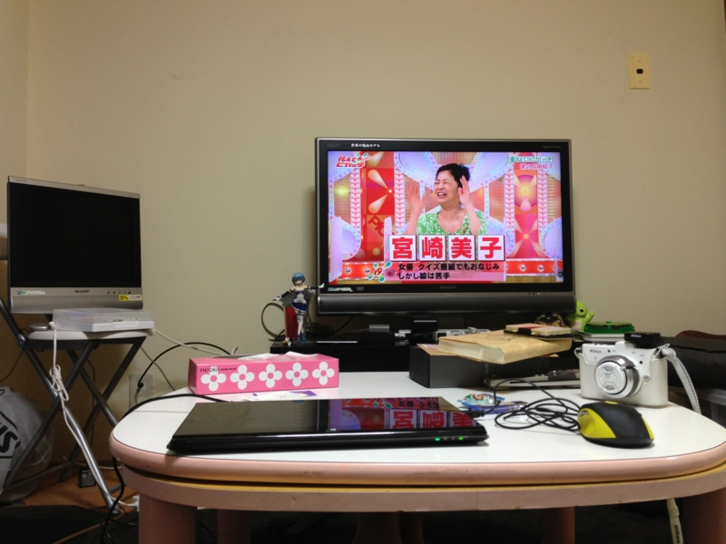
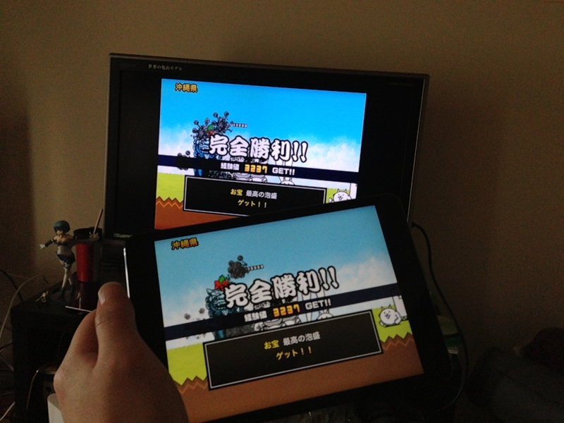
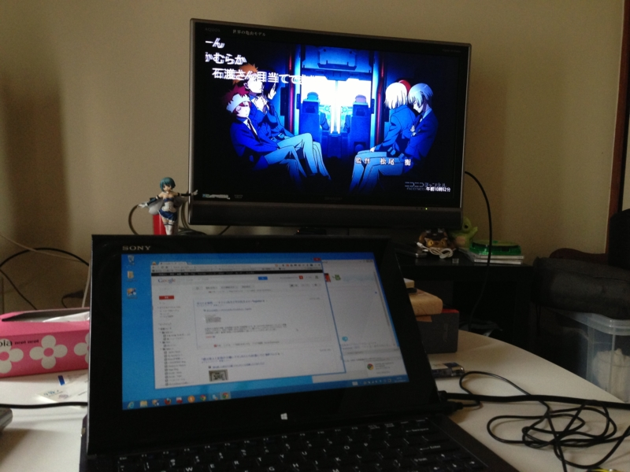

TV はあまり観ない。観なさ過ぎて、ときどき世間話についてけないほど。観たいサッカーの試合があるときに点ける程度で、それも近所で知り合いになったラーメン屋で観ることが多い。あ、春までは毎週『みなみけ』を観てたっけ。そんなわけで、うちはデジアナ変換でアナログ TV がまだ使えることもあり、2006年製の小さなアナログ液晶 TV がいまだに活躍していた。

つまり、PC にかけるカネはあっても TV にカネをかける気はさらさらない！　というわけ……だったのだけど、先日、実家から要らなくなった TV もらっちゃった (*´ω｀*)

まぁ、あればあればで使い道はいろいろあるわけで。さっそく、iPad mini のゲームを大画面で楽しもうと試みた。

<a href="http://www.amazon.co.jp/exec/obidos/ASIN/B009WQ9E8C/bestylesnet-22/">Apple Lightning Digital AVアダプタ MD826ZM/A</a>
<ul><li>出版社/メーカー: アップル</li><li>発売日: 2012/12/03</li><li>メディア: エレクトロニクス</li><li> クリック: 1回</li><li><a href="http://d.hatena.ne.jp/asin/B009WQ9E8C/bestylesnet-22" target="_blank">この商品を含むブログを見る</a></li></ul>

<a href="http://www.amazon.co.jp/exec/obidos/ASIN/B003L1ZYYM/bestylesnet-22/">Amazonベーシック ハイスピードHDMIケーブル 2.0m (タイプAオス- タイプAオス、イーサネット、3D、オーディオリターン対応)</a>
<ul><li>出版社/メーカー: AmazonBasics</li><li>メディア: エレクトロニクス</li><li>購入: 40人 クリック: 52回</li><li><a href="http://d.hatena.ne.jp/asin/B003L1ZYYM/bestylesnet-22" target="_blank">この商品を含むブログを見る</a></li></ul>

HDMI ケーブルと iPhone/iPad のディスプレイアダプタを購入してつなげてみた。

最近は弟どもに教えてもらった「にゃんこ大戦争」というゲームが気に入っている。大量の“にゃんこ”で全国支配を目指すゲームで、ついさっき西表島を征服して日本を統一した。

<a href="https://itunes.apple.com/jp/app/nyanko-da-zhan-zheng/id547145938?mt=8">iTunes App Store&#x3067;&#x898B;&#x3064;&#x304B;&#x308B; iPhone 3GS&#x3001;iPhone 4&#x3001;iPhone 4S&#x3001;iPhone 5&#x3001;iPod touch&#xFF08;&#x7B2C;2&#x4E16;&#x4EE3;&#xFF09;&#x3001;iPod touch&#xFF08;&#x7B2C;3&#x4E16;&#x4EE3;&#xFF09;&#x3001;iPod touch (&#x7B2C;4&#x4E16;&#x4EE3;)&#x3001;iPod touch (&#x7B2C;5&#x4E16;&#x4EE3;)&#x3001;&#x304A;&#x3088;&#x3073;iPad &#x5BFE;&#x5FDC;&#x306E;&#x306B;&#x3083;&#x3093;&#x3053;&#x5927;&#x6226;&#x4E89;</a>

とはいえ、太い HDMI ケーブルを刺してしまうと iPad mini の機動性がかなり失われてしまう。やっぱ動画鑑賞に使うのが無難かな？　みんなでわいわいゲームするときにはいいかもだけど。

最近は VAIO Duo 11 と TV をつなげて、ストアアプリで niconico を表示しながらこのブログを書いたり……なんてこともしてる。ちょうどノーパソ用の外部ディスプレ映画ほしかったので、ちょうどよかった。

電気代増えそうだな。

