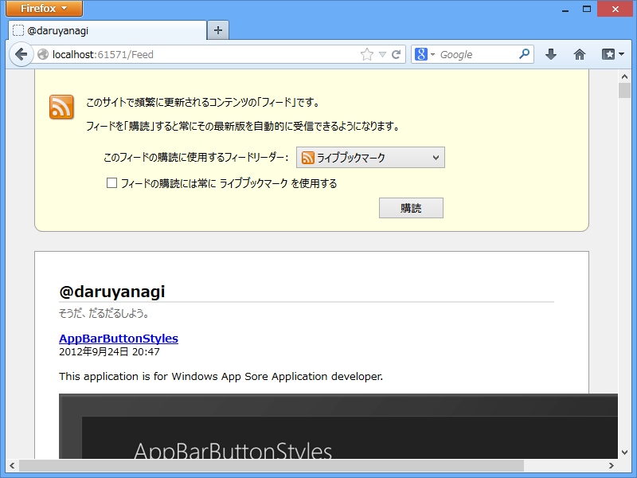

とあるフォルダー内のファイルのリストを RSS で出力したいなぁ、と思って昔に書いた記事（<a href="https://blog.daruyanagi.jp/entry/2012/02/02/225759">RSS 2.0 &#x3092;&#x5B9F;&#x88C5;&#x3059;&#x308B; - &#x3060;&#x308B;&#x308D;&#x3050;</a>）をコピペしてみたのだけれど、ちゃんと動かなかった……なぜだ。まぁ、原因を追求するのも面倒だったので、SyndicationFeed クラスを利用して書きなおしてみました。

<pre class="code lang-cs" data-lang="cs" data-unlink>@using System.IO
@using System.Xml
@using System.ServiceModel.Syndication

@{
var url = new Uri(Request.Url.Scheme + &quot;://&quot; + Request.Url.Authority);

// ココらへんはあんまり気にしないで
var files = Directory.GetFiles(Server.MapPath(&quot;~/App_Text/&quot;))
.Select(_ =&gt; new FileInfo(_))
.Where(_ =&gt; !_.Name.StartsWith(&quot;_&quot;))
.OrderByDescending(_ =&gt; _.LastWriteTime)
.Take(10);

var feed = new SyndicationFeed(App.Title, App.Description, new Uri(url, &quot;Feed&quot;))
{
Copyright = new TextSyndicationContent(App.Copyright.ToString()),
Items = files.Select(file =&gt;
{
var name = Path.GetFileNameWithoutExtension(file.FullName);

// ファイルの内容を読み込んで自作の Markdown エンジンにかけている
var content = TextFormatEngine.Transform(File.ReadAllText(file.FullName));

return new SyndicationItem(
name, content.ToString(), new Uri(url, name), name, file.LastWriteTime
);
}),
};

Response.Clear();
Response.ContentType = &quot;application/xml&quot;;
var writer = XmlWriter.Create(Response.Output);
feed.SaveAsRss20(writer);
Response.End();
}
</pre>

できた！

と思ったけど、Internet Explorer ではちゃんと表示できない。なんか XML が尻切れトンボで出力されておる……

