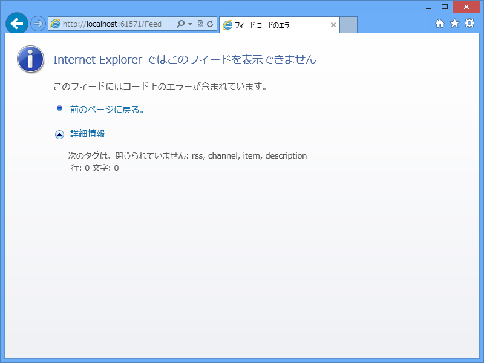
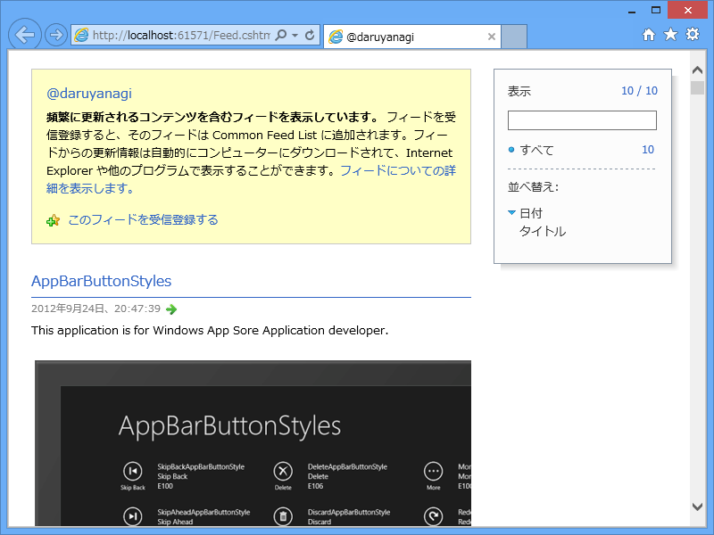

 

<blockquote cite="https://blog.daruyanagi.jp/entry/2013/04/17/065153">

できた！

と思ったけど、Internet Explorer ではちゃんと表示できない。なんか XML が尻切れトンボで出力されておる……

<cite><a href="https://blog.daruyanagi.jp/entry/2013/04/17/065153">WebMatrix 3: RSS &#x30D5;&#x30A3;&#x30FC;&#x30C9;&#x3092;&#x51FA;&#x529B;&#x3059;&#x308B; - &#x3060;&#x308B;&#x308D;&#x3050;</a></cite>
</blockquote>

この問題を解決しておきましょう。

 

初めは、

<ul>
<li>Response.Write() になにか制限（タイムアウト、バッファーサイズ）がある</li>
<li>Response.End() の使い方が間違ってる</li>
</ul>
のかなぁ、と思って色々と調べたのだけれど、そうではなさそう。処理に時間がかかっているわけでもないし、出力されるデータのサイズもたいしたことはない。

結局、単に XmlWriter の使い方を間違っているだけだった。

<pre class="code lang-cs" data-lang="cs" data-unlink>Response.Clear();
Response.ContentType = &quot;application/xml&quot;;
feed.SaveAsRss20(writer);
Response.End();
</pre>
ではなく、

<pre class="code lang-cs" data-lang="cs" data-unlink>Response.Clear();
Response.ContentType = &quot;application/xml&quot;;

using (var writer = XmlWriter.Create(Response.Output))
{
feed.SaveAsRss20(writer);
}

Response.End();
</pre>
と、ちゃんと XmlWriter.Dispose()（実際は、XmlWriter.Close() かな？）を呼び出しておかなくてはいけないみたい。

無事、すべて出力されたみたい。気をつけよう……

