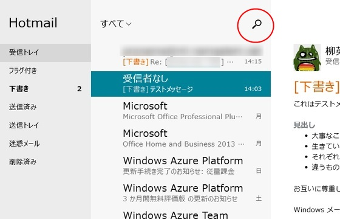
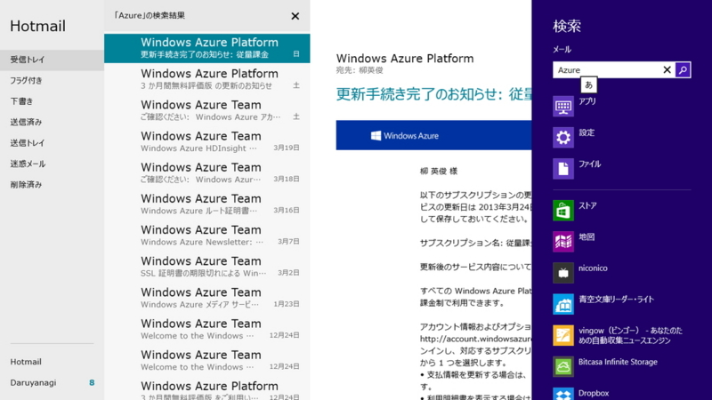
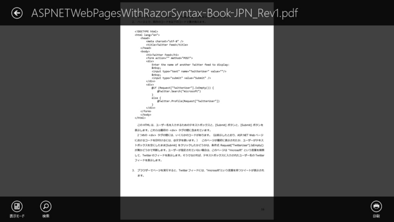
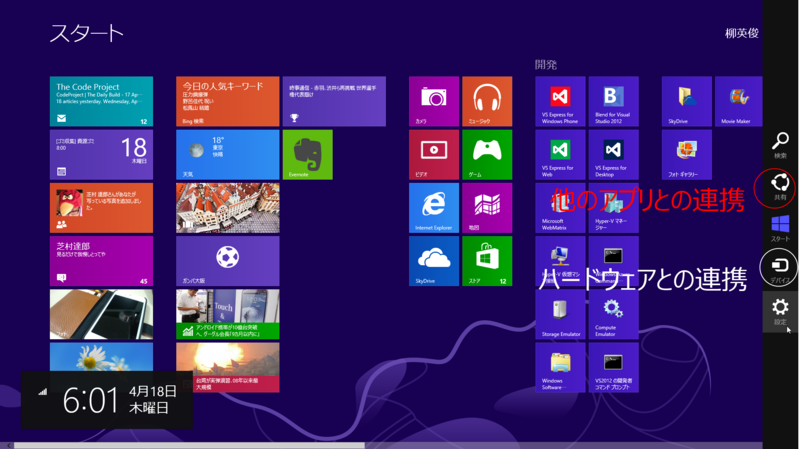

<a href="http://pc.watch.impress.co.jp/docs/column/win8wb/20130417_596076.html">&#x3010;Windows 8&#x30E6;&#x30FC;&#x30B6;&#x30FC;&#x30BA;&#x30FB;&#x30EF;&#x30FC;&#x30AF;&#x30D9;&#x30F3;&#x30C1;&#x3011;Windows 8&#x306B;&#x3068;&#x3063;&#x3066;&#x306E;&#x30C7;&#x30D0;&#x30A4;&#x30B9; - PC Watch</a> を読んで。

<h3>なかなかユーザーに浸透しないチャーム</h3>

僕が最初に「あれっ？」と思ったのは、<a href="http://www.forest.impress.co.jp/docs/news/20130326_593184.html">Microsoft&#x3001;Windows 8/RT&#x306E;&#x300C;&#x30E1;&#x30FC;&#x30EB;&#x300D;&#x300C;&#x30AB;&#x30EC;&#x30F3;&#x30C0;&#x30FC;&#x300D;&#x300C;People&#x300D;&#x3092;&#x30A2;&#x30C3;&#x30D7;&#x30C7;&#x30FC;&#x30C8; - &#x7A93;&#x306E;&#x675C;</a> のときだった。「メール」に［検索］ボタンがついてる！

押すと［検索］チャームが出るだけ。なんだそれ。

“チャーム”の使い方さえ知っていれば本来不要なボタンで、Windows 8 アプリのデザインガイドラインにおいてもこのようなボタンの使い方は否定されていたのではないか（あまり覚えていないけど）。

最近だと Adobe Reader Touch が同様に［印刷］ボタンを設けている。これを押すと、［デバイス］チャームが開き、プリンターを選べば PDF ファイルを印刷できるようになっている。いや、直接［デバイス］チャーム開けよ。ホットキーだって用意されているよ。

このとき、僕は「あぁ、Microsoft は負けを認めたんだなぁ」と感じた。同時に「ユーザーが新しいデザインに慣れるまで、過渡的にこういったボタンが用意されるのは悪いことではないのかな？」とも考えた。ユーザーというのは、とかく頑固で、なかなか自分のやり方を変えたがらないらしい。

<h3>チャームってそんなにムズかしい？</h3>

そもそもチャームってそんなに難しいかな。

［共有］が“他のアプリとの<b>連携</b>”、［デバイス］が“パソコンに接続されたハードウェアとの<b>連携</b>”と捉えれば、それぞれのボタンの役割は非常に明快で、シンプルだと思うのだけど。［検索］と［設定］はほぼそのままの意味だしね。

数多ある操作をたった 5 つのボタンに集約するっていうのは言うほど簡単なことではなく、かなり時間をかけてアイデアを煮詰め結果だと思うよ。

けれど、一歩その奥に入れば、だいぶ混乱しているのは確か。

<blockquote cite="http://pc.watch.impress.co.jp/docs/column/win8wb/20130417_596076.html">

　Windows 8では「デバイス」という考え方は、以前のWindowsと変わらないように見えて、ちょっとややこしくなっている。もちろん、何らかのインターフェイス、例えばUSBやBluetooth、ネットワークといった手段で接続された機器という点では同じだ。

　ところが、「デバイス」という言葉が登場する場面が複数あり、それぞれでできることや意味合いが異なっている。

<cite><a href="http://pc.watch.impress.co.jp/docs/column/win8wb/20130417_596076.html">&#x3010;Windows 8&#x30E6;&#x30FC;&#x30B6;&#x30FC;&#x30BA;&#x30FB;&#x30EF;&#x30FC;&#x30AF;&#x30D9;&#x30F3;&#x30C1;&#x3011;Windows 8&#x306B;&#x3068;&#x3063;&#x3066;&#x306E;&#x30C7;&#x30D0;&#x30A4;&#x30B9; - PC Watch</a></cite>
</blockquote>

その事自体はあんまり問題ない気がするのだけれど、設定周りのユーザーインターフェイスはぐちゃぐちゃで目も当てられない。デスクトップのコントロールパネルでしかできないことまであるしな……Windows 8.1 ではこういうところを煮詰めてくれたらなぁ、って思いますね。ぶっちゃけ、起動時にスタート画面をスキップできるだの、画面半々にスナップできるとかどうでもいい。

あと、Windows 8 が不振である根本的原因は<i>マウスで使いにくい</i>ことだと思う。わしはキーボード派だし、タッチデバイスも持っていて、その限りでは Windows 8 の操作性はそんなに悪く無いというか、むしろだいぶ向上していると感じている。けれど、フツーのひとはいまだにマウスオペレーションが主流で、しかもそういう人たちが“パソコン上級者”と自他ともに認めている状況にあるわけで（※少なくとも Windows では）。なにかしら、彼らに配慮した改善が必要だと思う。<i>それが“チャームを開くためのボタン”みたいな、無駄なモノでもしょうがないじゃない！　</i>けれど、ユーザーを新しいデザインに慣れさせるための補助手段そしてならともかく、ただ単に元のデザインに先祖返りするだけの変更はやめてほしい。意味があって新しいデザインを導入したのだろうし<a href="#f-228a46b9" name="fn-228a46b9" title="それが間違っていれば戻せばいいのだが">*1</a>、いち早くそのデザインに馴染んだユーザーもいるわけだしね。

<ul>
<li><a href="https://blog.daruyanagi.jp/entry/2012/06/06/204210">Metro &#x30C7;&#x30B9;&#x30AF;&#x30C8;&#x30C3;&#x30D7;&#x306F;&#x3067;&#x3063;&#x304B;&#x3044;&#x30B9;&#x30BF;&#x30FC;&#x30C8;&#x30E1;&#x30CB;&#x30E5;&#x30FC;&#x3002;&#x6B7B;&#x3093;&#x3060;&#x306E;&#x306F;&#x30B9;&#x30BF;&#x30FC;&#x30C8;&#x30E1;&#x30CB;&#x30E5;&#x30FC;&#x3067;&#x306F;&#x306A;&#x304F;&#x30DE;&#x30A6;&#x30B9;&#x3002; - &#x3060;&#x308B;&#x308D;&#x3050;</a></li>
</ul>

<a href="#fn-228a46b9" name="f-228a46b9" class="footnote-number">*1</a>:それが間違っていれば戻せばいいのだが

