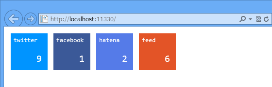
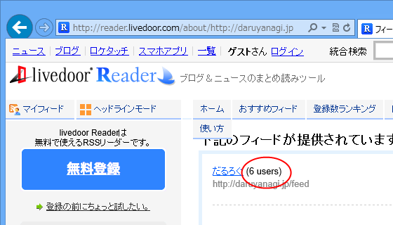
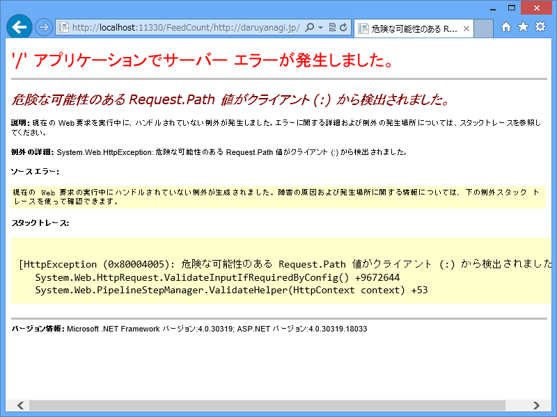

こんな感じのソーシャル共有＋ RSS 購読ボタンをサイトに追加したいな、と思って、今朝少し WebMatrix と格闘していた。

SNS における共有数の取得部分は JavaScript だけで完結するのだけれど、RSS 購読数の取得部分は JavaScript だけでは少ししんどいのかなぁ。Same origin policy というものに引っかかってしまう。まぁ、こういうときは WebMatrix でサーバー側に RSS 購読数を取得するようにすればいいよね。

 

~/FeedCount/<a href="https://blog.daruyanagi.jp/">https://blog.daruyanagi.jp/</a> で <a href="https://blog.daruyanagi.jp/">https://blog.daruyanagi.jp/</a> の RSS 購読数を取得する FeedCount.cshtml を書いてみた。とりあえず今回は一番簡単な Livedoor Reader だけ。

<pre class="code lang-cs" data-lang="cs" data-unlink>@using System.Text
@using System.Text.RegularExpressions

@functions
{
public int GetSubscriptionCountOfLiveDoorReader(string url)
{
try
{
using (var client = new WebClient() {
Encoding = Encoding.UTF8 } )
{
var text = client.DownloadString(
@&quot;http://reader.livedoor.com/about/&quot; + url);
var m = new Regex(
@&quot;&quot;&quot;subscriber_count&quot;&quot;\&gt; \((\d+) users\)&quot;)
.Matches(text);

return m.Count == 0 ? 0 : m[0].Groups[1].Value.AsInt();
}
}
catch
{
return 0;
}
}
}
</pre>
Livedoor Reader の購読者数は、<a href="http://reader.livedoor.com/about/">http://reader.livedoor.com/about/</a>（URL）へアクセスすると取得できるらしい。

あとは正規表現で当該部分を取得すればいい。AsInt() は ASP.NET Web Pages の便利関数。知っておくと便利だよ。

<pre class="code lang-cs" data-lang="cs" data-unlink>@{
var url = string.Join(&quot;//&quot;,
UrlData.Where(_ =&gt; !string.IsNullOrEmpty(_)));

var livedoor = GetSubscriptionCountOfLiveDoorReader(url);

var data = new {
livedoor = livedoor,
total = livedoor,
};

Response.Clear();
Response.ContentType = &quot;application/json&quot;;
Response.Write(Json.Encode(data));
Response.End();
}
</pre>
今回は JSON で値を返すことにしました。JsonHelper を使うとカンタン。

結果はこんな感じ。

 

<pre class="code" data-lang="" data-unlink>({&#34;livedoor&#34;:6,&#34;total&#34;:6})</pre>
次回はこれを JavaScript から呼んで、Web ページの表示しましょう。

<h4>注記</h4>

なお、UrlDate で <a href="https://blog.daruyanagi.jp/">https://blog.daruyanagi.jp/</a> を取得しようとすると、

このようなエラー<a href="#f-755e4e80" name="fn-755e4e80" title="危険な可能性のある Request.Path 値がクライアント (:) から検出されました。 ">*1</a>が発生したり、そのほかにもいろいろあるのだけれど、それについてはまた稿を改めたい。

<a href="#fn-755e4e80" name="f-755e4e80" class="footnote-number">*1</a>:危険な可能性のある Request.Path 値がクライアント (:) から検出されました。 

