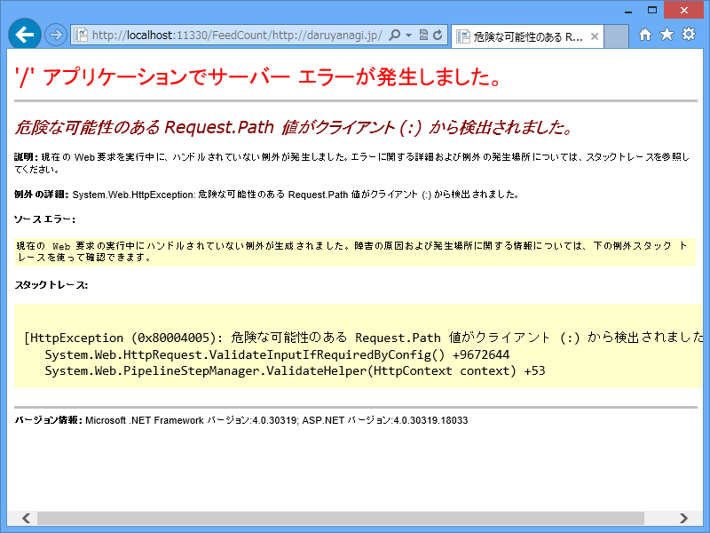
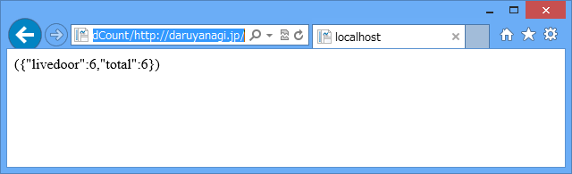
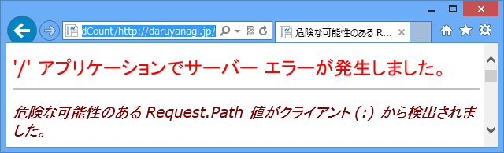

<a href="https://blog.daruyanagi.jp/entry/2013/04/20/224501">WebMatrix 3: &#x30D5;&#x30A3;&#x30FC;&#x30C9;&#x306E;&#x8CFC;&#x8AAD;&#x8005;&#x6570;&#x3092;&#x53D6;&#x5F97;&#x3059;&#x308B;&#xFF08;1&#xFF1A;&#x30B5;&#x30FC;&#x30D0;&#x30FC;&#x30B5;&#x30A4;&#x30C9;&#x7DE8;&#xFF09; - &#x3060;&#x308B;&#x308D;&#x3050;</a> の補足。

<pre class="code" data-lang="" data-unlink>http://localhost:11330/FeedCount/https://blog.daruyanagi.jp/</pre>
このような URL を受け取ると、

<blockquote>

危険な可能性のある Request.Path 値がクライアント (:) から検出されました。

</blockquote>

というエラーが出てしまいます。これは ASP.NET のセキュリティ機能のようですね。ただ、自分は Web 系のセキュリティにあまり詳しくないので、これがどのように悪用できるのかさっぱりわからないのですが……（SQLインジェクションかなにかかなぁ？）。いい本をご存知でしたら、どなたか教えてください。

とりあえず、今回はこれを解除してしまいます。あとは自己責任で……

<h3>Web.config を編集する</h3>
<pre class="code lang-xml" data-lang="xml" data-unlink>&lt;?xml version=&quot;1.0&quot; encoding=&quot;utf-8&quot;?&gt;

&lt;configuration&gt;
&lt;system.web&gt;
&lt;httpRuntime requestPathInvalidCharacters=&quot;&amp;lt;,&amp;gt;,*,%,&amp;amp;,\,?&quot; /&gt;
&lt;/system.web&gt;
&lt;/configuration&gt;
</pre>
&lt;httpRuntime&gt; の部分を追加すると動きます。

当該部分をコメントアウトするとエラーが発生します。

 

<h3>RequestPathInvalidCharacters プロパティ</h3>

<b>HttpRuntimeSection.RequestPathInvalidCharacters プロパティ</b>は ASP.NET 4 から追加されたもので（たぶん）、指定された文字が含まれたパスに含まれていないか検証します。初期値は、

<pre class="code" data-lang="" data-unlink>&lt;,&gt;,*,%,&amp;,:,\,?</pre>
です（コンマ区切り）。Web.config で指定する場合は実態参照にしないと正しい XML にならないので注意。

<ul>
<li><a href="http://msdn.microsoft.com/ja-jp/library/system.web.configuration.httpruntimesection.requestpathinvalidcharacters.aspx">HttpRuntimeSection.RequestPathInvalidCharacters Property (System.Web.Configuration) | Microsoft Docs</a></li>
</ul>
ASP.NET 2.x → ASP.NET 4.x の間ではセキュリティの強化もあるらしくて、昔から馴染んでる人にとっては地雷みたいですね。

<blockquote cite="http://msdn.microsoft.com/ja-jp/library/system.web.configuration.httpruntimesection.requestvalidationmode.aspx">

RequestValidationMode プロパティは、どの ASP.NET アプローチを検証に使用するかを指定します。 これは、ASP.NET 4.0 より前のバージョンまたは .NET Framework 4 で使用されているバージョンで使用されているアルゴリズムである場合もあります。 プロパティは次の値に設定できます。

<ul>
<li><b>4.0 (既定値)。</b> HttpRequest オブジェクトは、HTTP 要求データがアクセスされるたびに要求の検証が発生する必要があることを示すフラグを内部的に設定します。 これにより、クッキーなどのデータの前に要求の検証がトリガーされ、URL が要求時にアクセスされることが保証されます。 構成ファイルの pages 要素 (存在する場合) と個々のページの @ Page ディレクティブの要求検証設定は、無視されます。</li>
<li><b>2.0.</b> 要求検証は、ページに対してのみ有効です。すべての HTTP 要求に対して有効ではありません。 さらに、構成ファイルの pages 要素 (存在する場合) と個々のページの @ Page ディレクティブの要求検証設定は、検証対象のページ要求を決定するのに使用されます。</li>
</ul>
このプロパティに割り当てる値は、ASP.NET の特定のバージョンと一致するように検証されていません。 4.0 より小さい数値 (たとえば、 3.7、2.9、2.0) は、2.0 として解釈されます。 4.0 より大きい数値は、4.0 として解釈されます。

<cite><a href="http://msdn.microsoft.com/ja-jp/library/system.web.configuration.httpruntimesection.requestvalidationmode.aspx">HttpRuntimeSection.RequestValidationMode Property (System.Web.Configuration) | Microsoft Docs</a></cite>
</blockquote>

逆に言えば、それだけ安心になっているということなのですが。

