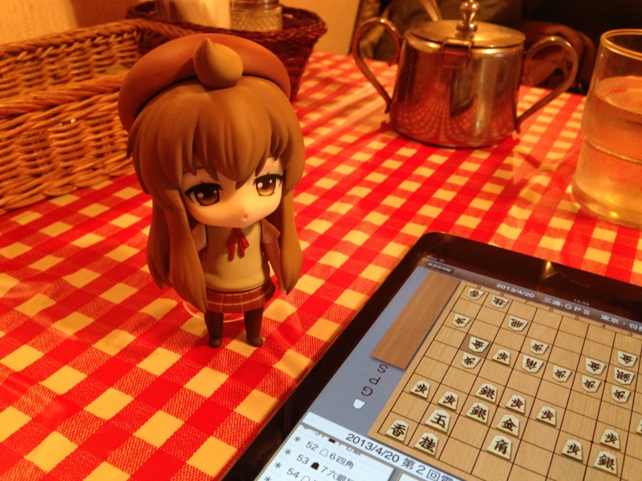

昨日、21歳になりました。もちろん、16進数でのお話です。

その日は友達からプレゼントをもらって、お寿司食べて、登山グッズを買い<a href="#f-0fd7d55c" name="fn-0fd7d55c" title="夏に山へ登ろうかと画策しています">*1</a>、アキバの喫茶店でお茶飲んで、家に帰ってゴロゴロと、電脳戦で三浦九段がコンピューターにぼこぼこにされているのを眺めて、のんびり過ごしました。あと、Facebook でお礼のメッセージを書くのでテンパってた！

去年はこんなブログを書いていたのですが（<a href="https://blog.daruyanagi.jp/entry/2012/04/20/012313">2^5 &#x6B73;&#x306B;&#x306A;&#x308A;&#x307E;&#x3057;&#x305F; - &#x3060;&#x308B;&#x308D;&#x3050;</a>）、あの時なにを考えていたのかさっぱり覚えてません。ただ、去年は実家の方で心配事もあって、かなり自分のことは後回しにしてしまったなぁ、というのが悔いとしてありますね。たとえば、女の子を誘うチャンスをみすみすドブに捨てたり（死

あと、だいぶ太りました。食べて呑んで、ストレス解消していたところがだいぶある。本を読む数も減って、ぼーっとする時間が増えたのだけど、それでも足りない。ただ、WebMatrix で遊ぶ時間は増えた（爆

まぁ、どう考えてもそっちは放っておけないわけで、今年もその延長は続けるしかないのだけれど、とりあえず小康状態になっているみたいなので、この隙に攻めに転じたいな、と考えています。最近は少しヌルく生きていると思うので、そろそろもう少し厳しめのところへ自分を追い込んでいきたい、と。

<a href="#fn-0fd7d55c" name="f-0fd7d55c" class="footnote-number">*1</a>:夏に山へ登ろうかと画策しています

