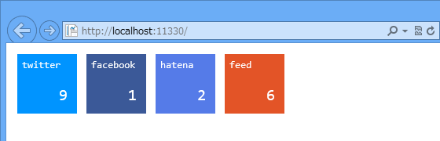

<a href="https://blog.daruyanagi.jp/entry/2013/04/20/224501">WebMatrix 3: &#x30D5;&#x30A3;&#x30FC;&#x30C9;&#x306E;&#x8CFC;&#x8AAD;&#x8005;&#x6570;&#x3092;&#x53D6;&#x5F97;&#x3059;&#x308B;&#xFF08;1&#xFF1A;&#x30B5;&#x30FC;&#x30D0;&#x30FC;&#x30B5;&#x30A4;&#x30C9;&#x7DE8;&#xFF09; - &#x3060;&#x308B;&#x308D;&#x3050;</a> で吐いた JSON を JavaScript で読み取ってみる。

<h3>SocialButtons.js</h3>

Scrips フォルダの中にいれておく。jQuery が必要なので、NuGet で入手しておく。

<pre class="code lang-javascript" data-lang="javascript" data-unlink>function get_twitter_button(url, dest, text) {
var share = 'https://twitter.com/share?url=' + url + '&amp;text=' + text;
var comment = 'https://twitter.com/search/?q=' + url;
var span = $('&lt;span&gt;').addClass('twitter');
$('#' + dest).append(span);
var element;
element = $('&lt;a&gt;').text('twitter').addClass('service-name').attr('href', share);
span.append(element);
element = $('&lt;a&gt;').addClass('count').attr('href', comment);
span.append(element);
$.ajax({
url: 'http://urls.api.twitter.com/1/urls/count.json?url=' + url,
dataType: 'jsonp',
success: function (json) {
element.text(json.count || 0);
}
});
}

function get_facebook_button(url, dest, text) {
var share = 'http://www.facebook.com/sharer.php?u=' + url + '&amp;t=' + text;
var comment = '';
var span = $('&lt;span&gt;').addClass('facebook');
$('#' + dest).append(span);
var element;
element = $('&lt;a&gt;').text('facebook').addClass('service-name').attr('href', share);
span.append(element);
element = $('&lt;a&gt;').addClass('count').attr('href', comment);
span.append(element);
$.ajax({
url: 'https://graph.facebook.com/' + url,
dataType: 'jsonp',
success: function (json) {
element.text(json.shares || 0);
}
});
}

function get_hatena_button(url, dest, text) {
var share = 'http://b.hatena.ne.jp/add?mode=confirm&amp;url=' + url + '&amp;title=' + text;
var comment = 'http://b.hatena.ne.jp/entry/' + url;
var span = $('&lt;span&gt;').addClass('hatena');
$('#' + dest).append(span);
var element;
element = $('&lt;a&gt;').text('hatena').addClass('service-name').attr('href', share);
span.append(element);
element = $('&lt;a&gt;').addClass('count').attr('href', comment);
span.append(element);
$.ajax({
url: 'http://api.b.st-hatena.com/entry.count?url=' + url,
dataType: 'jsonp',
success: function (json) {
element.text(json || 0);
}
});
}

function get_feed_button(url, dest, text) {
var share = url + 'feed';
var comment = url;
var span = $('&lt;span&gt;').addClass('feed');
$('#' + dest).append(span);
var element;
element = $('&lt;a&gt;').text('feed').addClass('service-name').attr('href', share);
span.append(element);
element = $('&lt;a&gt;').addClass('count').attr('href', comment);
span.append(element);
$.ajax({
url: '/FeedCount/' + url,
dataType: 'json',
success: function (json) {
element.text(json.total || 0);
}
});
}

function get_social_button(url, dest, text) {
get_twitter_button(url, dest, text);
get_facebook_button(url, dest, text);
get_hatena_button(url, dest, text);
get_feed_button(url, dest, text);
}
</pre>

<h3>Default.cshtml でテスト</h3>

これでだいたいうまく動くはず。

<pre class="code lang-html" data-lang="html" data-unlink>&lt;!DOCTYPE html&gt;

@{
var page_title = &quot;マイ サイトのタイトル&quot;;
}

&lt;html lang=&quot;ja&quot;&gt;
&lt;head&gt;
        &lt;meta http-equiv=&quot;Content-Type&quot; content=&quot;text/html; charset=utf-8&quot;/&gt;
        &lt;meta charset=&quot;utf-8&quot; /&gt;
        &lt;title&gt;@page_title&lt;/title&gt;
        &lt;link href=&quot;~/favicon.ico&quot; rel=&quot;shortcut icon&quot; type=&quot;image/x-icon&quot; /&gt;
        &lt;link href=&quot;~/Content/SocialButtons.css&quot; rel=&quot;stylesheet&quot; /&gt;
        
        &lt;script src=&quot;~/Scripts/jquery-1.9.1.js&quot;&gt;&lt;/script&gt;
        &lt;script src=&quot;~/Scripts/SocialButtons.js&quot;&gt;&lt;/script&gt;
    &lt;/head&gt;
&lt;body&gt;
&lt;div id=&quot;social-buttons&quot; class=&quot;social-button&quot;&gt;
&lt;script&gt;
                get_social_button('https://blog.daruyanagi.jp/', 'social-buttons', '@page_title')
            &lt;/script&gt;
&lt;/div&gt;
&lt;/body&gt;
&lt;/html&gt;
</pre>
今回は別に説明することはなにもない。div#social-buttons 以下にこんな感じの DOM が生成される。

話は変わるけど、最近の Firefox の開発者ツールはかなり進化している。おもにビジュアル的に。機能面では使いこなせていないモノが多数あるので、意見は差し控えておく。

それにしても JavaScript は苦手だなぁ……もう少しスマートに書けないものなのかな。

