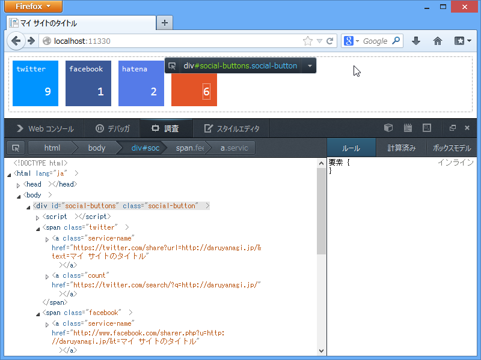

<a href="https://blog.daruyanagi.jp/entry/2013/04/21/154036">WebMatrix 3: &#x30D5;&#x30A3;&#x30FC;&#x30C9;&#x306E;&#x8CFC;&#x8AAD;&#x8005;&#x6570;&#x3092;&#x53D6;&#x5F97;&#x3059;&#x308B;&#xFF08;2: JavaScript &#x7DE8;&#xFF09; - &#x3060;&#x308B;&#x308D;&#x3050;</a> で忘れていたんだけれど、これ、CSS を当てないとすごくさびしい。今回はタイル状にレイアウトしてみたよ。

<h3>LESS のソース</h3>

~/Content/SocialButtons.less を記述。WebMatrix には OrangeBitsCompiler と呼ばれる LESS コンパイラーが拡張機能として提供されているので、LESS を書けばそのまま CSS にコンパイルできる。

<ul>
<li><a href="https://blog.daruyanagi.jp/entry/2012/08/15/161932">WebMatrix &#x3067; LESS &#x3092;&#x4F7F;&#x304A;&#x3046;&#xFF01; - &#x3060;&#x308B;&#x308D;&#x3050;</a></li>
<li><a href="https://blog.daruyanagi.jp/entry/2012/09/09/172243">WebMatrix &#x3067; LESS &#x3092;&#x4F7F;&#x304A;&#x3046;&#xFF01;&#xFF08;2&#xFF09; - &#x3060;&#x308B;&#x308D;&#x3050;</a></li>
</ul>
役に立つかどうか知らんけど、過去記事も参照してみてね （ゝω・）vｷｬﾋﾟ

<pre class="code lang-css" data-lang="css" data-unlink>.social-button {

span {
display: inline-block;
position: relative;
width: 64px;
height: 64px;
margin: 6px;
padding: 6px;
color: #fff;

a {
position: absolute;

font-family: Consolas, monospace;
color: #fff;
text-decoration: none;
}

a.service-name {
display: inline-block;

height: 64px;
width: 64px;

top: 6px;
left: 6px;

font-size: 0.8em;
}

a.count {
bottom: 12px;
right: 12px;
font-size: 1.25em;
}
}

.twitter {
background-color: #0094ff;
}

.facebook {
background-color: #3B5998;
}

.hatena {
background-color: #557BE8;
}

.feed {
background-color: #E35427;
}
}
</pre>

<h3>CSS のソースコード</h3>
<pre class="code lang-css" data-lang="css" data-unlink>.social-button span {
display: inline-block;
position: relative;
width: 64px;
height: 64px;
margin: 6px;
padding: 6px;
color: #fff;
}
.social-button span a {
position: absolute;
font-family: Consolas, monospace;
color: #fff;
text-decoration: none;
}
.social-button span a.service-name {
display: inline-block;
height: 64px;
width: 64px;
top: 6px;
left: 6px;
font-size: 0.8em;
}
.social-button span a.count {
bottom: 12px;
right: 12px;
font-size: 1.25em;
}
.social-button .twitter {
background-color: #0094ff;
}
.social-button .facebook {
background-color: #3B5998;
}
.social-button .hatena {
background-color: #557BE8;
}
.social-button .feed {
background-color: #E35427;
}
</pre>
ネストが全部ばらされてるけど、初めからこれを書くのはしんどいよね。

マージンやパディング、色を変数として定義しておくと、さらにのちのちのメンテナンス性が上がると思う。

WebMatrix は JavaScript も CSS もバッチリだよ！　という一連のお話でした。

<ul>
<li><a href="https://blog.daruyanagi.jp/entry/2013/04/20/224501">WebMatrix 3: &#x30D5;&#x30A3;&#x30FC;&#x30C9;&#x306E;&#x8CFC;&#x8AAD;&#x8005;&#x6570;&#x3092;&#x53D6;&#x5F97;&#x3059;&#x308B;&#xFF08;1&#xFF1A;&#x30B5;&#x30FC;&#x30D0;&#x30FC;&#x30B5;&#x30A4;&#x30C9;&#x7DE8;&#xFF09; - &#x3060;&#x308B;&#x308D;&#x3050;</a></li>
<li><a href="https://blog.daruyanagi.jp/entry/2013/04/21/154036">WebMatrix 3: &#x30D5;&#x30A3;&#x30FC;&#x30C9;&#x306E;&#x8CFC;&#x8AAD;&#x8005;&#x6570;&#x3092;&#x53D6;&#x5F97;&#x3059;&#x308B;&#xFF08;2: JavaScript &#x7DE8;&#xFF09; - &#x3060;&#x308B;&#x308D;&#x3050;</a></li>
<li><a href="https://blog.daruyanagi.jp/entry/2013/04/21/160348">WebMatrix 3: &#x30D5;&#x30A3;&#x30FC;&#x30C9;&#x306E;&#x8CFC;&#x8AAD;&#x8005;&#x6570;&#x3092;&#x53D6;&#x5F97;&#x3059;&#x308B;&#xFF08;3: CSS &#x7DE8;&#xFF09; - &#x3060;&#x308B;&#x308D;&#x3050;</a></li>
</ul>
JavaScript の部分は TypeScript にも挑戦してみたい。Web 標準の方でもウィジェットをサポートする動きがあるみたいなので、ちゃんと追っかけていかないとね！

