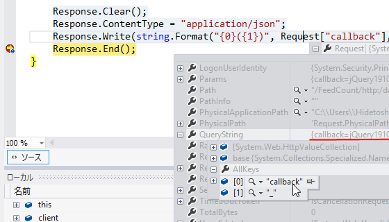

 

<ul>
<li><a href="https://blog.daruyanagi.jp/entry/2013/04/20/224501">WebMatrix 3: &#x30D5;&#x30A3;&#x30FC;&#x30C9;&#x306E;&#x8CFC;&#x8AAD;&#x8005;&#x6570;&#x3092;&#x53D6;&#x5F97;&#x3059;&#x308B;&#xFF08;1&#xFF1A;&#x30B5;&#x30FC;&#x30D0;&#x30FC;&#x30B5;&#x30A4;&#x30C9;&#x7DE8;&#xFF09; - &#x3060;&#x308B;&#x308D;&#x3050;</a></li>
<li><a href="https://blog.daruyanagi.jp/entry/2013/04/21/154036">WebMatrix 3: &#x30D5;&#x30A3;&#x30FC;&#x30C9;&#x306E;&#x8CFC;&#x8AAD;&#x8005;&#x6570;&#x3092;&#x53D6;&#x5F97;&#x3059;&#x308B;&#xFF08;2: JavaScript &#x7DE8;&#xFF09; - &#x3060;&#x308B;&#x308D;&#x3050;</a></li>
<li><a href="https://blog.daruyanagi.jp/entry/2013/04/21/160348">WebMatrix 3: &#x30D5;&#x30A3;&#x30FC;&#x30C9;&#x306E;&#x8CFC;&#x8AAD;&#x8005;&#x6570;&#x3092;&#x53D6;&#x5F97;&#x3059;&#x308B;&#xFF08;3: CSS &#x7DE8;&#xFF09; - &#x3060;&#x308B;&#x308D;&#x3050;</a></li>
</ul>
一連の記事では、FeedCount の結果を JSON でやり取りしていました。

<h3>JSON</h3>

<h4>サーバーサイド</h4>
<pre class="code lang-cs" data-lang="cs" data-unlink>// ~/FeedCount.cshtml

Response.Clear();
Response.ContentType = &quot;application/json&quot;;
Response.Write(Json.Encode(data));
Response.End();
</pre>

<h4>渡されるデータ（例）</h4>
<pre class="code lang-javascript" data-lang="javascript" data-unlink>{&quot;livedoor&quot;:6,&quot;total&quot;:6}
</pre>

<h4>クライアントサイド</h4>
<pre class="code lang-javascript" data-lang="javascript" data-unlink>// ~/Script/SocialButtons.js

$.ajax({
url: '/FeedCount/' + url,
dataType: 'json',
success: function (json) {
element.text(json.total || 0);
}
});
</pre>
けれど、Twitter や Facebook における共有数は JSONP で処理していました。それに合わせて、FeedCount も JSONP で処理できないか？　と思ったのですが、$.ajax の dataType を 'jsonp' にするだけでは動きません。サーバーサイドにも手を加えなければならないみたい。

<h3>JSONP</h3>

どうやればいいのかよくわからないとつぶやいたところ、つもりんが教えてくれました。

要は、JSON そのままではなく JavaScript の関数にして（コールバック関数）送り返せばいいのですね。

問題はコールバックの関数の名前をどうするかですが、jQuery の場合、指定しなければ勝手に適当な名前を付けて GET[callback="***"] で送ってくるようです。というわけで、Request["callback"] とか Request.QueryStrings["callback"] で取得できますね。

<h4>サーバーサイド</h4>
<pre class="code lang-cs" data-lang="cs" data-unlink>// ~/FeedCount.cshtml

Response.Clear();
Response.ContentType = &quot;application/json&quot;;
Response.Write( // 変更 !
string.Format(&quot;{0}({1})&quot;, Request[&quot;callback&quot;], Json.Encode(data))
);
Response.End();
</pre>

<h4>渡されるデータ（例）</h4>
<pre class="code lang-javascript" data-lang="javascript" data-unlink>jQuery******({&quot;livedoor&quot;:6,&quot;total&quot;:6});
</pre>

<h4>クライアントサイド</h4>
<pre class="code lang-javascript" data-lang="javascript" data-unlink>// ~/Script/SocialButtons.js

$.ajax({
url: '/FeedCount/' + url,
dataType: 'jsonp',  // &lt;- 変更 !
success: function (json) {
element.text(json.total || 0);
}
});
</pre>
ちゃんと動くかな？

Request["callback"] が空であれば JSON データで返すなど、改良の余地はあるかもしれない。

