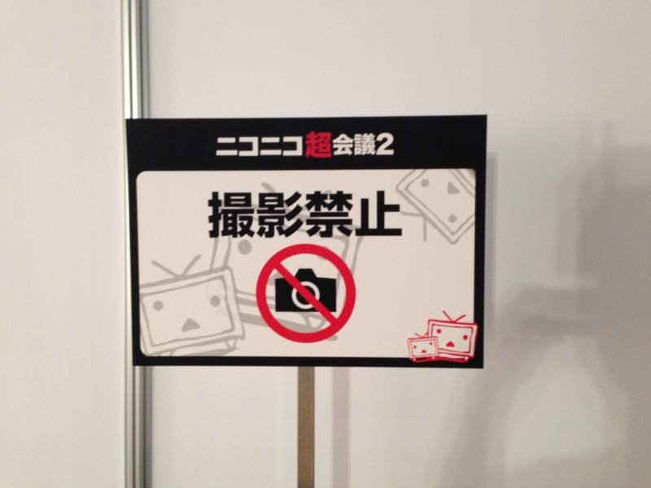
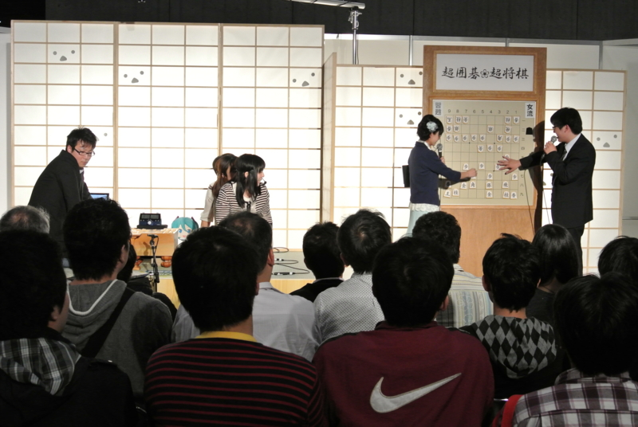
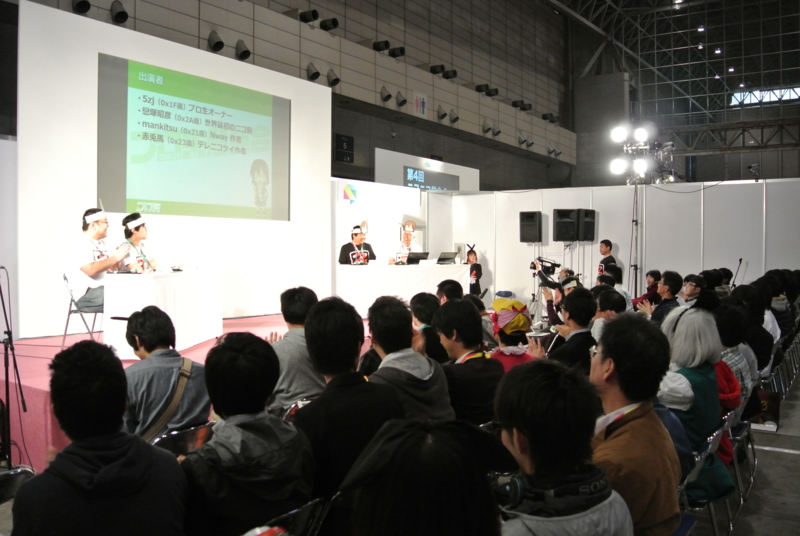
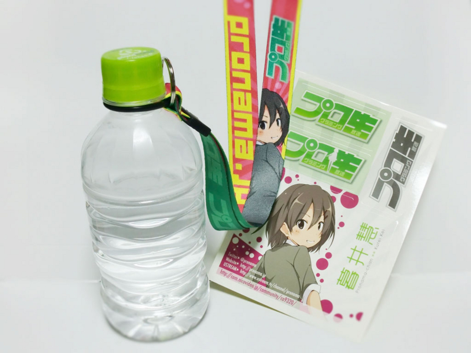

ミュージシャン（？）によるオフパコ逮捕事件の衝撃が冷めやらぬなか開催された“ニコニコ超会議2”（<a href="http://www.chokaigi.jp/">http://www.chokaigi.jp/</a>）。さいごは安倍首相まで登場して、大盛り上がりだったようですね<a href="#f1" name="fn1" title="民主党ブースが閑古鳥と聞いて爆笑（自分は行ってない）。共産党は不思議なオーラを放っていてそこそこ人気みたいだった">*1</a>。ぼくは午前中にプロ生の写真係をあとは、ずっと将棋ブースでコンピューターと女流棋士の対決を観戦していました。

女流棋士三人が合議制で“習甦”と戦うとは興味深い。

女流側が若干作戦負けの穴熊対決になったところ、第二回電脳戦で唯一コンピューターに勝利した人類の希望・阿部コール四段のサポートのおかげもあり、中盤で盛り返して一手を争う終盤に。結局は攻めが切れたと判断して女流側の投了となってしまったのが残念でしたが、かなり白熱した戦いでした。

光瑠先生の見立てではまだ攻めが切れたとは確定していなかったみたいなので、もう少し粘ってほしい気もしましたが……。

女流棋士が真剣な顔であーだこーだと手を練る姿は、失礼かもしれないけれどちょっと可愛らしかった。電脳戦から「将棋でも団体戦ってアリかも？」という風潮になってきた気がしないでもない。なんか面白い見せ方ができたら、もっと将棋は面白くなりそう。

さて、プログラミング生放送の方もかなり盛況で、さいごにはかなりの立ち見も出ていました。

個人的には @mankitsu のセッションが面白かったですね。ニコニコのコメントビューワー（コメビュ）っていうのは使ったことがないのだけれど、今の若手プログラマーの間では Twitter クライアントと並ぶ“登竜門”的な題材になっているようだ。どちらもネットワークから情報を取得して、クライアントに表示するのがメインなのだけれど、コメビュのほうがニコニコ側の非公式試用を探ったり、突然の仕様変更と戦う要素があって、それが闘争本能に火をつけるみたい（笑

ニコニコ動画を作った @koizuka（<a href="http://dic.nicovideo.jp/a/%E6%88%80%E5%A1%9A%E6%98%AD%E5%BD%A6">&#x6200;&#x585A;&#x662D;&#x5F66;&#x3068;&#x306F; (&#x30B3;&#x30A4;&#x30C5;&#x30AB;&#x30A2;&#x30AD;&#x30D2;&#x30B3;&#x3068;&#x306F;) [&#x5358;&#x8A9E;&#x8A18;&#x4E8B;] - &#x30CB;&#x30B3;&#x30CB;&#x30B3;&#x5927;&#x767E;&#x79D1;</a>）さんにも去年に引き続き登壇していただき、しかも懇親会まで一緒に。ちょっと席が遠くてあまりお話ができなかったのが残念ですが、楽しい時間を過ごさせていただきました。

……にしても、懇親会のチョイスは失敗した。去年のところがよかったのだけれど、今年は未成年お断りでほかを当たらざるを得ず。まぁ、次に活かしましょう。でも、超会議って次もあるのかな？　個人的には将棋ぐらいしか楽しめるコンテンツがないのだけれど、あの何とも言えないカオス感はなかなかよいと思う。

プロ生ちゃんの新グッズ。ペットボトルが首から下げられるので、こういうイベントでは便利。人が多いとカバンから出し入れするのも大変だし、かといって手が塞がれるのは避けたいし。

<a href="#fn1" name="f1" class="footnote-number">*1</a>:民主党ブースが閑古鳥と聞いて爆笑（自分は行ってない）。共産党は不思議なオーラを放っていてそこそこ人気みたいだった

