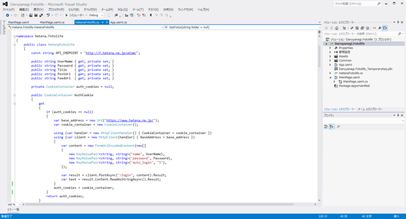

Surface RT（Windows RT）で“はてなブログ”を書くのが微妙にめんどくさいので、“はてなフォトライフ”のクライアントでも作ろうかと思い、@kanaharu ちゃんのブログ（<a href="http://cpp.kanaharu.com/entry/2013/01/06/133209">&#x306F;&#x3066;&#x306A;&#x30D5;&#x30A9;&#x30C8;&#x30E9;&#x30A4;&#x30D5;&#x306B;&#x753B;&#x50CF;&#x3092;&#x30A2;&#x30C3;&#x30D7;&#x30ED;&#x30FC;&#x30C9;&#x3059;&#x308B;&#x30D7;&#x30ED;&#x30B0;&#x30E9;&#x30E0;&#x3092;C#&#x3067;&#x5B9F;&#x88C5;&#x3057;&#x3066;&#x307F;&#x305F; - kanaharu.cpp</a>）を参考にしながら WSSE 認証を実装してみた。

<h3>HatenaFotolife クラス</h3>
<pre class="code lang-cs" data-lang="cs" data-unlink>namespace Hatena.Fotolife
{
public class HatenaFotolife
{
const string API_ENDPOINT = &quot;http://f.hatena.ne.jp/atom/&quot;;

public string UserName { get; private set; }
public string Password { get; private set; }
public string Title    { get; private set; }
public string PostUrl  { get; private set; }
public string FeedUrl  { get; private set; }
:
</pre>
みたいなクラスをまず用意。

<a href="http://d.hatena.ne.jp/keyword/%A4%CF%A4%C6%A4%CA%A5%D5%A5%A9%A5%C8%A5%E9%A5%A4%A5%D5AtomAPI">&#x306F;&#x3066;&#x306A;&#x30D5;&#x30A9;&#x30C8;&#x30E9;&#x30A4;&#x30D5;AtomAPI&#x3068;&#x306F; - &#x306F;&#x3066;&#x306A;&#x30AD;&#x30FC;&#x30EF;&#x30FC;&#x30C9;</a> によると、正しい X-WSSE ヘッダを含んだリクエストを <a href="http://f.hatena.ne.jp/atom/">http://f.hatena.ne.jp/atom/</a> に送ると、

<pre class="code lang-xml" data-lang="xml" data-unlink>HTTP/1.1 200 OK
Content-Type: application/x.atom+xml

&lt;?xml version=&quot;1.0&quot; encoding=&quot;utf-8&quot;?&gt;
&lt;feed xmlns=&quot;http://purl.org/atom/ns#&quot;&gt;
&lt;link type=&quot;application/x.atom+xml&quot; rel=&quot;service.post&quot;
        href=&quot;http://f.hatena.ne.jp/atom/post&quot; title=&quot;fotolife sample&quot;&gt;
&lt;link type=&quot;application/x.atom+xml&quot; rel=&quot;service.feed&quot;
        href=&quot;http://f.hatena.ne.jp/atom/feed&quot; title=&quot;fotolife sample&quot;&gt;
&lt;/feed&gt;
</pre>
というレスポンスが帰ってくるらしいので、それを PostUrl と FeedUrl に格納してあげる。ついでにタイトルもとっておく。

<h3>コンストラクタ</h3>

コンストラクタで <a href="http://f.hatena.ne.jp/atom/">http://f.hatena.ne.jp/atom/</a> を叩いて情報を得るようにした。コンストラクタで例外は出さないほうがいいんだっけ？　まぁ、いいや。

<pre class="code lang-cs" data-lang="cs" data-unlink>public HatenaFotolife(string user_name, string password)
{
if (string.IsNullOrEmpty(user_name))
throw new ArgumentNullException(&quot;Username is null&quot;);
else
UserName = user_name;

if (string.IsNullOrEmpty(password))
throw new ArgumentNullException(&quot;Password is null&quot;);
else
Password = password;

var request = new HttpRequestMessage(HttpMethod.Get, API_ENDPOINT);
request.Headers.Add(&quot;Accept&quot;,
&quot;application/x.atom+xml, application/xml, text/xml, */*&quot;);
request.Headers.Add(&quot;X-WSSE&quot;, GenerateWsseHeader());

var response = new HttpClient().SendAsync(request).Result;
switch (response.StatusCode)
{
case HttpStatusCode.OK:
var elements = XDocument
.Load(response.Content.ReadAsStreamAsync().Result)
.Root.Elements();

Title = elements
.First(_ =&gt; _.Attribute(&quot;rel&quot;).Value == &quot;service.post&quot;)
.Attribute(&quot;title&quot;).Value;
Title = WebUtility.HtmlDecode(Title);

PostUrl = elements
.First(_ =&gt; _.Attribute(&quot;rel&quot;).Value == &quot;service.post&quot;)
.Attribute(&quot;href&quot;).Value;
FeedUrl = elements
.First(_ =&gt; _.Attribute(&quot;rel&quot;).Value == &quot;service.feed&quot;)
.Attribute(&quot;href&quot;).Value;
break;

default:
Debug.WriteLine(request);
Debug.WriteLine(response);
throw new Exception(string.Format(&quot;{0}: {1}&quot;,
response.StatusCode, response.ReasonPhrase));
}
}
</pre>
オリジナルと違うところは、

<ul>
<li><a href="http://msdn.microsoft.com/ja-jp/library/system.net.http.httprequestmessage.aspx">HttpRequestMessage &#x30AF;&#x30E9;&#x30B9; (System.Net.Http)</a></li>
<li><a href="http://msdn.microsoft.com/ja-jp/library/system.net.http.httpclient.aspx">HttpClient &#x30AF;&#x30E9;&#x30B9; (System.Net.Http)</a></li>
<li><a href="http://msdn.microsoft.com/ja-jp/library/system.net.http.httpresponsemessage.aspx">HttpResponseMessage &#x30AF;&#x30E9;&#x30B9; (System.Net.Http)</a></li>
</ul>
を使っているところ。これは .NET 4.5 で追加されたもので、Store Apps で通信を行う場合は基本的にこれを使うことになるらしい。うー、ちゃんと使えるようにならねばね。詳しくは、メイド好きの記事で。

<ul>
<li><a href="http://shiba-yan.hatenablog.jp/entry/20120822/1345563275">Web API &#x3088;&#x308A;&#x3082; HttpClient &#x306B;&#x6CE8;&#x76EE;&#x3057;&#x305F;&#x3044; - &#x3057;&#x3070;&#x3084;&#x3093;&#x96D1;&#x8A18;</a></li>
</ul>
ヘッダーの追加の仕方がよくわからなかったのだけど、HttpRequestMessage を作成してヘッダーを追加し、それを HttpClient で送るという方法でとりあえず動いた。あ、Dispose() してないな、using 使ったほうがよさそうだ。

あと、みんなお馴染み HttpUtility クラスは <a href="http://msdn.microsoft.com/ja-jp/library/system.net.webutility.aspx">WebUtility &#x30AF;&#x30E9;&#x30B9; (System.Net)</a> になっている。こういうところでいちいち躓いちゃうのが、今のところのストアアプリ開発の難点。慣れればどうってことないのだろうけど。

<h3>WSSE ヘッダーの生成</h3>

<blockquote cite="http://developer.hatena.ne.jp/ja/documents/auth/apis/wsse">

WSSE認証はHTTPのX-WSSEヘッダを用いて認証用文字列を送信する認証手段です。WSSE認証用文字列にはユーザー名とパスワードが含まれます。このとき、パスワードはSHA1アルゴリズムによって暗号化されたダイジェストとして送信されるため、HTTP基本認証などに比べてセキュアな認証が可能です。

<cite><a href="http://developer.hatena.ne.jp/ja/documents/auth/apis/wsse">&#x306F;&#x3066;&#x306A;&#x30B5;&#x30FC;&#x30D3;&#x30B9;&#x306B;&#x304A;&#x3051;&#x308B;WSSE&#x8A8D;&#x8A3C; - Hatena Developer Center</a></cite>
</blockquote>

X-WSSE ヘッダーには以下の4つを含める必要がある。

<ul>
<li>Username：はてなID</li>
<li>Nonce：HTTPリクエスト毎に生成したセキュリティ・トークン（ヘッダーに含める際はBase64エンコードが必要）</li>
<li>Created：Nonceが作成された日時をISO-8601表記で記述したもの</li>
<li>PasswordDigest：Nonce, Created, パスワード(はてなアカウントのパスワード)を文字列連結しSHA1アルゴリズムでダイジェスト化して生成された文字列を、Base64エンコードした文字列</li>
</ul>
Nonce だけはよくわかんなかったのだけど、適当に 40 バイトぐらいの長さのランダムなデータであればいいみたい。

<pre class="code lang-cs" data-lang="cs" data-unlink>private string GenerateWsseHeader()
{
var nonce = GenerateNonce(40);
var created = DateTime.UtcNow.ToString(&quot;yyyy-MM-ddTHH:mm:ssZ&quot;);
var password_digest = SHA1ComputeHash(nonce
.Concat(Encoding.UTF8.GetBytes(created))
.Concat(Encoding.UTF8.GetBytes(Password))
.ToArray()
);

return string.Format(
&quot;UsernameToken Username=\&quot;{0}\&quot;, PasswordDigest=\&quot;{1}\&quot;, &quot; +
&quot;Nonce=\&quot;{2}\&quot;, Created=\&quot;{3}\&quot;&quot;,
UserName,
Convert.ToBase64String(password_digest),
Convert.ToBase64String(nonce),
created
);
}
</pre>

<h5>GenerateNonce()</h5>

オリジナル（<a href="http://cpp.kanaharu.com/entry/2013/01/06/132031">&#x306F;&#x3066;&#x306A;&#x306E;WSSE&#x8A8D;&#x8A3C;&#x3092;C#&#x3067;&#x5B9F;&#x88C5;&#x3057;&#x3066;&#x307F;&#x305F; - kanaharu.cpp</a>）では RNGCryptoServiceProvider を使っていたのだけれど、Store Apps では使えないみたい。

<pre class="code lang-cs" data-lang="cs" data-unlink>private byte[] GenerateNonce(int length)
{
var buffer = new byte[length];
new Random(Environment.TickCount).NextBytes(buffer);
return buffer;
}
</pre>
適当に作った。

<h5>SHA1 ハッシュの計算</h5>

オリジナルでは SHA1Managed を使っていたのだけれど、Store Apps では（以下略

<pre class="code lang-cs" data-lang="cs" data-unlink>private byte[] SHA1ComputeHash(byte[] input)
{
return HashAlgorithmProvider
.OpenAlgorithm(&quot;SHA1&quot;)
.HashData(input.AsBuffer())
.ToArray();
}
</pre>
酢酸先生（@ch3cooh）の記事を参考に書いてみた。

<ul>
<li><a href="http://ch3cooh.jp/index.php/tips/metro/system/cryptographic/compute-sha1-hash/">http://ch3cooh.jp/index.php/tips/metro/system/cryptographic/compute-sha1-hash/</a>（執筆時現在絶賛落下中、引越中だそうだ）</li>
</ul>
<a href="http://msdn.microsoft.com/ja-jp/library/system.runtime.interopservices.windowsruntime.windowsruntimebufferextensions.asbuffer.aspx">WindowsRuntimeBufferExtensions.AsBuffer &#x30E1;&#x30BD;&#x30C3;&#x30C9; (System.Runtime.InteropServices.WindowsRuntime)</a>（拡張メソッド）で byte[] から IBuffer へ変換できるよ！　これも知ってないとなかなか使いこなせないかもね……。

<h3>まとめ</h3>

<ul>
<li>WebClient → HttpClient</li>
<li>HttpUtility → WebUtility</li>
<li>RNGCryptoServiceProvider → Random</li>
<li>SHA1Managed → HashAlgorithmProvider.OpenAlgorithm("SHA1")</li>
</ul>
地道にノウハウを貯めていくしかないな。

