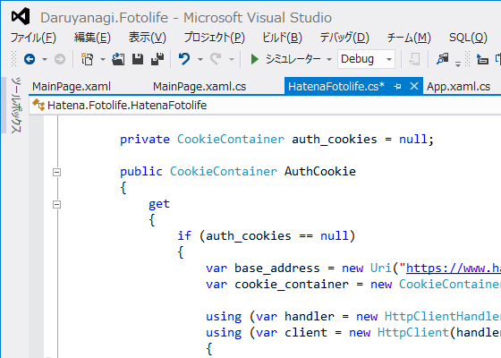
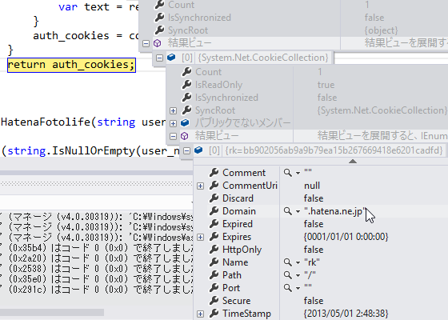
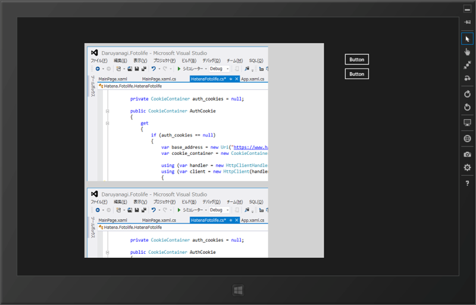

さてはて、<a href="https://blog.daruyanagi.jp/entry/2013/04/30/190004">Widows Store Apps: WSSE &#x8A8D;&#x8A3C;&#xFF08;&#x306F;&#x3066;&#x306A;&#x30D5;&#x30A9;&#x30C8;&#x30E9;&#x30A4;&#x30D5;&#xFF09; - &#x3060;&#x308B;&#x308D;&#x3050;</a> で AtomPub API（<a href="http://developer.hatena.ne.jp/ja/documents/fotolife/apis/atom">&#x306F;&#x3066;&#x306A;&#x30D5;&#x30A9;&#x30C8;&#x30E9;&#x30A4;&#x30D5;AtomAPI - Hatena Developer Center</a>）を無事叩けるようになったのだが、これがショボい。ファイルの操作系（EditURI）はともかく、情報の取得系（FeedURI）がとくにヘボくて、ちゃんと情報が取れないわ<a href="#f-eed2f1fc" name="fn-eed2f1fc" title="うちの環境では hatena:imageurl の情報が欠損する">*1</a>、ルートフォルダの内容しか取得できないわ。どうやら「情報の取得には RSS を使ってね」ということのようだ。なんだそれ。確かにそれでたいていは十分かもしれないけど、フォルダの列挙なんかはどうするんだ……こんなんだったらスクレイピング前提で組んだほうが早かった。

まぁ、それはともかく。

RSS を使えば（直近の）画像は取得できるが、非公開フォルダの画像に関しては、当然ログインが必要だ。なんとかして Cookie を取得し、それを使いまわさなければならない。というわけで、やってみた。

<h3>ログイン Cookie の取得</h3>

<a href="https://www.hatena.ne.jp/login">https://www.hatena.ne.jp/login</a> にユーザー名とアカウントを POST してログインする。

<pre class="code lang-cs" data-lang="cs" data-unlink>private CookieContainer auth_cookies = null;

public CookieContainer AuthCookie
{
get
{
if (auth_cookies == null)
{
var base_address = new Uri(&quot;https://www.hatena.ne.jp/&quot;);
var cookie_container = new CookieContainer();

using (var handler = new HttpClientHandler() {
CookieContainer = cookie_container
})
using (var client = new HttpClient(handler) {
BaseAddress = base_address
})
{
var content = new FormUrlEncodedContent(
new Dictionary&lt;string, string&gt;
{
{ &quot;name&quot;, UserName},
{ &quot;password&quot;, Password},
{ &quot;auto_login&quot;, &quot;1&quot;},
});

var result = client.PostAsync(&quot;/login&quot;, content).Result;
var text = result.Content.ReadAsStringAsync().Result;
}
auth_cookies = cookie_container;
}
return auth_cookies;
}
}
</pre>
プロパティにしてみた。初めて利用する際にログイン処理が行われ、Cookie を取得・格納する。

自前で <a href="http://msdn.microsoft.com/ja-jp/library/system.net.http.httpclienthandler.aspx">Microsoft &#x306E;&#x30C6;&#x30AF;&#x30CB;&#x30AB;&#x30EB; &#x30C9;&#x30AD;&#x30E5;&#x30E1;&#x30F3;&#x30C8;&#x306E;&#x4EE5;&#x524D;&#x306E;&#x30D0;&#x30FC;&#x30B8;&#x30E7;&#x30F3; | Microsoft Docs</a> を用意して、HttpClient の動作をカスタマイズしてあげるのがポイント。ここでは <a href="http://msdn.microsoft.com/ja-jp/library/system.net.cookiecontainer(v=vs.110).aspx">CookieContainer Class (System.Net) | Microsoft Docs</a> を取得し、それを保持するようにした<a href="#f-605ccd05" name="fn-605ccd05" title="ほんとはログイン情報だけ抜き取って使いまわすべきだろうけれど、今回は構わないだろうと思う">*2</a>。

<h3>ログイン Cookie の利用</h3>

先ほど取得した Cookie を使って RSS を GET する。

<pre class="code lang-cs" data-lang="cs" data-unlink>public List&lt;FotoItem&gt; GetFotosByRss(string folder = null)
{
var url = string.IsNullOrEmpty(folder)
? string.Format(&quot;http://f.hatena.ne.jp/{0}/rss&quot;, UserName)
: string.Format(&quot;http://f.hatena.ne.jp/{0}/{1}/rss&quot;, UserName, WebUtility.UrlEncode(folder).Replace(&quot;+&quot;, &quot;%20&quot;));

using (var handler = new HttpClientHandler() { CookieContainer = AuthCookie, })
using (var client = new HttpClient(handler))
{
var response = client.GetAsync().Result;

switch (response.StatusCode)
{
case HttpStatusCode.OK:
const string NS_RSS = &quot;{http://purl.org/rss/1.0/}&quot;;
const string NS_CONTENT = &quot;{http://purl.org/rss/1.0/modules/content/}&quot;;
const string NS_HATENA = &quot;{http://www.hatena.ne.jp/info/xmlns#}&quot;;
const string NS_DC = &quot;{http://purl.org/dc/elements/1.1/}&quot;;

return XDocument.Parse(response.Content.ReadAsStringAsync().Result)
.Descendants(NS_RSS + &quot;item&quot;)
.Select(_ =&gt; new FotoItem()
{
Title = _.Element(NS_RSS + &quot;title&quot;).Value,
Url = _.Element(NS_RSS + &quot;link&quot;).Value,
Description = _.Element(NS_RSS + &quot;description&quot;).Value,
Content = _.Element(NS_CONTENT + &quot;encoded&quot;).Value,
Date = _.Element(NS_DC + &quot;date&quot;).Value,
ImageUrl = _.Element(NS_HATENA + &quot;imageurl&quot;).Value,
ImageUrlSmall = _.Element(NS_HATENA + &quot;imageurlsmall&quot;).Value,
ImageUrlMedium = _.Element(NS_HATENA + &quot;imageurlmedium&quot;).Value,
Syntax = _.Element(NS_HATENA + &quot;syntax&quot;).Value,
Colors = _.Element(NS_HATENA + &quot;colors&quot;).Elements().Select(e =&gt; e.Value).ToArray(),
}
).ToList();

default:
Debug.WriteLine(client);
Debug.WriteLine(response);
throw new Exception(string.Format(&quot;{0}: {1}&quot;, response.StatusCode, response.ReasonPhrase));
}

}
}
</pre>
重要なのは、

<pre class="code lang-cs" data-lang="cs" data-unlink>var handler = new HttpClientHandler()
{
CookieContainer = AuthCookie,
}
</pre>
の部分だけ。公開フォルダなら、HttpClientHandler なしでいいね。

<pre class="code lang-cs" data-lang="cs" data-unlink>public class FotoItem
{
// AtomPub で取得できる情報
public string Title { get; set; }
public string Url { get; set; }
public string EditUrl { get; set; }
public string Issued { get; set; }
public string[] Autors { get; set; }
public string Id { get; set; }
public string ImageUrl { get; set; }
public string ImageUrlSmall { get; set; }
public string Syntax { get; set; }
public string Content { get; set; }

// RSS で取得できる情報
public string Description { get; set; }
public string Date { get; set; }
public string ImageUrlMedium { get; set; }
public string[] Colors { get; set; }

// 画像をバインディングするためのプロパティ
public BitmapSource ImageSource
{
get
{
return new BitmapImage(new Uri(ImageUrl));
}
}
}
</pre>
RSS を処理して、以上のようなオブジェクトのリストを作り、ListView だかなんだかにバインディングしてあげたらこんな感じになる。

デザインもクソもないけど。

正直ここで飽きたので、このアプリはもうこれ以上作らない。

<a href="#fn-eed2f1fc" name="f-eed2f1fc" class="footnote-number">*1</a>:うちの環境では hatena:imageurl の情報が欠損する

<a href="#fn-605ccd05" name="f-605ccd05" class="footnote-number">*2</a>:ほんとはログイン情報だけ抜き取って使いまわすべきだろうけれど、今回は構わないだろうと思う

