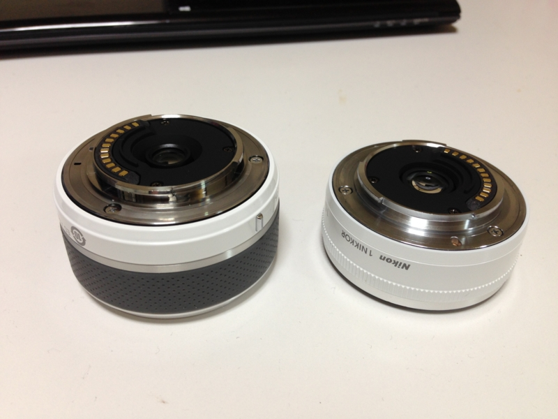
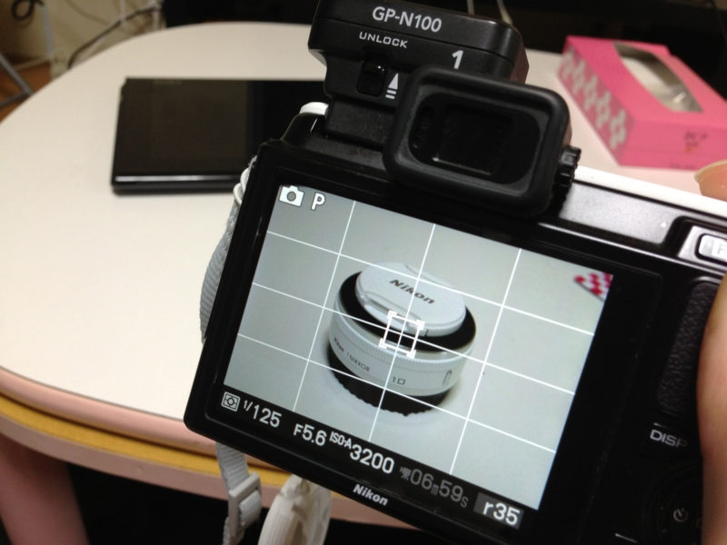

<a href="http://www.amazon.co.jp/exec/obidos/ASIN/B008V62S7I/bestylesnet-22/">Nikon 標準ズームレンズ 1 NIKKOR 11-27.5mm f/3.5-5.6 ブラック ニコンCXフォーマット専用</a>
<ul><li>出版社/メーカー: ニコン</li><li>発売日: 2012/09/06</li><li>メディア: エレクトロニクス</li><li> クリック: 2回</li><li><a href="http://d.hatena.ne.jp/asin/B008V62S7I/bestylesnet-22" target="_blank">この商品を含むブログを見る</a></li></ul>

Nikon D300s のサブ機として活躍中の Nikon 1 V1 なのだけど、レンズは <a href="http://d.hatena.ne.jp/asin/B005OD1CDM/bestylesnet-22">Nikon 単焦点レンズ 1 NIKKOR 10mm f/2.8 ブラック ニコンCXフォーマット専用</a> しかもっておらず<a href="#f-0358a1a9" name="fn-0358a1a9" title="一眼レフ用のレンズを付けられるアダプターはもってるけど">*1</a>。ひとりでポテポテ散歩するときにはこれで十分なのだけど、勉強会の撮影をしようと思うと、単焦点なのが少しツラい。そこで、この前、愛媛・松山へ勉強会へ行くとき、2万円弱で買える 11-27.5mm のレンズを買ってみたった。

<ul>
<li><a href="https://blog.daruyanagi.jp/entry/2013/04/03/072017">&#x30D7;&#x30ED;&#x30B0;&#x30E9;&#x30DF;&#x30F3;&#x30B0;&#x751F;&#x653E;&#x9001;&#x52C9;&#x5F37;&#x4F1A; &#x7B2C;22&#x56DE;&#xFF20;&#x677E;&#x5C71;&#x306B;&#x53C2;&#x52A0;&#x3057;&#x3066;&#x304D;&#x307E;&#x3057;&#x305F; #pronama - &#x3060;&#x308B;&#x308D;&#x3050;</a></li>
<li><a href="https://blog.daruyanagi.jp/entry/2013/04/03/080959">&#x9053;&#x5F8C;&#x6E29;&#x6CC9;&#x3078;&#x884C;&#x3063;&#x3066;&#x304D;&#x305F;&#x3063;&#x305F; - &#x3060;&#x308B;&#x308D;&#x3050;</a></li>
<li><a href="https://blog.daruyanagi.jp/entry/2013/04/04/095736">&#x611B;&#x5A9B;&#x30FB;&#x677E;&#x5C71;&#x306E;&#x4E8C;&#x65E5;&#x76EE;&#x3002;&#x9BDB;&#x3068;&#x304B;&#x79CB;&#x5C71;&#x5144;&#x5F1F;&#x3068;&#x304B; - &#x3060;&#x308B;&#x308D;&#x3050;</a></li>
</ul>

35mm判換算で 30-75mm の画角は、小規模の会議室で使い勝手がよい。そして何よりコンパクト！

単焦点レンズと大きさを比べてみた（左が 11-27.5mm、右が 10mm）。タッパがそれほど変わらないので、これまで使っていたポーチにもすんなり入る。画質の良し悪しはわしにはわからんのだけど、少なくとも不満に感じることはなかった。VR（手ぶれ補正）はないけれど、それもとくに困らず。明るくバシッと撮れる感じ。

それにしても、Nikon 1 V2 がほしくなってきた（ｳｽﾞｳｽﾞ

<a href="#fn-0358a1a9" name="f-0358a1a9" class="footnote-number">*1</a>:一眼レフ用のレンズを付けられるアダプターはもってるけど

