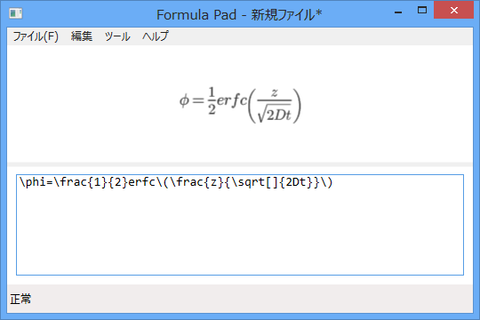
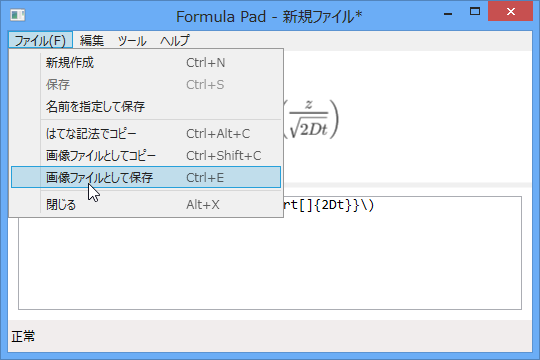
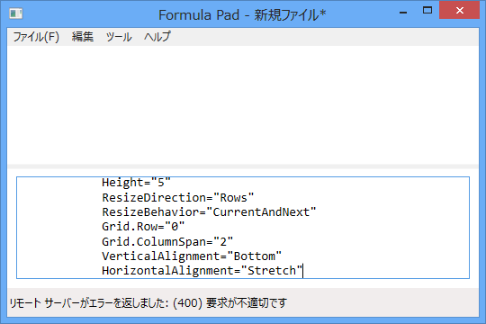

テキストボックスに TeX 記法で数式を入力すると、それを画像にしてくれます。数式画像はクリップボードへコピーしたり、ファイルとして保存可能。数式テキストを“はてな記法”でコピーすることもできます<a href="#f-c78bf501" name="fn-c78bf501" title="はてなでちゃんと表示できるとは限りません">*1</a>。“Google Chart API”を利用しているので、ネットワーク回線が必須。

俺得な機能として、

<pre class="code lang-cs" data-lang="cs" data-unlink>text = text.Replace(@&quot;\land&quot;, @&quot;\wedge&quot;);
text = text.Replace(@&quot;\lor&quot;, @&quot;\vee&quot;);
text = text.Replace(@&quot;\lnot&quot;, @&quot;\neg&quot;);
</pre>
という処理が入っています。“Google Chart API”や“はてな”では使えない“\land（論理和）”“\lor（論理積）”“\lnot（否定）”が使えます。

<h3>動作環境</h3>

<ul>
<li>Windows 8</li>
<li>.NET Framework 4.5</li>
</ul>

<h3>ダウンロード</h3>

<ul>
<li><a href="http://download.daruyanagi.net/FormulaPad">http://download.daruyanagi.net/FormulaPad</a></li>
</ul>

<h3>ソースコード</h3>

<ul>
<li><a href="https://github.com/daruyanagi/Google.Math">GitHub - daruyanagi/Google.Math: a simple editor for math formula</a></li>
</ul>

<h3>そのた</h3>

このソフトは過去に作ったものを、少し手直ししたものです。ソースコードをなくしたので、一部機能が退化していますが気にしないでください。

<ul>
<li><a href="https://blog.daruyanagi.jp/entry/2013/01/14/221302">Google Chart &#x3092;&#x4F7F;&#x3063;&#x305F;&#x6570;&#x5F0F;&#x30C4;&#x30FC;&#x30EB;&#x3092;&#x4F5C;&#x3063;&#x3066;&#x307F;&#x305F; - &#x3060;&#x308B;&#x308D;&#x3050;</a>（ソースコード失くした）</li>
<li><a href="https://blog.daruyanagi.jp/entry/2013/01/15/210406">Google Chart &#x3092;&#x4F7F;&#x3063;&#x305F;&#x6570;&#x5F0F;&#x30C4;&#x30FC;&#x30EB;&#x3092;&#x4F5C;&#x3063;&#x3066;&#x307F;&#x305F;&#xFF08;2&#xFF09; - &#x3060;&#x308B;&#x308D;&#x3050;</a>（未実装）</li>
<li><a href="https://blog.daruyanagi.jp/entry/2013/01/17/065707">Google Chart &#x3092;&#x4F7F;&#x3063;&#x305F;&#x6570;&#x5F0F;&#x30C4;&#x30FC;&#x30EB;&#x3092;&#x4F5C;&#x3063;&#x3066;&#x307F;&#x305F;&#xFF08;3&#xFF09; - &#x3060;&#x308B;&#x308D;&#x3050;</a>（未実装）</li>
</ul>

その代わりと言ってはなんだけど、少しだけエラー処理してみた。BitmapImage クラスは強力すぎて謎な部分が多いなぁ。

<a href="#fn-c78bf501" name="f-c78bf501" class="footnote-number">*1</a>:はてなでちゃんと表示できるとは限りません

