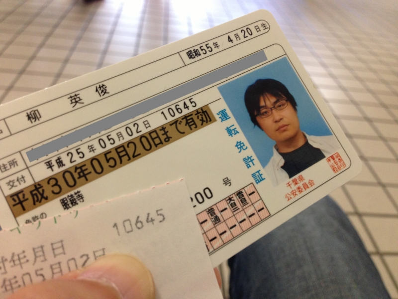
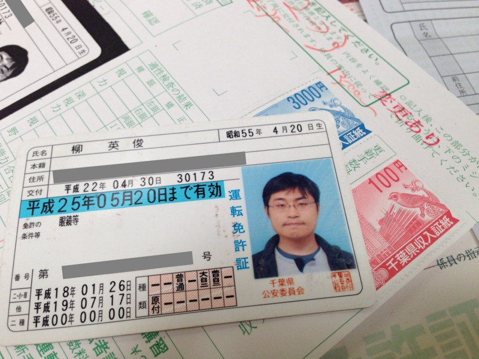
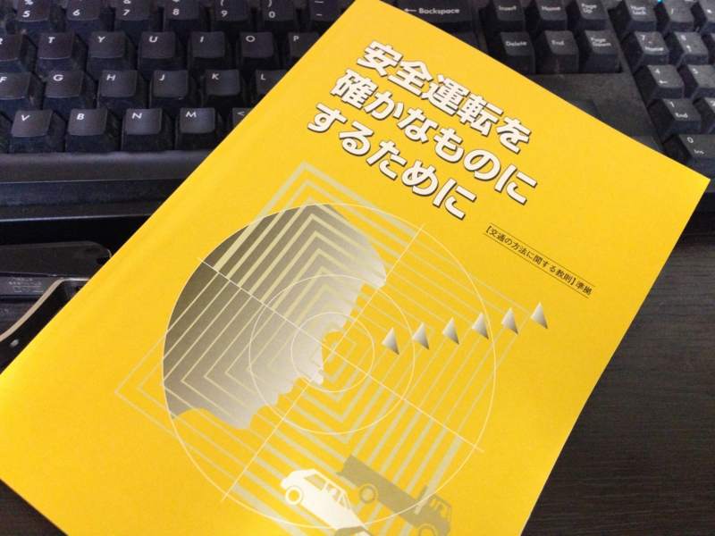

免許の更新行ってきました。ゴールド免許証ですよ！　やったー！（嬉しいので、今日のブログのタイトルは <a href="http://ja.wikipedia.org/wiki/ARIA_(%E6%BC%AB%E7%94%BB)">ARIA (&#x6F2B;&#x753B;) - Wikipedia</a> 風です）

もう7年前になるのかな、ホンダのビートを回転限界＜レブリミット＞までブン回して東金道を爆走し、とてもニコやかな写真をパパラッチされた挙句、白バイ隊員に家まで迎えにきてもらったときのことは忘れません。あのあと、簡易裁判所に8万円ほど巻き上げられ、普通免許（今の中型限定免許）を失いました。会社のおカネのやりくりでムシャクシャしていたとはいえ<a href="#f1" name="fn1" title="ちょうど東金にある税理士さんのところへ行く途中でした">*1</a>、アレはよくなかった。

たまたま大型二輪免許の取得と時期がかぶっていたので、普通免許は失っても二輪ならば運転できたのは不幸中の幸い。バイクで運転免許センターへ通い、2回目の試験<a href="#f2" name="fn2" title="1回ではよほどでない限り通してくれないのだそうな……">*2</a>で普通免許を取り直してからは、かなり安全運転と法律の遵守を心掛けて運転してきたつもり。なので、今回のゴールド免許証はだいぶうれしい。

まぁ、これも続けなければ意味ないのですが。

ちなみに、前の免許証はこんなの。個人情報保護のため、前回から本籍地が印字されなくなりましたが、今回からは本籍地の欄そのものがなくなりました。これは国際標準対応を睨んだ措置でもあるとのこと。本籍地の概念って、よその国にはあまりないのかしら。

もちろん、講習もちゃんと受けてきましたよ。まぁ、毎回似たような内容ですけど、僕たちには<i>原則クルマを運転する自由など認められておらず</i>、免許はそれを<i>特別に許可するもの</i>だという話を聞いて、前に聞いたのとは違う新鮮な感じを受けました。そうだよね、免許というものはそういうものなのだよね。

<b>“公道”</b>とは文字通り<b>“公（おおやけ）”</b>の場であり、そこでは<b>“公人”</b>として振る舞わなければならない。個人的な事情・感情を排し、定められたルールを守り、お互い配慮しあって“自動車社会”という公共空間を守り、維持する人でなければならない。そうすれば、自分の自由を少し我慢し、法的・道義的責任を負う代わりに、より大きな社会的自由を享受できる――社会的合意の下に。

こんなところで共和主義の精神を再確認するとは思わなかった。

<a href="#fn1" name="f1" class="footnote-number">*1</a>:ちょうど東金にある税理士さんのところへ行く途中でした

<a href="#fn2" name="f2" class="footnote-number">*2</a>:1回ではよほどでない限り通してくれないのだそうな……

