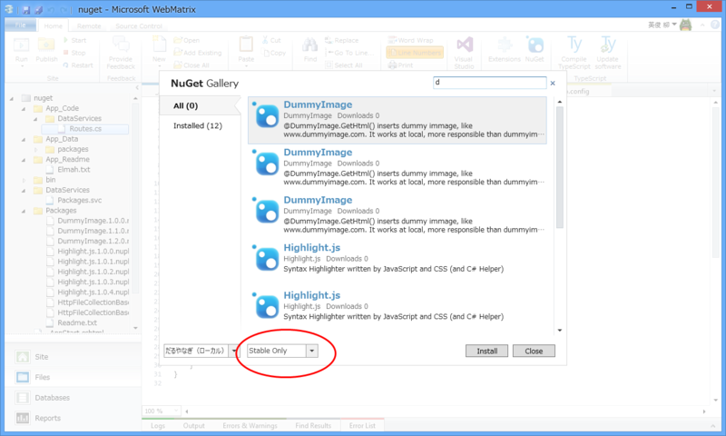
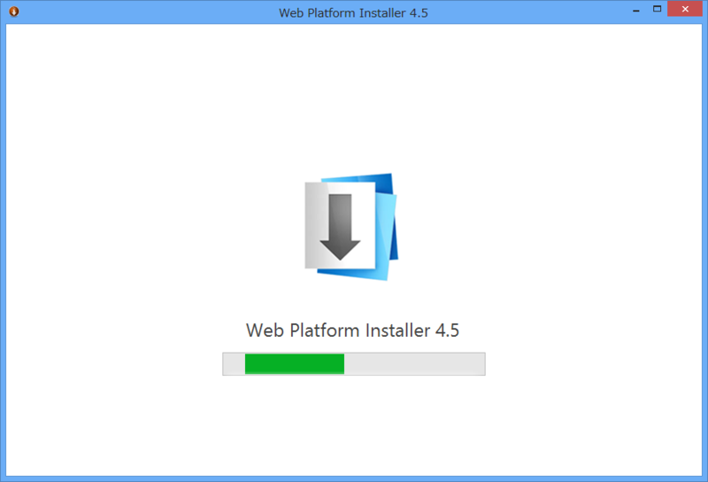
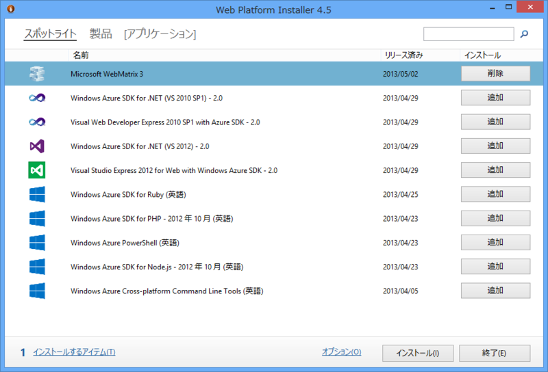
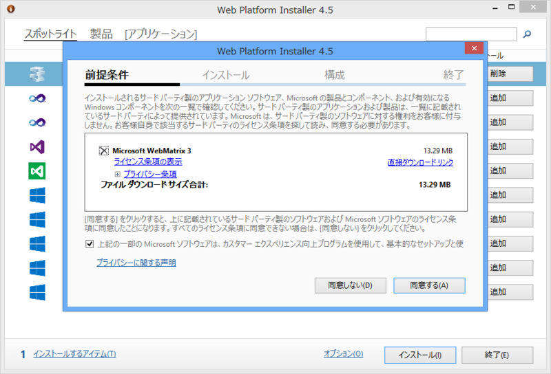
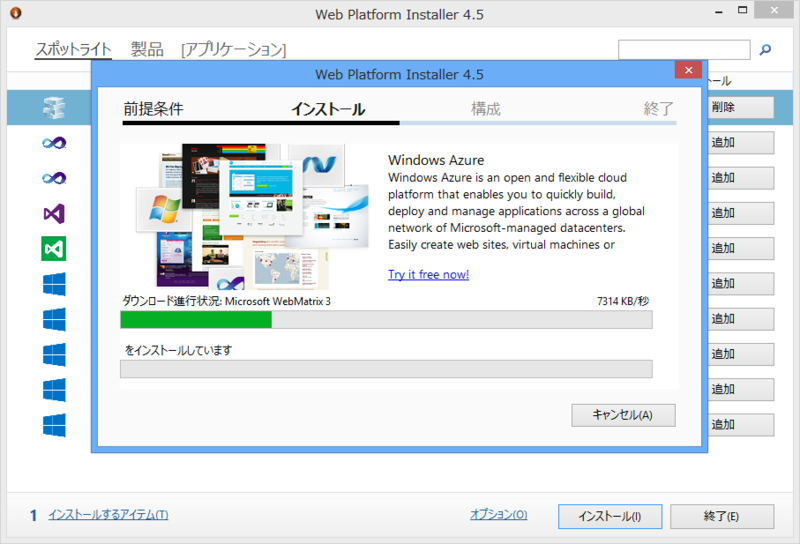
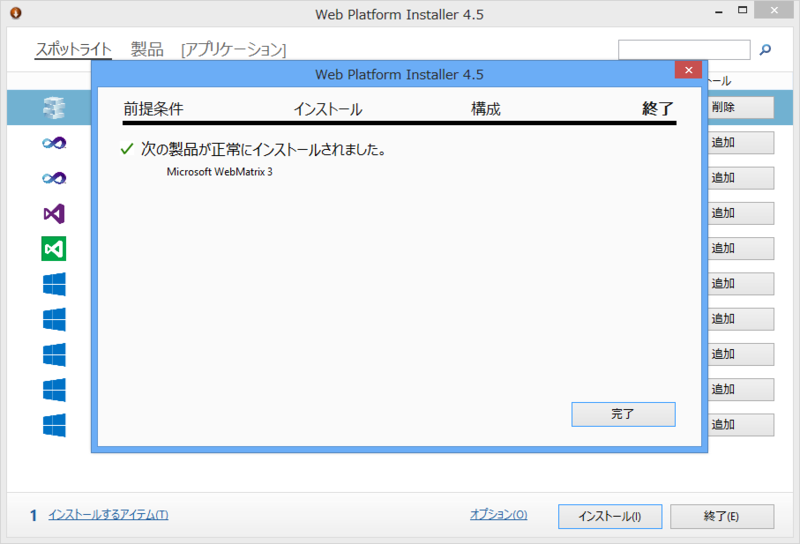

おつかれさま！　URL からも「next」がとれました。

<ul>
<li><a href="http://www.microsoft.com/web/webmatrix/">http://www.microsoft.com/web/webmatrix/</a></li>
</ul>
あと、TechCrunch が記事にしてくれています。

<ul>
<li><a href="http://jp.techcrunch.com/2013/05/02/20130501microsoft-webmatrix-3-web-development-tool-comes-with-deeper-windows-azure-integration-and-support-for-github/">Microsoft&#x306E;Web&#x958B;&#x767A;&#x30C4;&#x30FC;&#x30EB;WebMatrix&#x304C;&#x30D0;&#x30FC;&#x30B8;&#x30E7;&#x30F3;3&#x3068;&#x306A;&#x308A;GitHub&#x3092;&#x30B5;&#x30DD;&#x30FC;&#x30C8; | TechCrunch Japan</a></li>
</ul>
僕の出番はなさそうですね（ぁ

これまでプレビューを使ってきたけれど、クリティカルなバグはあまりなかったんじゃないかな。クラッシュもほとんどなかった。2010年に公開された当初はエディターが重かったり、たまにクラッシュしたりなどと少し困ったところもあったのですが、そういった弱点も少しずつ改善されて、今ではすっかりよい子になりました。とくに Windows Azure Web Sites 連携は最高……楽ちんすぎる！

正式版はちゃんと日本語化もされているようですね。注目の変更点はこれまでも何回かブログに書いてきたので、興味があれば参照してほしいです。

<ul>
<li><a href="https://blog.daruyanagi.jp/entry/2013/04/05/153356">WebMatrix 3 Preview + Team Foundation Service - &#x3060;&#x308B;&#x308D;&#x3050;</a></li>
<li><a href="https://blog.daruyanagi.jp/entry/2013/03/23/080714">WebMatrix 3 Preview&#xFF1A;TypeScript &#x306E;&#x30B5;&#x30DD;&#x30FC;&#x30C8; - &#x3060;&#x308B;&#x308D;&#x3050;</a></li>
<li><a href="https://blog.daruyanagi.jp/entry/2013/03/23/073646">WebMatrix 3 Preview &rarr; Windows Azure Web Sites &#x304C;&#x5149;&#x901F;&#x904E;&#x304E;&#x3066;&#x7B11;&#x3046;&#x3057;&#x304B;&#x306A;&#x3044; - &#x3060;&#x308B;&#x308D;&#x3050;</a></li>
<li><a href="https://blog.daruyanagi.jp/entry/2013/03/22/060002">Microsoft WebMatrix 3 Preview - &#x3060;&#x308B;&#x308D;&#x3050;</a></li>
</ul>
あと、細かいところではこんなところも変わってるんだよ。

プレリリース版の NuGet パッケージもインストールできます！

<h3>インストール</h3>

インストールは「Web Platform Installer 4.5」から。「Microsoft WebMatrix 2」を使っている場合は、アップグレードの通知がくるので、そこから「Web Platform Installer」「WebMatrix」のアップデートがまとめて行えるはず。

プレビュー版からアップデートした場合は、「WebMatrix」本体の更新だけで済むようですね（あっという間にアップデートできた）。

「WebMatrix 3」ではインストール処理にも改善が加えられており、初期状態では動作に最低限必要なコンポーネントのみをセットアップするようになっています。わけのわからないコンポーネントをいろいろぶち込まれるのが嫌だという人にも優しいし、なによりセットアップにかかる時間がだいぶ減っているのがうれしいところ。

XAMPP なんか捨てちまえよ。

