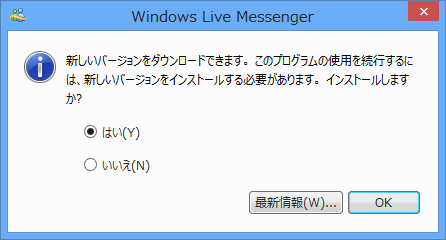
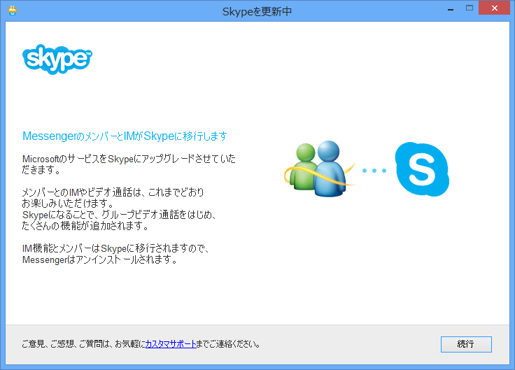

もう始まってるっぽいのですが、ウチにもきました。

<ul>
<li><a href="http://www.forest.impress.co.jp/docs/news/20130218_588224.html">&#x300C;Windows Live Messenger&#x300D;&#x304C;&#x7D42;&#x4E86;&#x3001;&#x300C;Skype&#x300D;&#x3078;&#x306E;&#x30A2;&#x30C3;&#x30D7;&#x30B0;&#x30EC;&#x30FC;&#x30C9;&#x304C;4&#x6708;&#x304B;&#x3089;&#x9806;&#x6B21;&#x958B;&#x59CB; - &#x7A93;&#x306E;&#x675C;</a></li>
</ul>
一見「Windows Live Messenger」のアップデートのようにも見えますが……

［はい］を選択すると「Skype for Windows Desktop」のインストールが始まります。

今までありがとう、お疲れ様でした。

<ul>
<li><a href="http://www.forest.impress.co.jp/docs/news/20090907_313537.html">&#x7A93;&#x306E;&#x675C; - &#x3010;NEWS&#x3011;&#x300C;Windows Live Messenger&#x300D;&#x306A;&#x3069;&#x306E;&#x751F;&#x8A95;10&#x5468;&#x5E74;&#x3092;&#x8A18;&#x5FF5;&#x3057;&#x305F;&#x65E5;&#x672C;&#x8A9E;&#x7279;&#x8A2D;&#x30B5;&#x30A4;&#x30C8;&#x304C;&#x958B;&#x8A2D;</a></li>
<li><a href="http://www.forest.impress.co.jp/docs/review/20091217_336477.html">&#x7A93;&#x306E;&#x675C; - &#x3010;REVIEW&#x3011;&#x300C;Windows Live Messenger&#x300D;&#x3078;&#x30BB;&#x30F3;&#x30BF;&#x30FC;&#x8A66;&#x9A13;&#x307E;&#x3067;&#x306E;&#x6B8B;&#x308A;&#x6642;&#x9593;&#x3092;&#x8868;&#x793A;&#x3067;&#x304D;&#x308B;&#x30BD;&#x30D5;&#x30C8;</a></li>
</ul>
そういえば、こんなのもありましたねぇ。

