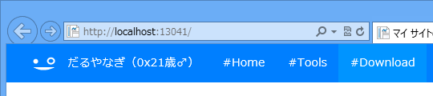

まずはここから。

<ul>
<li><a href="http://download.daruyanagi.net/">http://download.daruyanagi.net/</a></li>
</ul>
仕組み的には Markdown テキストを App_Text フォルダに入れておいて、それを HTML に変換しています。Helper でプラグインっぽく拡張できるのがちょっと自慢。

<ul>
<li><a href="https://blog.daruyanagi.jp/entry/2013/02/24/154553">WebMatrix 2: Markdown &#x3092;&#x6C4E;&#x7528;&#x7684;&#x306B;&#x62E1;&#x5F35;&#x3059;&#x308B;&#x4ED5;&#x7D44;&#x307F;&#x3092;&#x8003;&#x3048;&#x3066;&#x307F;&#x308B; - &#x3060;&#x308B;&#x308D;&#x3050;</a></li>
</ul>
ソーシャル関連のボタンは、この一連の記事で実装してみたものを使っています。

<ul>
<li><a href="https://blog.daruyanagi.jp/entry/2013/04/20/224501">WebMatrix 3: &#x30D5;&#x30A3;&#x30FC;&#x30C9;&#x306E;&#x8CFC;&#x8AAD;&#x8005;&#x6570;&#x3092;&#x53D6;&#x5F97;&#x3059;&#x308B;&#xFF08;1&#xFF1A;&#x30B5;&#x30FC;&#x30D0;&#x30FC;&#x30B5;&#x30A4;&#x30C9;&#x7DE8;&#xFF09; - &#x3060;&#x308B;&#x308D;&#x3050;</a></li>
<li><a href="https://blog.daruyanagi.jp/entry/2013/04/21/154036">WebMatrix 3: &#x30D5;&#x30A3;&#x30FC;&#x30C9;&#x306E;&#x8CFC;&#x8AAD;&#x8005;&#x6570;&#x3092;&#x53D6;&#x5F97;&#x3059;&#x308B;&#xFF08;2: JavaScript &#x7DE8;&#xFF09; - &#x3060;&#x308B;&#x308D;&#x3050;</a></li>
<li><a href="https://blog.daruyanagi.jp/entry/2013/04/21/160348">WebMatrix 3: &#x30D5;&#x30A3;&#x30FC;&#x30C9;&#x306E;&#x8CFC;&#x8AAD;&#x8005;&#x6570;&#x3092;&#x53D6;&#x5F97;&#x3059;&#x308B;&#xFF08;3: CSS &#x7DE8;&#xFF09; - &#x3060;&#x308B;&#x308D;&#x3050;</a></li>
<li><a href="https://blog.daruyanagi.jp/entry/2013/04/22/200709">WebMatrix 3: JSON &#x3068; JSONP - &#x3060;&#x308B;&#x308D;&#x3050;</a></li>
</ul>
フィードの出力は以下の記事で実装したものをベースにしています。

<ul>
<li><a href="https://blog.daruyanagi.jp/entry/2013/04/17/065153">WebMatrix 3: RSS &#x30D5;&#x30A3;&#x30FC;&#x30C9;&#x3092;&#x51FA;&#x529B;&#x3059;&#x308B; - &#x3060;&#x308B;&#x308D;&#x3050;</a></li>
</ul>
今のところキャッシュ機能がないのでそれをつけようかなぁ、と。それ以外にも不満な部分が結構あるので、このサイトで十分に基本機能を練って NuGet パッケージにし、ほかのサイトにも展開していきたいと思います。

<ul>
<li><a href="https://blog.daruyanagi.jp/entry/2013/04/05/133515">WebMatrix&#xFF1A;NuGet &#x30B5;&#x30FC;&#x30D0;&#x30FC;&#x3092;&#x305F;&#x3066;&#x308B; - &#x3060;&#x308B;&#x308D;&#x3050;</a></li>
</ul>
WordPress のような既存の大規模 CMS を使うのもいいけど、自分で少しずつ実装した方が“自分の手のひらの上で動かしている”感じがあって僕は好きです。

Windows Azure Web Sites を使って Dropbox からデプロイできたら便利そうなのだけど、ボクのお給料では Azure の維持は少し大変そうなので泣く泣く断念しました。おちんぎんほしぃなりぃ。

<h4>P.S.</h4>

ロゴ、イケてない？

