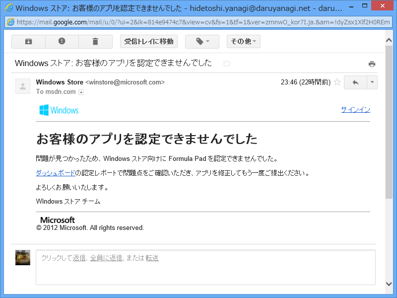
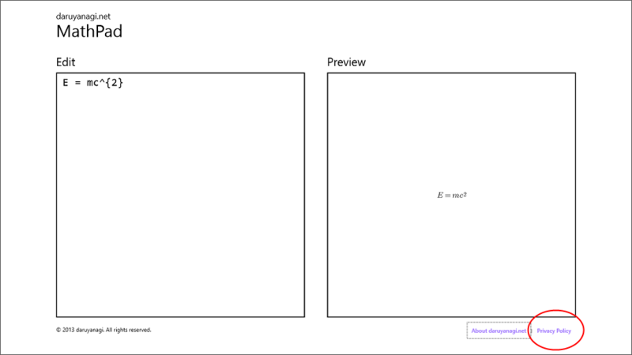
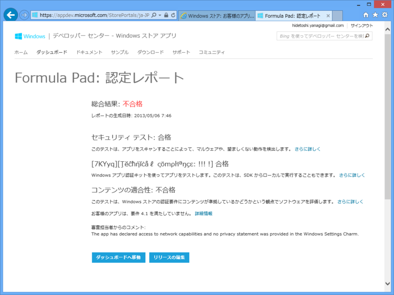

実は GW 中に <a href="https://blog.daruyanagi.jp/entry/2013/05/02/021238">Formula Pad 1.0.1 - &#x3060;&#x308B;&#x308D;&#x3050;</a> を Windows 8 へ移植して遊んでいたのですが、ストアに申請してリジェクトを食らいました。

ぇー、なにが悪かったんだ……結構あちこち気を付けたのに！　たとえば、前回はプライバシーポリシーを提供していないという理由でリジェクトを食らったので、ちゃんと画面右下にリンクを用意しておいたんだ。

なぜなんだ、なぜなんだと、なかば憮然とつつ認定レポートを開いてみると……

 

<blockquote>

The app has declared access to network capabilities and no privacy statement was provided in the Windows Settings Charm.

（このアプリケーションはネットワークへのアクセス機能の利用が宣言されていますが、それに必要なプライバシーポリシーが<b>Windows の［設定］チャームに</b>用意されていません）

</blockquote>

プライバシーポリシーは、<b>［設定］チャームに掲載</b>しないとダメなようです。<b>［設定］チャームに掲載</b>しないとダメなようです。

大事なことなので二回言いました。

まぁ、気が向いたらまた再申請しようかなと思います。

<h4>P.S.</h4>

エロリジェクトよりはマシ！

