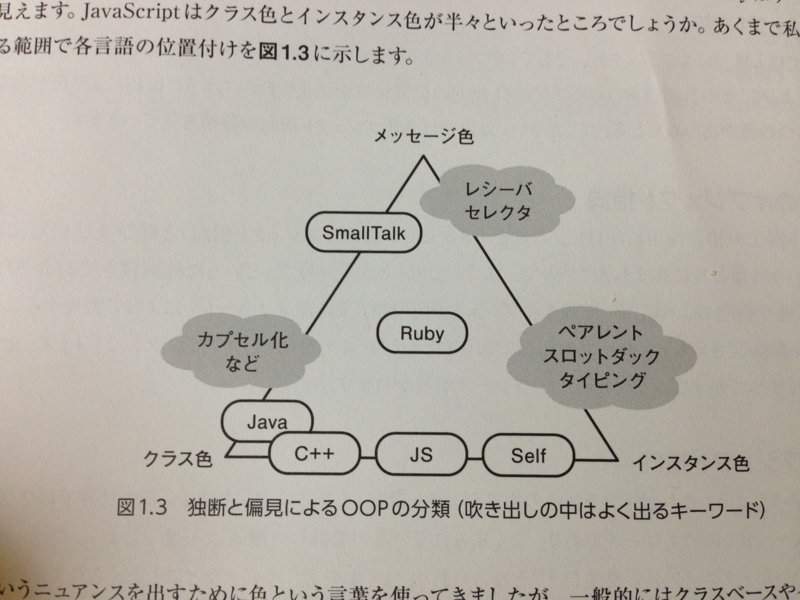

<a href="http://www.amazon.co.jp/exec/obidos/ASIN/4774154385/bestylesnet-22/">プロになるためのJavaScript入門 ~node.js、Backbone.js、HTML5、jQuery-Mobile (Software Design plus)</a>
<ul><li>作者: 河村嘉之,川尻剛</li><li>出版社/メーカー: 技術評論社</li><li>発売日: 2012/12/07</li><li>メディア: 大型本</li><li>購入: 4人 クリック: 1,144回</li><li><a href="http://d.hatena.ne.jp/asin/4774154385/bestylesnet-22" target="_blank">この商品を含むブログ (6件) を見る</a></li></ul>

TypeScript 1.0 の足音が聞こえてきた。そろそろ本気を出して TypeScript を学ぶべき時が近づいてきた。しかし、そのまえに JavaScript を知らねばならないだろう。

というわけで『プロになるためのJavaScript入門』という本を買ってみた。まだ2章までしか読んでないのだけれど、なかなか面白い。

たとえば、これはオブジェクト指向プログラミング（OOP）における JavaScript の立ち位置を図式化したもの。筆者によると、OOP には大きく分けて3つの要素が存在するという（以下、わしの独断と偏見も含む）。

<h4>メッセージ</h4>

<blockquote>

すべての処理 ＝ メッセージの送信 ＋ オブジェクト（レシーバー）

</blockquote>

たとえば Smalltalk には制御構造すらなく、すべてが“メッセージ”として扱われている。元祖オブジェクト指向。

<h4>型</h4>

<blockquote>

クラス ＝ 構造化されたデータ ＋ それに所属するメソッド 
インスタンス ＝ クラスの具現化

</blockquote>

データとメソッドの<b>カプセル化</b>。コールされたメッセージではなく、それを受け取ったレシーバーによって処理の内容が決められる（<b>多態性</b>）。<b>継承</b>という概念で“あらかじめ静的に”階層設計されたクラスをもつ。

<h4>インスタンス</h4>

<blockquote>

オブジェクト ＝ 値でも参照でも関数でもなんでも入れられる連想配列のようなもの（スロット） 
インスタンス ＝ 既存オブジェクトのコピー

</blockquote>

データとメソッドをクラスではなくインスタンスで扱う（プロトタイプ）。オブジェクトへあとから機能を追加するのが簡単。

この3つが等置できるものかと言われればどうかなって気もするけど、自分の中で JavaScript の立ち位置がちょっとクリアになった気がする。要は、今まで馴染んできたものとはまったく別物だと思えばいいんだ。

