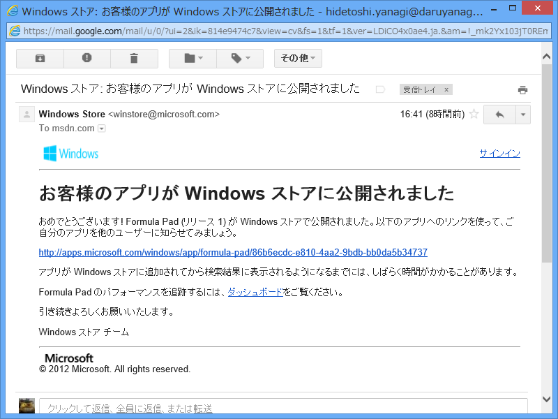
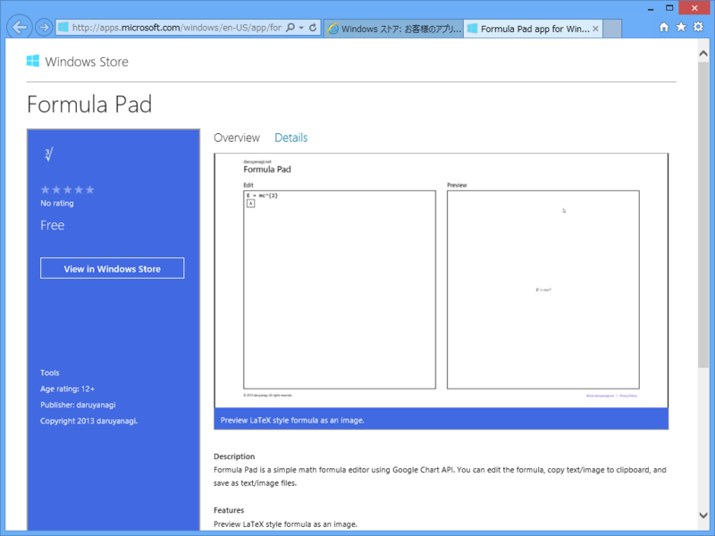
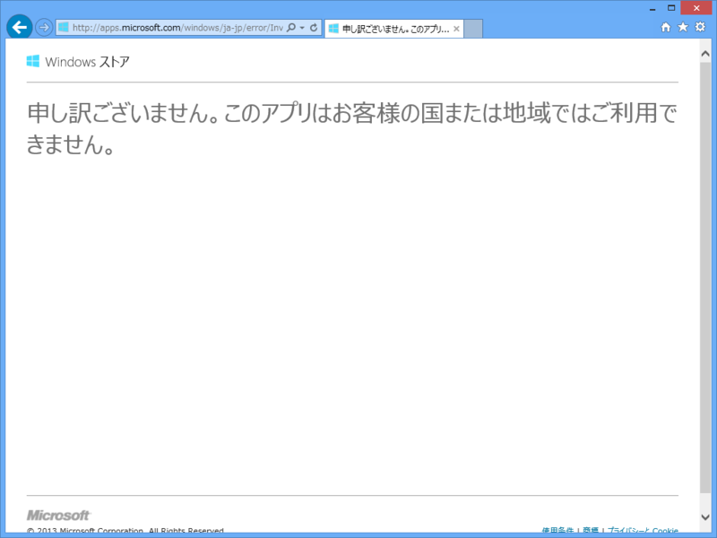
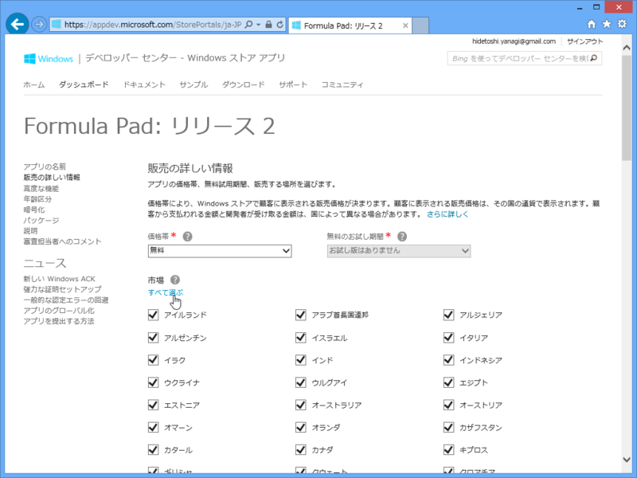

わーぃ、わーぃ！

<ul>
<li><a href="http://apps.microsoft.com/windows/en-US/app/formula-pad/86b6ecdc-e810-4aa2-9bdb-bb0da5b34737">http://apps.microsoft.com/windows/en-US/app/formula-pad/86b6ecdc-e810-4aa2-9bdb-bb0da5b34737</a></li>
</ul>
……が、いつまでたってもインストールできません。

確かにアプリの公開 Web ページはできているのだけれど、リンクをクリックして「ストア」アプリで開いても詳細画面に移行せず、インストールできない。なぜだ。

そこでふと思いついて、リンクのロケールを en-US から ja-JP に。

<ul>
<li><a href="http://apps.microsoft.com/windows/ja-JP/app/formula-pad/86b6ecdc-e810-4aa2-9bdb-bb0da5b34737">http://apps.microsoft.com/windows/ja-JP/app/formula-pad/86b6ecdc-e810-4aa2-9bdb-bb0da5b34737</a></li>
</ul>

なんだと！　<i>やっちまった／(＾o＾)＼</i>公開地域を米国限定にしてしまっていました。

とりあえず、すべての市場を選択して再申請……でいいのかな。

リンクを「ストア」アプリで開いたときにエラーが出れば、もう少し早く気付いたのですが。自分のミスであるとは言え、不親切といえば不親切。

