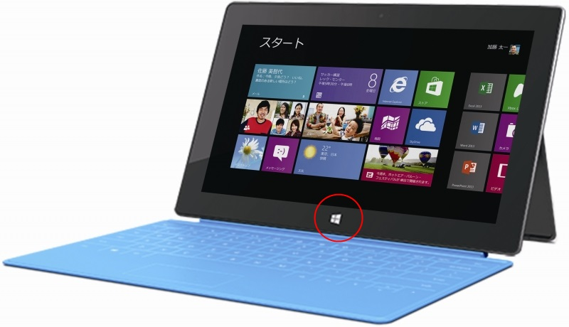
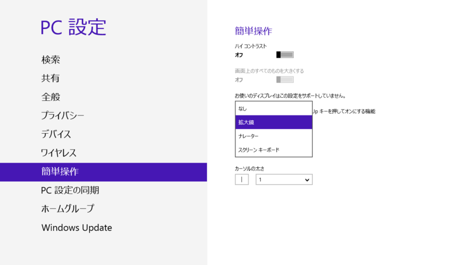
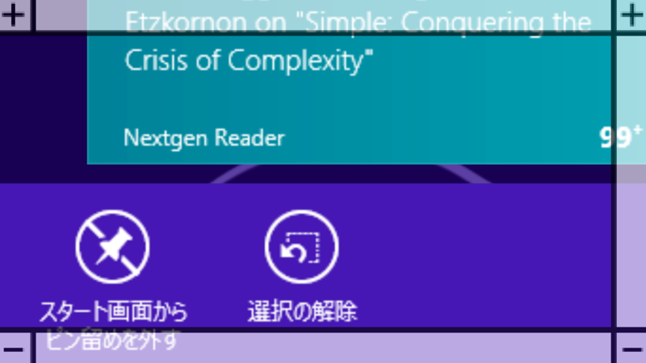
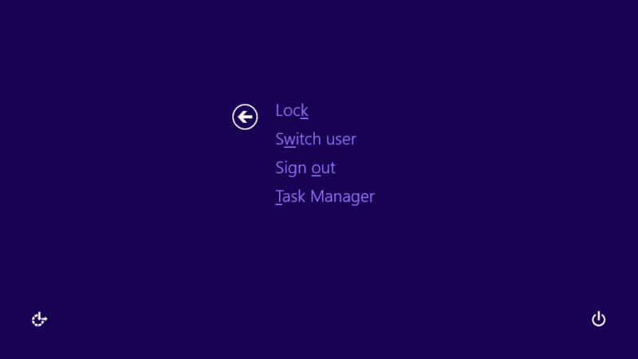

Surface RT のベゼル下部に設けられている Windows ロゴキーを押すと、現在表示中の画面とスタート画面を切り替えることができる。押すとブルッと振動するフィードバック機能がちょっとイケてる<a href="#f-8ed2ad4f" name="fn-8ed2ad4f" title="まぁ、最近のスマートフォンではおなじみだけど">*1</a>。

けれど、このボタン、ほかにもいろんなことに使えるんだよ。ただし、キーボードの［Windows］キーでは使えないので注意<a href="#f-c274f27b" name="fn-c274f27b" title="本体側の［Windows］キーとキーボードの［Windows］キーは根本的に違うものだと思っておいた方がいいみたい">*2</a>。

<h3>［Windows］＋［Volume Down］キー＝スクリーンショットの保存</h3>

これは有名かも。スクリーンショットを撮影して、

<pre class="code" data-lang="" data-unlink>C:\Users\（ユーザー名）\Pictures\Screenshots</pre>
に保存する。［Windows］＋［PrintScreen］キーの動作と同じだね。

<ul>
<li><a href="https://blog.daruyanagi.jp/entry/2012/03/05/220912">Windows 8 &#x306F;&#xFF3B;Windows&#xFF3D;&#xFF0B;&#xFF3B;PrintScreen&#xFF3D;&#x30AD;&#x30FC;&#x3067;&#x30C7;&#x30B9;&#x30AF;&#x30C8;&#x30C3;&#x30D7;&#x306E;&#x30B9;&#x30AF;&#x30EA;&#x30FC;&#x30F3;&#x30B7;&#x30E7;&#x30C3;&#x30C8;&#x3092;&ldquo;&#x30D4;&#x30AF;&#x30C1;&#x30E3;&#x30FC;&rdquo;&#x30D5;&#x30A9;&#x30EB;&#x30C0;&#x306B;&#x4FDD;&#x5B58;&#x3067;&#x304D;&#x308B; - &#x3060;&#x308B;&#x308D;&#x3050;</a></li>
</ul>

<h3>［Windows］＋［Volume Up］キー＝いろいろ</h3>

初期設定では「ナレーター」に割り当てられていて、操作を読み上げてくれる。ただ、［Windows］＋［Volume Up］キーと間違って押しちゃって、いきなりしゃべりだして困ることも多い。止め方が分からないとあたふたしちゃう。

実はこのキーコンビネーションには、［PC 設定］－［簡単操作］メニューで「拡大鏡」や「スクリーンキーボード」を割り当てることもできる。個人的には「拡大鏡」が一番おすすめ。プレゼンのときにかなり使える。

 

<h3>［Windows］＋電源ボタン＝［Ctrl］＋［Alt］＋［Del］キー</h3>

ちょっとコツがいるのだけど、［Windows］キーを少し長押しして電源ボタンを押すと、［Ctrl］＋［Alt］＋［Del］キーと同じ動作になる。万が一フリーズしても、わざわざ Touch Cover を開かなくて済むね！

<a href="#fn-8ed2ad4f" name="f-8ed2ad4f" class="footnote-number">*1</a>:まぁ、最近のスマートフォンではおなじみだけど

<a href="#fn-c274f27b" name="f-c274f27b" class="footnote-number">*2</a>:本体側の［Windows］キーとキーボードの［Windows］キーは根本的に違うものだと思っておいた方がいいみたい

