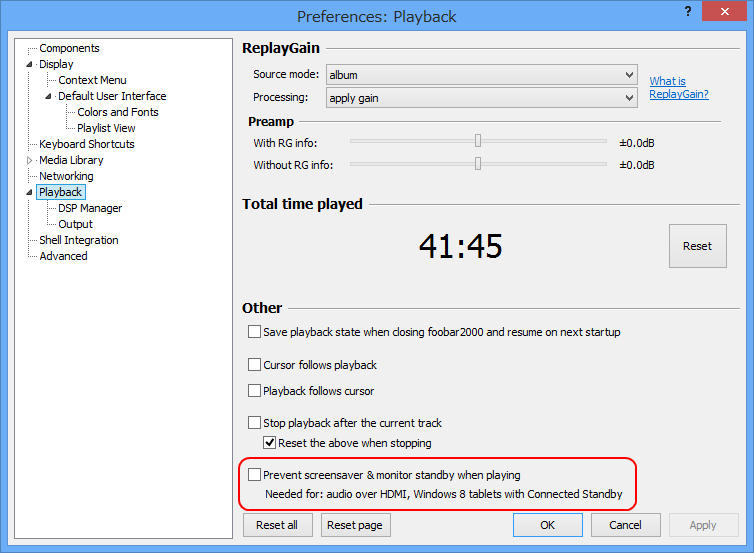
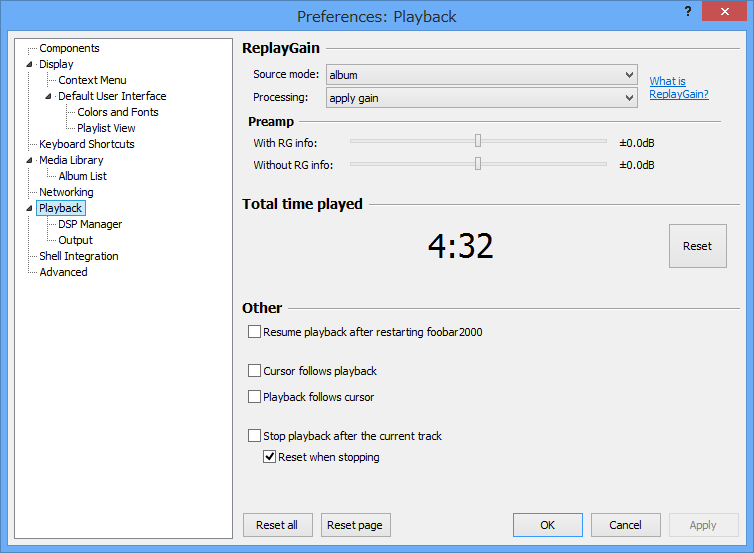
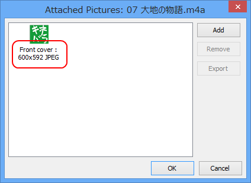
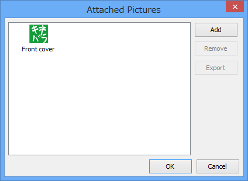

最近夜眠れなくて、昼に寝たくなる。昨日も夜の10時ぐらいに少しウトウトしたあと、朝の7時ぐらいまで眠れず。意識があったのはそこまでで……<i>気が付いたら午後3時でした。</i>ごめんなさいごめんなさい。三重のファイヤーウォール＜目覚まし＞がこうも簡単に突破されるとは。

まぁ、やっちまったのはしょうがないので、今日は家で foobar2000 v1.2.6 のアップデート内容を調べて終り。

<blockquote cite="http://www.foobar2000.org/changelog">

<h5>1.2.6</h5>

<ul>
<li>Windows 8 “connected standby” countermeasures:</li>
</ul>
Option to keep display up while playing - seems to be the only way to prevent Windows desktop apps from being shut down while the machine turns idle

<ul>
<li>Fixed misbehavior when updating attached pictures in files with ID3v2.2 tags.</li>
<li>ReplayGain tagging now works with AIFF.</li>
<li>Fixed crashing when embedding specific picture files into Ogg Vorbis files.</li>
<li>Attached picture manager dialog tweaks.</li>
</ul>

<cite><a href="http://www.foobar2000.org/changelog">foobar2000: Change Log</a></cite>
</blockquote>

<h3>Windows 8 “connected standby” countermeasures</h3>

<blockquote>

Option to keep display up while playing - seems to be the only way to prevent Windows desktop apps from being shut down while the machine turns idle

</blockquote>

残念ながら“Connected Standby”に対応したデバイスが Surface RT しか手元になく（デスクトップアプリが動かねえ！）詳しい検証はできなかったのだけれど、デスクトップアプリから“Connected Standby”への移行を阻止するのはムズかしく、少しトリッキーな方法が必要なようだ。“audio over HDMI”が必要とあるのはそのせいだと思うけれど<a href="#f1" name="fn1" title="知らんけど">*1</a>、“Connected Standby”対応の最新タブレットならば気にする必要はないと思われる。

ちなみに“Connected Standby”は

<ul>
<li>ARM プロセッサ</li>
<li>Clover Trail（最新 Intel Atom プロセッサ）</li>
<li>Haswell（次世代 Intel Core プロセッサ）</li>
</ul>
で利用できるようだ。スリープ状態で30秒に一回ネットワーク接続を行い、Windows 8 アプリ（ストアアプリ）などからリクエストされたタスクを処理する。“Connected Standby”モードでは、デスクトップアプリはなにもできない。

ちなみに v1.2.5 の設定ダイアログ。一番下のチェックボックスがない。

<h3>Attached picture manager dialog tweaks</h3>

Attached picture manager に画像ファイルの形式と大きさが表示されるようになった。

ちなみに v1.2.5 のダイアログ。バージョン履歴に書いてなければ絶対気付かないことだ。

<ul>
<li><a href="http://www.forest.impress.co.jp/docs/news/20130509_598740.html">&#x97F3;&#x697D;&#x30D7;&#x30EC;&#x30A4;&#x30E4;&#x30FC;&#x300C;foobar2000&#x300D;&#x306E;&#x6700;&#x65B0;&#x7248;v1.2.6&#x304C;&#x516C;&#x958B; - &#x7A93;&#x306E;&#x675C;</a></li>
</ul>

<a href="#fn1" name="f1" class="footnote-number">*1</a>:知らんけど

